# FEGA Metadata Technical Report

## EGA v2 model

| Group name | Federated European Genome-phenome Archive (FEGA) |
| ----: | :---- |
| **Subgroup name** | FEGA Metadata Working Group (MWG) |
| **Authors**of the report | Marcos Casado Barbero[^1] (EMBL-EBI[^2])Anandhi Iyappan[^3] (EMBL[^4]) Silvia Bahena[^5] (EMBL-EBI) Amy J. Curwin[^6] (CRG[^7]) Jorge Oliveira[^8] (BioData.pt[^9]) Miguel Cisneiros[^10] (BioData.pt) Coline Thomas[^11] (EMBL-EBI) |
| **Contributors**to the group | Federico Bianchini[^12] (UiO[^13])Wolmar Nyberg Åkerström[^14] (UU[^15]) Markus Englund[^16] (UU) Akiris Moctezuma Cervantes[^17] (CRG) Gabriele Rinck[^18] (EMBL-EBI)Yasset Perez-Riverol[^19] (EMBL-EBI) Deepti Jaiswal Kundu[^20] (EMBL-EBI) Grant McNair[^21] (CGA[^22]) Robin Liechti[^23] (SIB[^24]) Owen Appleton[^25] (SIB[^26]) Gemma Vicente[^27] (CRG) Błażej Marciniak[^28] (UL[^29]) Alban Gaignard[^30] (NU[^31]) Young Cheng[^32] (CGA) Alexandros Dimopoulos[^33] (BSRC Alexander Fleming[^34]) David Salgado[^35] (INSERM[^36]) Ulvi Talas[^37] (UT[^38]) Maciej Bisaga[^39] (UL) |
| **Acknowledgements** | Ana T. Alonso[^40] (CRG) – Figures 1 and 2 |
| **Reviewers** | Federico Bianchini (UiO) Sabela de la Torre[^41] (CRG) Jordi Rambla De Argila[^42] (CRG) Gabriele Rinck (EMBL-EBI) Mireia Marín Ginestar (CRG) Grant McNair (CGA) Robin Liechti (SIB) Akiris Moctezuma Cervantes (CRG) |

### Log of changes

| Date | version | Who | Description |
| ----: | ----- | :---- | :---- |
| **02/04/2026** | v1.0.1[^43] | Marcos Casado Barbero | Addition of PRIDE contributors |
| **27/02/2026** | v1.0.0[^44] | Marcos Casado Barbero | Address review comments from Jordi Rambla De Argila; add new figures and tables |
| **20/01/2026** | v0.0.4 | Marcos Casado Barbero | Add "Metadata model naming conventions" section and update model naming across document; general text review. |
| **07/01/2026** | v0.0.3 | Marcos Casado Barbero | Address ongoing feedback and update content |
| **31/08/2025** | v0.0.2 | Amy Curwin, Gabriele Rinck, Sabela de la Torre, Federico Bianchini, Anandhi Iyappan, Grant McNair, Robin Liechti, Marcos Casado Barbero, Akiris Moctezuma, Jorge Oliveira, Miguel Cisneiros | First internal group review |
| **29/07/2025** | v0.0.1 | Marcos Casado Barbero, Anandhi Iyappan, Silvia Bahena, Amy J. Curwin, Jorge Oliveira, Coline Thomas | Drafted technical report |
| **16/08/2024** | v0.0.0 | Marcos Casado Barbero | Drafted document template and sections |

**Contents**

[**Glossary of Terms and Abbreviations	9**](#glossary-of-terms-and-abbreviations)

[**1\. Executive summary	14**](#executive-summary)

[**2\. Introduction	15**](#introduction)

[**3\. Scope	18**](#scope)

[**4\. Metadata model naming conventions	18**](#metadata-model-naming-conventions)

[**5\. User stories	19**](#user-stories)

[**6\. Methods	21**](#methods)

[6.1. Collaboration across FEGA nodes	21](#collaboration-across-fega-nodes)

[6.2. Metadata modelling and validation	22](#metadata-modelling-and-validation)

[6.3. Namespace strategy	24](#namespace-strategy)

[6.4. Metadata validation	24](#metadata-validation)

[6.5. RDF and linked data	26](#rdf-and-linked-data)

[**7\. EGA v2 metadata model	26**](#ega-v2-metadata-model)

[7.1. Group formation and work summary	27](#group-formation-and-work-summary)

[7.2. External involvement	27](#external-involvement)

[7.3. Model entities	29](#model-entities)

[7.4. Model cardinality	31](#model-cardinality)

[7.5. Use-cases	38](#use-cases)

[7.6. Linked data	57](#linked-data)

[7.7. Sensitive metadata	60](#sensitive-metadata)

[7.8. Improvements	62](#improvements)

[7.9. Model versioning	65](#model-versioning)

[7.10. Mapping archived data to the proposed model	66](#mapping-archived-data-to-the-proposed-model)

[7.11. Implementation plan	68](#implementation-plan)

[**8\. Governance	69**](#governance)

[**9\. Dependencies	71**](#dependencies)

[9.1. Validation services	71](#validation-services)

[9.2. Upstream schemas and profiles	72](#upstream-schemas-and-profiles)

[9.3. Hosting and resolution	72](#hosting-and-resolution)

[9.4. Linked data processing	73](#linked-data-processing)

[**10\. Risks and mitigation	73**](#risks-and-mitigation)

[**11\. Results	75**](#results)

[**12\. Discussion	76**](#discussion)

[12.1. FEGA operational structure	76](#fega-operational-structure)

[12.2. Community-rooted model design and use-case validation	76](#community-rooted-model-design-and-use-case-validation)

[12.3. Ontology integration and linked-data adoption	76](#ontology-integration-and-linked-data-adoption)

[12.4. Evaluation and impact	77](#evaluation-and-impact)

[12.5. Challenges	77](#challenges)

[**13\. Next steps	77**](#next-steps)

[**14\. Open questions	79**](#open-questions)

[**15\. Annexes	81**](#annexes)

List of figures

[Figure 1\. Overview of the FEGA network and the workflow of data provenance and access requests.	16](#figure-1-overview-of-the-fega-network-and-the-workflow-of-data-provenance-and-access-requests)

[Figure 2\. Federated EGA network overview, highlighting the need to share metadata for data discovery and access.	17](#figure-2-federated-ega-network-overview-highlighting-the-need-to-share-metadata-for-data-discovery-and-access)

[Figure 3\. Overview of the timeline from the MWG.	27](#figure-3-overview-of-the-timeline-from-the-mwg)

[Figure 4\. Flow diagram representing an oversimplification of the model entities and relationships of the EGA v2 metadata model.	32](#figure-4-flow-diagram-representing-an-oversimplification-of-the-model-entities-and-relationships-of-the-ega-v2-metadata-model)

[Figure 5\. Flow diagram representing the entities and relationships of the EGA v2 metadata model.	34](#figure-5-flow-diagram-representing-the-entities-and-relationships-of-the-ega-v2-metadata-model)

[Figure 6\. Visual representation of the different process trees based on the submission granularity.	36](#figure-6-visual-representation-of-the-different-process-trees-based-on-the-submission-granularity)

[Figure 7\. Classification of processes and comparison of EGA v1 experiments/analysis and EGA v2 processes.	37](#figure-7-classification-of-processes-and-comparison-of-ega-v1-experimentsanalysis-and-ega-v2-processes)

[Figure 8\. Representation of the same sequencing and alignment processes in both the EGA v1 and v2 models.	40](#figure-8-representation-of-the-same-sequencing-and-alignment-processes-in-both-the-ega-v1-and-v2-models)

[Figure 9\. Representation in detail (with real accessions) of the same sequencing and alignment processes in both the EGA v1 and v2 models.	41](#figure-9-representation-in-detail-with-real-accessions-of-the-same-sequencing-and-alignment-processes-in-both-the-ega-v1-and-v2-models)

[Figure 10\. Representation in detail (with real accessions) of the whole worked CEGA example modelled through EGA v1 model.	42](#figure-10-representation-in-detail-with-real-accessions-of-the-whole-worked-cega-example-modelled-through-ega-v1-model)

[Figure 11\. Representation in detail (with real accessions) of the worked CEGA example, modelled through the EGA v2 model.	43](#figure-11-representation-in-detail-with-real-accessions-of-the-worked-cega-example-modelled-through-the-ega-v2-model)

[Figure 12\. Representation (in EGA v2 model) of a simplified view for individual A, except for clinical information.	45](#figure-12-representation-in-ega-v2-model-of-a-simplified-view-for-individual-a-except-for-clinical-information)

[Figure 13\. Comparison of differences between examples for individual B and A in EGA v2 model.	47](#figure-13-comparison-of-differences-between-examples-for-individual-b-and-a-in-ega-v2-model)

[Figure 14\. Representation of clinical information for both individuals A and B in EGA v2 model.	48](#figure-14-representation-of-clinical-information-for-both-individuals-a-and-b-in-ega-v2-model)

[Figure 15\. Proteomics use case representation in EGA v2 model.	52](#figure-15-proteomics-use-case-representation-in-ega-v2-model)

[Figure 16\. Diagram of a stool-microbiome research data lifecycle into the EGA v2 Metadata Model. Datasets 1 & 2 may fit best in public archives (e.g., ENA), simplifying the example.	56](#figure-16-diagram-of-a-stool-microbiome-research-data-lifecycle-into-the-ega-v2-metadata-model-datasets-1--2-may-fit-best-in-public-archives-eg-ena-simplifying-the-example)

[Figure 17\. Diagram depicting the expansion of a JSON document into JSON-LD with the addition of @context.	57](#figure-17-diagram-depicting-the-expansion-of-a-json-document-into-json-ld-with-the-addition-of-context)

[Figure 18\. Representation of existing embedded contexts and how it improves the findability of EGA records on the web. (1) Record of a dataset in the EGA portal; (2) application/ld+json node embedded in the HTML of the record, containing context and metadata in JSON-LD format; (3) result of a query at Google Datasets, returning the EGA dataset thanks to its embedded context.	59](#figure-18-representation-of-existing-embedded-contexts-and-how-it-improves-the-findability-of-ega-records-on-the-web-1-record-of-a-dataset-in-the-ega-portal-2-applicationldjson-node-embedded-in-the-html-of-the-record-containing-context-and-metadata-in-json-ld-format-3-result-of-a-query-at-google-datasets-returning-the-ega-dataset-thanks-to-its-embedded-context)

[Figure 19\. Summary diagram representing the submission proposal with regards to open and controlled access metadata.	61](#figure-19-summary-diagram-representing-the-submission-proposal-with-regards-to-open-and-controlled-access-metadata)

[Figure 20\. Made-up example of the core EGA v2 model and a FEGA Norway extension evolving over time.	65](#figure-20-made-up-example-of-the-core-ega-v2-model-and-a-fega-norway-extension-evolving-over-time)

List of Tables

[Table 1\. User stories.	19](#table-1-user-stories)

[Table 2\. Classification of processes based on input-output combinations.	36](#table-2-classification-of-processes-based-on-input-output-combinations)

[Table 3\. Anticipated FAIR gains of the EGA v2 model over the EGA v1 model.	64](#table-3-anticipated-fair-gains-of-the-ega-v2-model-over-the-ega-v1-model)

[Table 4\. EGA v1-v2 models mapping strategy overview.	67](#table-4-ega-v1-v2-models-mapping-strategy-overview)

[Table 5\. FEGA governing groups over the EGA v2 model.	69](#table-5-fega-governing-groups-over-the-ega-v2-model)

[Table 6\. Change release flow step-by-step.	70](#table-6-change-release-flow-step-by-step)

[Table 7\. Risks and mitigations overview.	73](#table-7-risks-and-mitigations-overview)

[Table 8\. Open questions of the Technical Report.	79](#table-8-open-questions-of-the-technical-report)

Table of contents and contributions

| Section | Author(s) | Reviewer(s) |
| :---- | :---- | :---- |
| [Executive summary](#executive-summary) | [Marcos Casado Barbero](mailto:mcasado@ebi.ac.uk) | [Amy Curwin](mailto:amy.curwin@crg.eu), [Gabriele Rinck](mailto:rinck@ebi.ac.uk),  [Sabela de la Torre](mailto:sabela.delatorre@crg.eu), [Federico Bianchini](mailto:fredebi@uio.no), [Marcos Casado Barbero](mailto:mcasado@ebi.ac.uk) |
| [Introduction](#introduction) | [amy.curwin@crg.eu](mailto:amy.curwin@crg.eu) | [Marcos Casado Barbero](mailto:mcasado@ebi.ac.uk), [Gabriele Rinck](mailto:rinck@ebi.ac.uk), [Sabela de la Torre](mailto:sabela.delatorre@crg.eu), [Federico Bianchini](mailto:fredebi@uio.no) |
| [Scope](#scope) | [Marcos Casado Barbero](mailto:mcasado@ebi.ac.uk) | [Amy Curwin](mailto:amy.curwin@crg.eu), [Gabriele Rinck](mailto:rinck@ebi.ac.uk),  [Sabela de la Torre](mailto:sabela.delatorre@crg.eu), [Federico Bianchini](mailto:fredebi@uio.no), [Marcos Casado Barbero](mailto:mcasado@ebi.ac.uk) |
| [Metadata model naming conventions](#metadata-model-naming-conventions) | [Marcos Casado Barbero](mailto:mcasado@ebi.ac.uk) | [Marcos Casado Barbero](mailto:mcasado@ebi.ac.uk), Jordi Rambla De Argila |
| [Methods](#methods) | [Marcos Casado Barbero](mailto:mcasado@ebi.ac.uk) | [Anandhi Iyappan](mailto:anandhi.iyappan@embl.de), [Marcos Casado Barbero](mailto:mcasado@ebi.ac.uk), [Federico Bianchini](mailto:fredebi@uio.no) |
| [Group formation and work summary](#group-formation-and-work-summary) | [Marcos Casado Barbero](mailto:mcasado@ebi.ac.uk) | [Gabriele Rinck](mailto:rinck@ebi.ac.uk), [Grant McNair](mailto:mcnair.grant@gmail.com), [Federico Bianchini](mailto:fredebi@uio.no), [Marcos Casado Barbero](mailto:mcasado@ebi.ac.uk) |
| [External Involvement](#external-involvement) | [Marcos Casado Barbero](mailto:mcasado@ebi.ac.uk) | [Gabriele Rinck](mailto:rinck@ebi.ac.uk), [Grant McNair](mailto:mcnair.grant@gmail.com), [Federico Bianchini](mailto:fredebi@uio.no), [Marcos Casado Barbero](mailto:mcasado@ebi.ac.uk) |
| [Model Entities](#model-entities) | [Marcos Casado Barbero](mailto:mcasado@ebi.ac.uk) | [Robin Liechti](mailto:robin.liechti@gmail.com), [Gabriele Rinck](mailto:rinck@ebi.ac.uk), [Mireia Marín Ginestar](mailto:mireiamarincrg@gmail.com),  [Federico Bianchini](mailto:fredebi@uio.no), Jordi Rambla De Argila, [Marcos Casado Barbero](mailto:mcasado@ebi.ac.uk) |
| [Model Cardinality](#model-cardinality) | [Marcos Casado Barbero](mailto:mcasado@ebi.ac.uk) | [Gabriele Rinck](mailto:rinck@ebi.ac.uk), [Mireia Marín Ginestar](mailto:mireiamarincrg@gmail.com), [Federico Bianchini](mailto:fredebi@uio.no), Jordi Rambla De Argila, [Marcos Casado Barbero](mailto:mcasado@ebi.ac.uk) |
| [CEGA Use-case](#cega-use-case) | [Marcos Casado Barbero](mailto:mcasado@ebi.ac.uk) | [Anandhi Iyappan](mailto:anandhi.iyappan@embl.de), [Grant McNair](mailto:mcnair.grant@gmail.com), [Sabela de la Torre](mailto:sabela.delatorre@crg.eu), [Federico Bianchini](mailto:fredebi@uio.no), [Marcos Casado Barbero](mailto:mcasado@ebi.ac.uk) |
| [Microarray Use-case](#microarray) | [Marcos Casado Barbero](mailto:mcasado@ebi.ac.uk) & [Coline Thomas](mailto:cthomas@ebi.ac.uk) | [Robin Liechti](mailto:robin.liechti@gmail.com), [Federico Bianchini](mailto:fredebi@uio.no), [Marcos Casado Barbero](mailto:mcasado@ebi.ac.uk) |
| [Proteomics Use-case](#proteomics) | [anandhi.iyappan@embl.de](mailto:anandhi.iyappan@embl.de)& [Silvia Bahena](mailto:sbahena@ebi.ac.uk) | [Gabriele Rinck](mailto:rinck@ebi.ac.uk), [Marcos Casado Barbero](mailto:mcasado@ebi.ac.uk) |
| [Microbiome Use-case](#microbiome) | [Jorge Oliveira](mailto:jorge.oliveira@tecnico.ulisboa.pt) & [Miguel Cisneiros](mailto:mcisneiros@biodata.pt)  | [Marcos Casado Barbero](mailto:mcasado@ebi.ac.uk) |
| [User Stories](#user-stories) | [Marcos Casado Barbero](mailto:mcasado@ebi.ac.uk) | [Anandhi Iyappan](mailto:anandhi.iyappan@embl.de), [Marcos Casado Barbero](mailto:mcasado@ebi.ac.uk) |
| [Linked data](#linked-data) | [Marcos Casado Barbero](mailto:mcasado@ebi.ac.uk) | [Gabriele Rinck](mailto:rinck@ebi.ac.uk), [Marcos Casado Barbero](mailto:mcasado@ebi.ac.uk) |
| [Sensitive metadata](#sensitive-metadata) | [Marcos Casado Barbero](mailto:mcasado@ebi.ac.uk) | [Akiris Moctezuma](mailto:akiris.moctezuma@crg.eu), Jordi Rambla De Argila, [Marcos Casado Barbero](mailto:mcasado@ebi.ac.uk) |
| [Improvements](#improvements) | [Marcos Casado Barbero](mailto:mcasado@ebi.ac.uk) | [Jorge Oliveira](mailto:jorge.oliveira@tecnico.ulisboa.pt), [Miguel Cisneiros](mailto:mcisneiros@biodata.pt), Jordi Rambla De Argila, [Marcos Casado Barbero](mailto:mcasado@ebi.ac.uk) |
| [Model versioning](#model-versioning) | [Marcos Casado Barbero](mailto:mcasado@ebi.ac.uk) | [Jorge Oliveira](mailto:jorge.oliveira@tecnico.ulisboa.pt), [Miguel Cisneiros](mailto:mcisneiros@biodata.pt), Jordi Rambla De Argila, [Marcos Casado Barbero](mailto:mcasado@ebi.ac.uk) |
| [Mapping archived data to proposed model](#mapping-archived-data-to-the-proposed-model) | [Marcos Casado Barbero](mailto:mcasado@ebi.ac.uk) | [Akiris Moctezuma](mailto:akiris.moctezuma@crg.eu), [Marcos Casado Barbero](mailto:mcasado@ebi.ac.uk) |
| [Implementation plan](#implementation-plan) | [Marcos Casado Barbero](mailto:mcasado@ebi.ac.uk) | [Marcos Casado Barbero](mailto:mcasado@ebi.ac.uk), Jordi Rambla De Argila |
| [Governance](#governance) | [Marcos Casado Barbero](mailto:mcasado@ebi.ac.uk)& [Amy Curwin](mailto:amy.curwin@crg.eu) | [Marcos Casado Barbero](mailto:mcasado@ebi.ac.uk), Jordi Rambla De Argila |
| [Dependencies](#dependencies) | [Marcos Casado Barbero](mailto:mcasado@ebi.ac.uk) | [Marcos Casado Barbero](mailto:mcasado@ebi.ac.uk) |
| [Risks and mitigations](#risks-and-mitigation) | [Marcos Casado Barbero](mailto:mcasado@ebi.ac.uk) | [Marcos Casado Barbero](mailto:mcasado@ebi.ac.uk) |
| [Results](#results) | [Anandhi Iyappan](mailto:anandhi.iyappan@embl.de) | [Marcos Casado Barbero](mailto:mcasado@ebi.ac.uk) |
| [Discussion](#discussion) | [anandhi.iyappan@embl.de](mailto:anandhi.iyappan@embl.de) | [Marcos Casado Barbero](mailto:mcasado@ebi.ac.uk) |
| [Next steps](#next-steps) | [Marcos Casado Barbero](mailto:mcasado@ebi.ac.uk) | [Marcos Casado Barbero](mailto:mcasado@ebi.ac.uk) |
| [Open questions](#open-questions) | [Marcos Casado Barbero](mailto:mcasado@ebi.ac.uk) | [Marcos Casado Barbero](mailto:mcasado@ebi.ac.uk) |

# Glossary of Terms and Abbreviations

| Abbreviations | Description |
| ----- | ----- |
| ADF | Array Design Format file specification |
| AF | Array Format |
| API | Application Programming Interface |
| BAM	 | Binary Alignment/Map sequencing file |
| BioData.pt | Portuguese Infrastructure of Biological Data |
| BSRC | Biomedical Sciences Research Center |
| CEGA | Central EGA (EMBL-EBI and CRG). |
| CGA | Centre for Genomic Analysis |
| CI | Continuous Integration |
| CRG | Centre for Genomic Regulation |
| DAA | Data Access Agreement |
| DAC	 | Data Access Committee |
| DCAT	 | Data Catalog Vocabulary (W3C standard) |
| DCAT-AP | Data Catalog Vocabulary Application Profile |
| DCTERMS | Dublin Core Terms |
| EGA | European Genome-phenome Archive |
| EHDS | European Health Data Space |
| ELSI | Ethical, Legal, and Social Implications |
| EMBL | European Molecular Biology Laboratory |
| EMBL-EBI | European Molecular Biology Laboratory – European Bioinformatics Institute |
| ENA | European Nucleotide Archive |
| ENVO | Environment Ontology |
| FAIR	 | Findable, Accessible, Interoperable, Reusable |
| FEGA | Federated EGA |
| FHD | Federated Human Data |
| FOAF | Friend of a Friend |
| GA4GH | Global Alliance for Genomics and Health |
| GDI | Genomic Data Infrastructure project |
| GDI HDM | GDI Harmonized Dataset Model |
| GDPR | General Data Protection Regulation |
| GH | GitHub |
| GHGA | German Human Genome-Phenome Archive |
| GoE | Genome of Europe |
| HCA | Human Cell Atlas |
| HUMAnN | HMP Unified Metabolic Analysis Network |
| IGSR | The International Genome Sample Resource |
| INSERM | Institut National de la Santé et de la Recherche Médicale |
| IRI | Internationalized Resource Identifier |
| ISA | Investigation Study Assay |
| JGA | Japanese Genotype-phenotype Archive |
| JSON-LD	 | JSON for Linked Data |
| MIxS | Minimum Information about any (x) Sequence |
| MQA | Metadata Quality Assessment |
| MWG | Metadata Working Group |
| NAKO | NAKO Gesundheitsstudie, German National Cohort |
| NBIS | National Bioinformatics Infrastructure Sweden |
| NGS | Next Generation Sequencing |
| NU | Norwegian University |
| OBI | Ontology for Biomedical Investigations |
| OLS | Ontology Lookup Service |
| OLS4 | Ontology Lookup Service v4 |
| OWL | Web Ontology Language |
| PEG | Predictor Effector Gene |
| PRIDE | PRoteomics IDEntifications Database |
| PROV-O | Provenance Ontology |
| PSI | Proteomics Standards Initiative |
| QC | Quality Control |
| RDF	 | Resource Description Framework |
| RDFS | RDF Schema |
| SDRF | Sample and Data Relationship Format for Proteomics |
| SEMAPV | Semantic Mapping Vocabulary |
| SIB | Swiss Institute of Bioinformatics |
| SKOS | Simple Knowledge Organization System |
| SPARQL	 | RDF query language and protocol |
| UiO | University of Oslo |
| UL | University of Lodz |
| URI	 | Uniform Resource Identifier |
| UT | University of Tartu |
| UU | University of Uppsala |

| Term | Definition |
| ----- | ----- |
| Biomaterial	 | Biological sample or derivative |
| Cardinality | The relationships between entities and their instance-level numerical constraints (e.g., many to many, exactly one, etc.) |
| Catalog	 | Node-level collection of dataset metadata |
| Catalog Record | Administrative entry describing one dataset |
| CEGA | Central EGA, jointly managed by the EMBL-EBI and CRG |
| Cohort	 | Group of individuals or samples sharing traits |
| Continuous Integration | Practice where developers frequently merge changes into a shared repo and each change triggers automated builds and tests to catch issues early |
| CURIE | Compact URI form prefix:reference that expands via a prefix map to a full IRI. Specified by W3C CURIE Syntax 1\.0[^45] |
| Data Service	 | Endpoint that serves one or more datasets |
| Datafile	 | Digital file containing experimental data |
| Dataset	 | Controlled-access bundle of related datafiles |
| Dataset Series | Thematic collection of separate datasets |
| EGA v1 Model | The current metadata model (as of January 2026) that has been in production (i.e., in use) since the establishment of the EGA in 2008\. It is used until the EGA v2 model is in production by CEGA for submissions, and by FEGA nodes that use the Local EGA[^46]. |
| EGA v2 Model | The second major iteration of the EGA metadata model, proposed by the FEGA MWG in this document, and still to be implemented. |
| Identifier	 | Stable reference string for an entity |
| IRI | Like a URI but allows Unicode; can be losslessly converted to a URI by percent-encoding. Defined in RFC 3987[^47] |
| JSON Schema | JSON format for validation rules |
| JSON-LD context | Mapping that converts JSON keys to IRIs |
| Linked Data	 | Web of data connected by resolvable IRIs |
| Metadata | Data that describes other data. For example, "blue" in "a blue pen"; or "diabetes" in "a patient with diabetes" |
| Ontology	 | Structured representation of concepts, including controlled vocabulary with defined relations |
| Policy	 | When in uppercase, it refers to the entity "Policy" of the EGA v2 model, representing a statement of data-use and access conditions; when in lower case, it refers to the everyday sense of a general organisational rule or practice |
| Process	 | Activity representing the execution of a protocol with inputs and outputs |
| Project	 | Umbrella grouping of related studies and datasets |
| Protocol	 | Step-by-step scientific method description |
| Protocol Collection | Versioned set of related protocols |
| Serialisation | Concrete encoding of a data model into a specific file or message format, such as JSON, XML or RDF/Turtle. |
| SPARQL endpoint | Service that answers SPARQL queries |
| Study	 | Scientific investigation or analysis bundle |
| URI | ASCII identifier string for a resource using the generic syntax. Defined in [RFC 3986](https://www.rfc-editor.org/rfc/rfc3986).  |
| URL | A URI that provides a network location for retrieval (for example *https*). Defined in [RFC 1738](https://datatracker.ietf.org/doc/html/rfc1738). |

1. # Executive summary

The **Federated EGA** (FEGA) **Metadata Working Group** (MWG) has designed a new, **process-oriented metadata model** intended to replace the EGA v1 model[^48], used by Central EGA (CEGA) and FEGA nodes using Local EGA[^49]. It prepares the FEGA network for FAIR, linked-data interoperability across **human omics**. **The model is under active development, and this report**[^50] **accompanies that work in progress.** What exists today is an abstract specification and a first set of JSON Schema drafts[^51] with embedded JSON-LD contexts; detailed serialisations, production deployments and full validator roll-out are future milestones, not completed deliverables.

Core **entities** include Biomaterial, Protocol, Process, Datafile, Dataset, Policy, Data Access Committee (DAC), Study, Cohort, Project, Protocol Collection and DCAT-style Catalog objects. **Validation** through the open-source **ELIXIR Biovalidator[^52]** ensures both syntactic and selected semantic checks (e.g., ontology term validation). **Use-case workshops** in genomics, microarrays, proteomics, and microbiomes confirmed the model's flexibility without needing schema rewrites.

A **transparent GitHub repository[^53]** contains the schemas, documentation, versioning, automated workflows, and a change process aligned to FEGA's network governance. As the first stepping stones for **future migration** of the current EGA v1 model to the EGA v2 model, we propose completing the set of model schemas, an initial v1-to-v2 model mapper, and a test implementation at CEGA. Finally, we present a phased adoption by FEGA nodes and other stakeholders. This approach would culminate when the maturity and efficacy of the model have been proved end-to-end and the model shift can happen in the production environments.

***Disclaimer(s)**: this document is a snapshot of the live documentation of the FEGA MWG as of February 2026\. New content and changes will be added to `docs/technical-report.md`*[^54]. Some materials referenced in this document are only accessible to members of their respective groups (ELIXIR, GDI and FEGA). To gain access to them, request membership through the official channels.

2. # Introduction

In the era of rapidly expanding human genomics data in research and healthcare, efficient data reuse is gaining importance to maximise benefits for patients. The 1+Million Genomes (1+MG) Initiative[^55] was launched in 2018 to enable access to one million sequenced human genomes across Europe, and provided a cohesive vision to support diverse jurisdictional data sharing requirements. This has prompted the establishment of federated genomic data sharing networks in Europe, which catalysed the development of multiple projects, including the **Federated European Genome-phenome Archive** (FEGA)[^56],[^57].

Since its launch in 2022, the FEGA Network (see [Figure 1](#figure-1-overview-of-the-fega-network-and-the-workflow-of-data-provenance-and-access-requests) and [Figure 2](#figure-2-federated-ega-network-overview-highlighting-the-need-to-share-metadata-for-data-discovery-and-access)) has become fully operational, coordinated by CEGA, based in EMBL's European Bioinformatics Institute (EMBL-EBI) and the Centre for Genomic Regulation (CRG), and as of January 2026 it consists of **nine national nodes** (Finland, Germany, Norway, Spain, Sweden, Poland, Portugal, Canada, and most recently Switzerland)[^58], and has 53 datasets available[^59].

The complexities, challenges, and achievements of FEGA, unravelling the dynamic interplay between regulatory frameworks, technical challenges, and the shared vision of advancing genomic research to improve global health have recently been described in the FEGA marker paper published in Nature Genetics[^60].

##### ***Figure 1**. Overview of the FEGA network and the workflow of data provenance and access requests.*

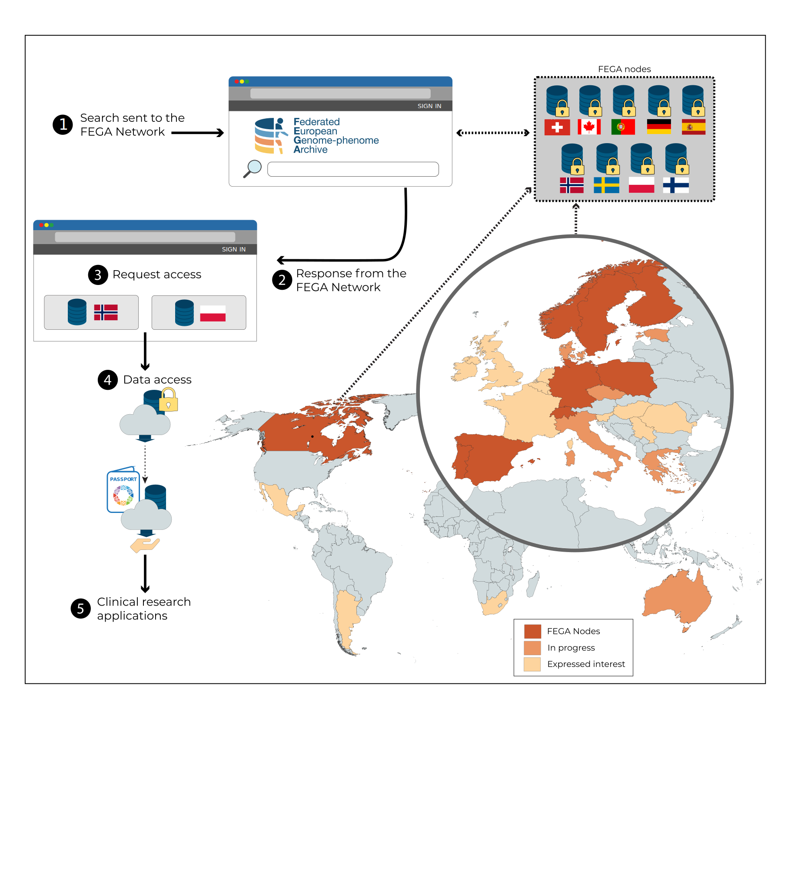

##### ***Figure 2\.** Federated EGA network overview, highlighting the need to share metadata for data discovery and access.*

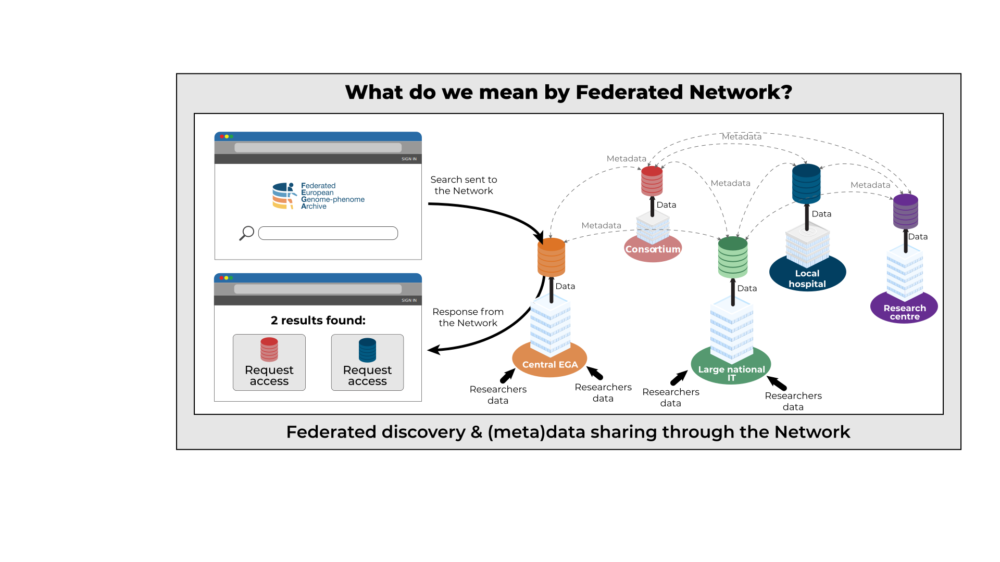

In a rapidly evolving data-sharing landscape, FEGA collaborates with European and other international initiatives, like the 1+ Million Genomes (1+MG)[^61] or the European Genomic Data Infrastructure (GDI)[^62], to serve a variety of human genomic data-sharing use-cases with its operational network for transnational discovery of and access to human data. The FEGA architecture facilitates the core stages of the data management lifecycle, including data and metadata submission to CEGA or FEGA nodes, long-term and secure storage, **metadata publication for discovery**, data access request management, and controlled-access to data. These operations use encrypted data in secure environments, with user access managed through advanced authentication and authorisation systems. Interoperability is ensured by adhering to community standards, such as those developed by the Global Alliance for Genomics and Health (GA4GH)[^63]. FEGA nodes have the flexibility to implement or deploy components of their choice, provided they comply with these agreed-upon standards.

In the dynamic field of human genomics, creating **interoperable federated networks for discovery and access** is essential for maximizing data reuse. Building on updated resources and the expertise of the initial FEGA nodes, more countries are establishing new nodes to enhance data sharing and collaboration. As the volume and diversity of data continue to grow, the supporting infrastructure must adapt to address these evolving challenges.

This document showcases **FEGA's efforts on the topic of metadata standards** by focusing on a robust metadata framework to support its FAIR data-sharing goals. The current **CEGA metadata model[^64]**, hereinafter the EGA v1 model, has been instrumental in enabling the registration and management of sensitive genomic data. However, as the scope of research expands and new technologies emerge, this reveals the need for the metadata model to accommodate complex data relationships and scenarios. Below, we outline how the **FEGA Metadata Working Group** (MWG) is building a sustainable model to manage and link metadata effectively, ensuring scalability, interoperability, and alignment with the wider research community.

3. # Scope

This document outlines the FEGA MWG's **proposed abstract metadata model for FEGA, and its approach to metadata validation and linked data**. The model is designed to support robust, FAIR-compliant metadata within FEGA. While the model primarily serves the FEGA network (e.g., node maintainers and data curators), it is also intended as a resource for the **broader research community**, showcasing the working group's approach to improving FEGA's current metadata infrastructure.

The scope of this model includes defining **core metadata entities** (e.g., Biomaterial) and **relationships** (e.g., *Biomaterial UsedBy Process*) in FEGA's use-cases. Each element was developed based on well-established practices (e.g., JSON Schemas and RDF) and models from sources including the EGA v1 model. One of the main goals was to create a **long-term sustainable metadata model** to allow for potential adaptations and extensions, with clear emphasis on the experimental and analytical metadata. This abstract model serves both as: (1) a prospective foundation, as a community-led project, for an eventual EGA v2 metadata model implementation; and (2) as a publicly accessible metadata framework, available to external projects or institutions seeking to implement a similar approach. The fact that every piece of documentation and software is **open-source** demonstrates our commitment to engaging with the community.

This document does **not** address details of how the new metadata model may integrate with other external metadata models (e.g., BioSchemas) or projects (e.g., GDI), but lays the groundwork for future collaborative alignment. 

The focus remains on creating a **scalable, open-source metadata model that aligns with FEGA's FAIR goals and can be adapted** to evolving research data needs over time.

4. # Metadata model naming conventions

Before the FEGA MWG proposed the new EGA metadata model, **there was a single major version of the EGA model** from its start in 2008\. Given the fact that the core source for the new model is the previous one, and in the interest of clear and traceable provenance in technical documentation, the naming conventions follow semantic versioning 2.0.0[^65] and are as follows:

* **EGA v1 model**: the first major version of the EGA metadata model. It is, as of January 2026, the current metadata model, and has been in production (i.e., in use) since the establishment of the EGA in 2008\. It is used, until the EGA v2 model is in production, by CEGA for submissions, and by FEGA nodes when sharing metadata with CEGA.

* **EGA v2 model**: the second major iteration of the EGA metadata model, proposed by the FEGA MWG in this document, and the first major version to incorporate FEGA requirements. As of January 2026 it remains to be implemented.

The FEGA MWG aims for the EGA v2 model to be the common language for submission metadata across FEGA nodes, irrespective of the specific implementation of the model at each node, thus making this EGA v2 model the common metadata model for FEGA.

Find more details about the [*Model versioning*](#model-versioning) and [*Governance*](#governance) in their respective sections.

5. # User stories

[Table 1](#table-1-user-stories) outlines **user stories**, drafted as hypotheses to validate, that capture the needs and expectations of various stakeholders interacting with the EGA v2 metadata model. Each row identifies a **role** (*as a …*), the specific **action** (*I want to …*) they aim to perform, and the desired **result** (*to …*) they seek to achieve. This structured format enables a clear understanding of how the model can address user needs, facilitate usability, and support interoperability across diverse contexts.

###### ***Table 1**. User stories.*

| Role(*as a …*) | Action(*I want to …*) | Result(*to …*) |
| ----- | ----- | ----- |
| Bioinformatician | Perform complex cross-FEGA archive queries | Support cross-archive dataset comparative analysis |
| Data consumer | Easily find data use policies of FEGA records | Make informed decisions about data use |
| Data consumer | Easily explore the metadata entities (e.g., knowledge graph) | Discover new suitable records for my research |
| Data curator | Validate metadata easily | Ensure metadata meets archive standards |
| Data curator | Validate metadata locally | Assess metadata compliance without sharing the metadata content |
| Data curator | Validate metadata locally | Assess metadata compliance without relying on third party services |
| Data steward | Be able to use clear and standardised metadata structures | Support interoperable (e.g., with other archives) and diverse (e.g., in experimental types) submissions |
| Database administrator | Use a stable and versioned approach to FEGA identifiers | Maintain metadata traceability over time |
| Database administrator | Use a clear, open-source and versioned metadata validation system | Maintain traceability and transparency of used validation standards |
| External stakeholder | Reuse FEGA's metadata validation/linked data approach | Avoid duplicating effort developing metadata management frameworks, and be interoperable with FEGA |
| EGA v2 model maintainer | Easily manage change requests to the EGA v2 model | Ensure that the EGA v2 model is up to date with the user and field requirements |
| FEGA node maintainer | Have a consistent format for sharing FEGA metadata | Ensure seamless communication of metadata across FEGA nodes |
| FEGA node maintainer | Avoid data loss during model transitions | Adapt existing metadata in my node to the new model |
| FEGA node submitter | Enhance reusability, by using existing standards, ontologies and linked data | Increase the submitted metadata quality and interoperability |
| FEGA node submitter | Receive clear feedback on metadata-related errors | Promptly prepare submitted metadata in a compliant format |
| FEGA node submitter | Improve discoverability and reusability of my submitted metadata | Increase the citability of my submitted (meta)data both in research and grants |
| FEGA operations committee member | Monitor adoption of the new metadata model | Ensure consistency across all nodes |
| GDI collaborator | Align metadata models between FEGA and GDI | Reduce duplication of effort across initiatives in overlapping nodes |
| Pipeline developer | Include metadata validation in automated workflows | Assert compliance of submitted metadata automatically |
| Data controller | Ensure metadata adheres to FAIR principles and relevant Ethical, Legal, and Social Implications (ELSI) requirements | Meet international frameworks and standards, and to approve submission to FEGA |
| Project coordinator | Demonstrate how metadata links across archives | Illustrate the benefits of interoperability, and motivate data silos to cooperate |
| Researcher | Access datasets linked to related publications | Facilitate my research |

6. # Methods

The methods described here outline the collaborative processes, tools, and strategies employed to achieve the objectives described above.

1. ## Collaboration across FEGA nodes

Structured group meetings were held monthly (1-hour sessions) starting September 2023\. Communication channels included:

* **Slack**: A dedicated channel (*fega\_metadata\_working\_group*[^66]) in the ELIXIR workspace for day-to-day discussions.

* **Google Drive**: A Google Drive directory for collaborative documentation, questionnaires and storage of meeting notes.

* **Email**: Used for coordination and progress reports.

* **GitHub**: A repository (EGA-archive/fega-metadata-schema[^67]) to manage schemas and technical reports. Additionally, contributors use forks[^68] of the main repository to add changes.

  2. ## Metadata modelling and validation

The EGA v2 model development focuses on aligning with FAIR principles, reusing existing standards, and integrating linked data concepts.

Key aspects of the modelling process include:

1. **Ontology Integration.** The MWG identified mappings to several widely adopted ontologies:

   1. **Basic descriptions of the model.** Including standards and vocabularies like: **schema.org**[^69],[^70] (e.g., schema:description[^71]), Simple Knowledge Organization System[^72],[^73] (**SKOS,** e.g., skos:exactMatch[^74]), Semantic Mapping Vocabulary[^75] (**SEMAPV**, e.g., semapv:LexicalMatching[^76]) and Resource Description Framework Schema[^77],[^78] (**RDFS**, e.g., rdfs:label[^79]).

   2. **Provenance description.** For example, the Provenance Ontology[^80],[^81] (**PROV-O**, e.g., prov:used[^82]) or Open Researcher and Contributor ID Schema[^83] (**ORCID iD Identifier Schema**, e.g., 0000-0002-7747-6256[^84]).

   3. **Field validation.** Enabling the model to include semantic validation based on ontologies like the Experimental Factor Ontology[^85],[^86] (**EFO**, e.g., EFO:0002699[^87]) or UBER anatomy ONtology (UBERON, e.g., UBERON:0000992[^88]).

   Ontologies were selected based on their relevance to FEGA use-cases and their adoption in widely used community standards and ecosystems. Additional ontologies will be incorporated as the model evolves.

2. **Field standards.** In line with the FEGA MWG's goal of creating a sustainable model, multiple existing standards are rendered into the EGA v2 model:

   1. **Phenopackets**[^89]. Standardised, machine-readable schema for exchanging case-level phenotypic and disease information (e.g., disease[^90]), supporting consistent representation of individuals and biosamples across clinical and research settings.

   2. **Beacon-v2**[^91]. GA4GH API specification enabling federated discovery of genomic and associated phenotypic datasets across distributed nodes using a common query/response framework

   3. **BioSchemas**[^92]. Community profiles built on schema.org to mark up life-science resources (e.g., computational workflow[^93]) for improved web discoverability and interoperability across registries and catalogues.

   4. **Investigation Study Assay** (ISA). ISA-JSON[^94] metadata framework (e.g., process parameters[^95]) to structure experimental metadata across multi-omics workflows.

   5. **Data Cataloguing.** Alignment with RDF-native catalogue standards: Data Catalog Vocabulary[^96] (DCAT, e.g., dcat:Catalog[^97]) for catalogue interoperability, plus European application profiles (DCAT-AP[^98] and HealthDCAT-AP[^99]) to represent dataset-level metadata consistently for cross-portal discovery (including European Health Data Space (EHDS)-oriented extensions).

3. **Validation Tools.**

   1. **ELIXIR Biovalidator**[^100]. The primary tool for validating JSON documents against schemas, supporting API-based constraints, like ontology term checks through the Ontology Lookup Service[^101] (OLS).

   2. **JSON-LD Playground**[^102]. Used for testing JSON-LD expansions and linked data principles.

   3. **JSON Schema Validator**[^103]. For general schema validation during schema development.

4. **JSON Schemas.** Albeit in progress, the EGA v2 model represents each entity (e.g., biomaterial) as a JSON file (e.g., FEGA.biomaterial.json[^104]) following the JSON Schema Specification[^105] plus additional custom keywords defined by Biovalidator. These schemas include mappings, detailed property definitions, types, and constraints, ensuring robust validation and extensibility. JSON-LD Contexts (@context) are embedded directly within schemas to enable seamless JSON-to-JSON-LD transformations.

5. **Automation**. To aid with the continuous development of the EGA v2 model, scripts[^106],[^107] and workflows[^108] are set in place to automate recurrent tasks (e.g., validation, release preparation, document linting) through GitHub workflows.

   3. ## Namespace strategy

To maintain interoperability and establish a consistent identifier system, an **ega** entry[^109] was created at identifiers.org[^110], covering the resolution of EGA Stable IDs (e.g., EGAD00001008392[^111]). This way, Compact Uniform Resource Identifiers (CURIEs) like ega:EGAD00001008392 are uniquely resolved to the appropriate record through identifiers.org.

In the future, a **fega namespace** will be created to cover the heterogeneity of Persistent IDs (PIDs) within FEGA. This namespace would enable extensions via JSON-LD contexts at the federated level, supporting the creation of linked data graphs.

These namespaces align with FEGA's mission to support both internal metadata needs and broader interoperability.

4. ## Metadata validation

Validation, in its simplest form, entails comparing some "content" against some "rules", producing an evaluation of whether the content conforms to the rules. In the EGA v2 metadata model, validation couples a **domain-specific ruleset** (maintained as JSON Schema files) **with the ELIXIR Biovalidator**, providing syntactic validation and selected semantic checks (e.g., ontology term validation).

Our whole stack is **open-source, portable** and **scalable** (i.e., as many servers, wherever needed), making sure that the same validation outcome is reached regardless of the deployer (e.g., FEGA node, submitter).

The set of JSON Schemas contains the "**rules**" and can be referenced within a metadata JSON document via its schema attribute. The "**content**" (i.e., metadata) is formatted as JSON as well and is contained within the data attribute of a JSON document. A JSON instance is declared *valid* when every assertion in the corresponding JSON Schema succeeds. For example, the data[^112] in biomaterial-valid\_1.json is valid when it passes all constraints specified in the same document's schema[^113].

**JSON Schema specification** (draft 2020-12[^114]) and custom keywords from ELIXIR Biovalidator[^115] provide the groundwork for the FEGA Schemas to encode domain-specific constraints (e.g., required fields, ontology checks). For further details, refer to the schemas' documentation[^116] in the GitHub repository.

The FEGA metadata schemas are built for **continuous development**. See more details at the [*Model versioning*](#model-versioning) section.

1. ### Running validation

Validating data through the EGA v2 model is plain and simple: it requires access to a **Biovalidator endpoint and feeding it a JSON document**. To interact with the validator, Biovalidator can be deployed locally or you can use a provided API (e.g., biovalidator.ega.ebi.ac.uk/validate[^117]). When Biovalidator is deployed locally or elsewhere, a /validate endpoint is exposed and accepts JSON documents containing both the schema and data, or references to them. This same endpoint outputs the result of the validation when used. Further details about deploying Biovalidator can be found at its GitHub repository[^118].

The group has created onboarding materials on this matter, including a dedicated FEGA Metadata Technical Deep Dive[^119] and succinct posters[^120],[^121],[^122]. Furthermore, an example of the end-to-end validation workflow can be found in the automated json\_validation\_deploying\_biovalidator.yml[^123]. In fact, it can be manually triggered for maintainers who are not proficient at coding, easing the assertion of data validation even further.

5. ## RDF and linked data

In order to provide @context to the FEGA schemas and data to make them RDF-friendly, we extensively used the JSON-LD Playground[^124] and JSON-LD 1.1 documentation[^125].

1. ### Framing

When combining JSON Schemas and Linked data, we faced the issue of balancing between the **flexibility of JSON-LD and the stringency of JSON Schemas**. On one hand, RDF modelled metadata is extremely flexible in format (e.g., Turtle, JSON-LD) and structure (e.g., expanded, compacted, flattened). On the other hand, JSON Schema has strict requirements to maintain our standards during validation. These JSON Schemas expect metadata to be in a specific format and follow a specific structure.

Several solutions for this challenge were taken into consideration. For example, flattening and compacting all JSON-LDs before validation, or being stringent with the expected format of JSON-LD documents we validated.

Lastly, the chosen path is to use **framing**[^126], which allows us to map a specific structure for all incoming and flattened JSON-LD files. Through framing, we are able to **change JSON-LD files to a format that the EGA v2 model JSON Schemas** were created to validate. The EGA v2 frames, still in development (see frames/[^127]), will define the structure FEGA expects for each of the main entities. When these frames are applied to a flattened JSON-LD document containing such entities, we can reformat them into a structured JSON-LD with that entity type as root, and thus make them suitable for validation through the EGA v2 model JSON Schemas. In summary, framing allows us to transform RDF-data into a format compatible with the EGA v2 model JSON Schemas.

7. # EGA v2 metadata model

The EGA v2 model has two main components to highlight, both tightly intertwined: the **conceptual model** and the **technology stack**. The former consists of the way information is structured and linked (e.g., how a blood sample is represented), while the latter represents the chosen implementation approaches (e.g., how to assert submissions comply with the conceptual model). They are difficult to split apart, as both complement each other, and thus throughout this document we refer to both together as "EGA v2 model" or "EGA v2 metadata model".

1. ## Group formation and work summary

The FEGA MWG engaged CEGA and **multiple nodes**: Germany, Poland, Norway, Finland, Portugal, Sweden, Spain, Canada and, later, Switzerland. The group (i.e., we) worked collaboratively as per the timeline shown in [Figure 3](#figure-3-overview-of-the-timeline-from-the-mwg), and detailed below.

Initial efforts in October 2023 involved **presenting existing metadata models and requirements** from five nodes and GDI. In January 2024, a survey was circulated to explore the metadata landscape, receiving 10 responses from 8 countries, including CEGA, FEGA Germany, FEGA Poland, FEGA Norway, FEGA Finland, FEGA Portugal, FEGA Sweden and FEGA Spain.

After collecting the feedback from the survey, we worked through **rounds of drafting** followed by feedback, culminating in a **first draft of the abstract model by July 2024**, presented to external stakeholders. See [*External Involvement*](#external-involvement) for further details.

In the second half of 2024, we continued with further rounds of external reviews and outreach, engaging diverse participants in workshops and presentations. Taken together, all the feedback helped shape the EGA v2 model. At the beginning of 2025, we started putting all our efforts into this **technical report and the fega-metadata-schema repository**[^128].

##### ***Figure 3\.** Overview of the timeline from the MWG.*

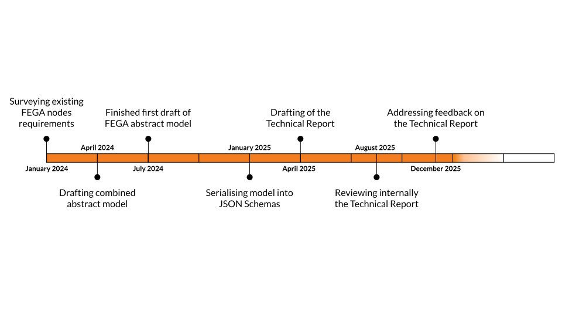

2. ## External involvement

External collaboration included interactions with ELIXIR, GDI, GA4GH, Beacon, BioSchemas and other stakeholders:

1. **GDI** requirements were presented in early MWG meetings, aiming for eventual alignment or convergence of metadata models. Furthermore, participants of the FEGA MWG are also involved in GDI's metadata squad[^129] and the GDI-Beacon metadata workshops[^130].

2. Outreach through **conferences, workshops, and external stakeholder meetings** ensured feedback from diverse stakeholders, including the European Nucleotide Archive[^131],[^132] (ENA), National Bioinformatics Infrastructure Sweden[^133] (NBIS), and the Japanese Genotype-phenotype Archive[^134],[^135] (JGA), among many others.

To gather feedback and ensure broad adoption of the metadata model, the MWG engaged in several outreach activities:

* Distributing multiple **forms** across national and international consortia:

  * "Presentations" form[^136] to organise the kick-off of the group.

  * "Model mapping" form[^137] to collect inputs for the initial design of the EGA v2 metadata model.

  * "Federated EGA metadata model poster feedback" form[^138] to gather feedback from participants of the 2024 ELIXIR All Hands meeting[^139] in Uppsala, Sweden.

  * "Metadata feedback" form[^140] during the 2024 ELIXIR Federated Human Data[^141] (FHD) Community Day[^142] in Lisbon, Portugal.

  * "Accessibility of FEGA metadata" form[^143] to gather insight on the exposure of metadata through FEGA. The results were presented[^144] to the FEGA group and discussed, prompting the organisation of a Metadata Accessibility Workshop in 2026\.

* **Presentations at major workshops**:

  * GDI Pillar II Metadata Workshop[^145] (March 2024).

  * ELIXIR Federated Human Data Community Day[^146] (Nov 2024).

  * BioSchemas Community Day[^147] (Jan 2025).

  * FEGA Technical Deep dive[^148] (March 2025).

  * GA4GH Beacon for Metadata Discovery[^149] (March 2025)

  * Predictor Effector Gene (PEG) working group[^150] (July 2025).

  * ELIXIR Federated Human Data Community Day[^151] (Nov 2025).

* A dedicated **external stakeholders meeting** in July 2024, presenting the "Pruned FEGA Abstract Metadata Model"[^152], and gathering feedback from 25 participants covering diverse projects and teams, such as German National Cohort[^153] (NAKO), GA4GH, ENA, NBIS, Beacon, GDI and JGA.

* Creation of the following **posters**:

  * "Improving metadata compliance and interoperability at EGA with Biovalidator"[^154], presented at the ELIXIR All Hands Meeting in June 2023[^155], in Dublin, Ireland.

  * "Advancing Genomic Data Interoperability: The FEGA Metadata Model"[^156], presented at the ELIXIR All Hands Meeting in June 2024, in Uppsala, Sweden.

  * "Unifying FEGA metadata: A standardized model for multimodal data"[^157], presented at the ELIXIR All Hands Meeting in June 2025[^158], in Thessaloniki, Greece.

* Collaboration from **experts in omics** fields through the use-case sessions (see [***Use-cases***](#use-cases)).

* Creation of this **technical report** to disseminate progress and outcomes.

These activities (and subsequent word-of-mouth) encouraged researchers from a wider network (e.g., PEG, The International Genome Sample Resource[^159]) to connect with the FEGA MWG about metadata models.

3. ## Model entities

During the development of the EGA v2 metadata model, we adopted a **process-centered approach** that emphasises procedural representations over traditional biological experiment or analysis perspectives. See examples of these differences in [Figure 8](#figure-8-representation-of-the-same-sequencing-and-alignment-processes-in-both-the-ega-v1-and-v2-models) and [Figure 9](#figure-9-representation-in-detail-with-real-accessions-of-the-same-sequencing-and-alignment-processes-in-both-the-ega-v1-and-v2-models). This shift allows for a more flexible and comprehensive framework, capable of representing a wide array of processes, not limited to canonical experimental designs. Our approach draws inspiration from models such as the Human Cell Atlas[^160],[^161] (HCA) and the SEEK workflow model[^162],[^163], which have successfully implemented similar methodologies.

The entities defined in the EGA v2 model are as follows. Each of them  listed here with its name (e.g., Biomaterial), the closest match to an ontology term (e.g., OBI:0100051 – not necessarily the only mapping, a replacement, or a 1-to-1 match), and its definition in the EGA v2 model.

* **Biomaterial** (OBI:0100051[^164]): Represents any biological material, from whole organisms (including humans) to subcellular components and macromolecules (e.g., DNA samples).

* **Protocol** (prov:Plan[^165]): Detailed plan of instructions on how a procedure is done. For example, sample preparation, sequencing or feature extraction techniques. See [*Disambiguation*](#processes-and-protocols).

* **Process** (prov:Activity[^166]): A specific execution of a protocol or procedure, applied to specific inputs (Biomaterial or Datafile) and producing specific outputs (Biomaterial or Datafile). See [*Disambiguation*](#processes-and-protocols).

* **Datafile** (dcat:Distribution[^167]): A resource containing data. Includes a diverse range of formats (e.g., BAM, VCF, mzML) from multiple life science domains (e.g., genomics, imaging, phenoclinical, proteomics). See [*Disambiguation*](#datasets-and-datafiles).

* **Dataset** (dcat:Dataset[^168]): A collection of Datafiles[^169], published or curated by a single agent, and available for access or download in one or more representations. Datasets are subject to a particular policy for controlled-access, commonly making them the units of access distribution. See [*Disambiguation*](#datasets-and-datafiles).

* **Policy** (dcterms:RightsStatement[^170]): Data access policy, governing how data is processed, protected, and shared. It can include, for example, data use conditions and references to the dataset's Data Access Agreement (DAA).

* **Data Access Committee (DAC)** (prov:Agent[^171]): Body managing data access requests, overseeing the approval process for data usage in accordance with its defined Policy.

* **Study** (schema:ResearchProject[^172]): Compilation of Protocol Collections (e.g., examinations, analyses or critical inspections) applied to investigate a particular topic within the context of a given Project.

* **Cohort** (prov:Collection[^173]): A group of Biomaterials (e.g., individuals, biopsies) sharing specific characteristics, facilitating comparative studies and discovery.

* **Project** (schema:Project[^174]): Umbrella record that groups related Studies and Datasets under a single scientific or funding scope.

* **Protocol collection** (prov:Collection, prov:Plan): A versioned set of Protocol records that together define a complete workflow. May include a single or multiple protocols, depending on the desired granularity by the submitter. See [*Disambiguation*](#processes-and-protocols).

* **Catalog** (dcat:Catalog[^175]): Curated collection of metadata about all Datasets exposed by CEGA or a FEGA node.

* **Catalog Record** (dcat:CatalogRecord[^176]): Administrative entity that logs the registration details (e.g., date, agent, status) for a single Dataset (its primary topic) within CEGA's/FEGA nodes' catalogs.

To see these entities in use, refer to the examples in the [*Use-cases*](#use-cases) section.

4. ## Model cardinality

A simplified version of the EGA v2 model can be seen in a diagram in [Figure 4](#figure-4-flow-diagram-representing-an-oversimplification-of-the-model-entities-and-relationships-of-the-ega-v2-metadata-model). In it, we represent a quick, **five-block overview**: biomaterial, activities, datafiles, and the administrative and data management layers.

##### ***Figure 4\.** Flow diagram representing an oversimplification of the model entities and relationships of the EGA v2 metadata model.*

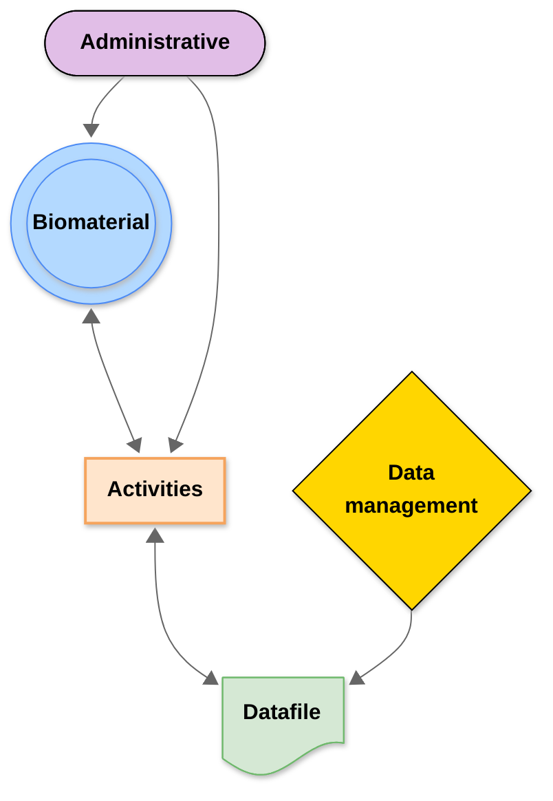
```mermaid
---
config:
  theme: neutral
  look: neo
  layout: dagre
---
flowchart TB
    n28["<b>Biomaterial</b><p></p>"] <--> n27@{ label: "<b style=\"font-weight:\">Activities</b>" }
    n27 <--> n29@{ label: "<b style=\"font-weight:\">Datafile</b>" }
    n26(["<b>Administrative</b>"]) --> n28
    n25["<b>Data<br>management</b>"] --> n29
    n26 --> n27

    n28@{ shape: dbl-circ}
    n27@{ shape: rect}
    n29@{ shape: doc}
    n25@{ shape: diam}
     n28:::biomaterial
     n27:::process
     n29:::datafile
     n26:::Administrative
     n25:::dataManagement
    classDef biomaterial fill:#B3D9FF,stroke:#4C8BF5,stroke-width:1px
    classDef datafile   fill:#D5E8D4,stroke:#6FB96C,stroke-width:1px
    classDef process fill:#FFE5CC, stroke:#F5A45D, stroke-width:2px, stroke-dasharray: 0
    classDef protocol fill:#FFE5CC, stroke:#F5A45D, stroke-width:2px, fill:#feeedf, background-color:#feeedf, stroke-dasharray: 2
    classDef Collection fill:#ffb875, color:#000000, stroke-width:1px, stroke-dasharray: 0, stroke:#000000
    classDef Administrative stroke:#000000, fill:#E1BEE7, color:#000000
    classDef dataManagement fill:#FFD600, stroke:#000000, color:#000000
```

The summarised view of [Figure 4](#figure-4-flow-diagram-representing-an-oversimplification-of-the-model-entities-and-relationships-of-the-ega-v2-metadata-model) is expanded further in [Figure 5](#figure-5-flow-diagram-representing-the-entities-and-relationships-of-the-ega-v2-metadata-model), with mapped terms (e.g., dcat:Distribution) and semantically tagged relationships (e.g., prov:wasUsedBy). Domain namespaces in the diagram are:

* **prov**: Provenance[^177].

* **dcat**: Data Catalog Vocabulary[^178].

* **dcterms**: Dublin Core Metadata Initiative Terms[^179].

* **schema**: Schema.org[^180].

* **foaf**: Friend of a Friend[^181].

Cardinality constraints (e.g., "*how many datafiles can a process generate*") need to be further defined (ongoing discussions).

Furthermore, note that cardinality between the model entities in [Figure 5](#figure-5-flow-diagram-representing-the-entities-and-relationships-of-the-ega-v2-metadata-model) is classified as:

* **Core**. Implies the default connections between entities envisioned by the model. In other words, the source of truth for how to link parts of the model.

* **Implementation**. Corresponds to inferred relationships that may help with querying the model once it is in use. These are mere suggestions to facilitate the recovery of information through queries, based on common discoverability patterns (e.g., a user requesting to know which cohorts participated in a study), and should be based on, not replace, the core ones.

##### ***Figure 5\.** Flow diagram representing the entities and relationships of the EGA v2 metadata model.*

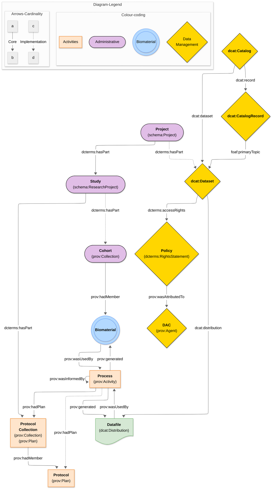
```mermaid
---
config:
  theme: neutral
  look: neo
  layout: dagre
  flowchart:
    defaultRenderer: elk
---
flowchart TB
 subgraph s1["Colour-coding"]
        Administrative1(["Administrative"])
        Biomaterial1["Biomaterial"]
        Activities1["Activities"]
        DataManagement["Data<br>Management"]
  end
 subgraph s2["Arrows-Cardinality"]
        b["b"]
        a["a"]
        d["d"]
        c["c"]
  end
 subgraph s3["Diagram-Legend"]
        s1
        s2
  end
    a -- Core --> b
    c -. Implementation ..-> d
    Project@{ label: "<b style=\"color:\">Project<br></b>(schema:Project)" } -- dcterms:hasPart --> Study(["<b>Study<br></b>(schema:ResearchProject)<b></b>"])
    Project -. dcterms:hasPart ..-> Dataset["<b>dcat:Dataset<br></b>"]
    Study -- dcterms:hasPart --> ProtocolCollection@{ label: "<b style=\"color:\">Protocol</b><br><b style=\"color:\">Collection</b><br>(prov:Collection)<br>(prov:Plan)" }
    Study -. dcterms:hasPart ..-> Cohort(["<b>Cohort</b><br>(prov:Collection)"])
    Cohort -- prov:hadMember --> Biomaterial["<b>Biomaterial</b><p></p>"]
    ProtocolCollection -- prov:hadMember --> Protocol["<b>Protocol</b><br>(prov:Plan)"]
    Biomaterial -- prov:wasUsedBy --> Process@{ label: "<b style=\"font-weight:\">Process</b><br>(prov:Activity)" }
    Process -- prov:generated --> Datafile@{ label: "<b style=\"font-weight:\">Datafile</b><br>(dcat:Distribution)" } & Biomaterial
    Datafile -- prov:wasUsedBy --> Process
    Process -- prov:wasInformedBy --> Process
    Process -- prov:hadPlan --> ProtocolCollection
    Process -. prov:hadPlan ..-> Protocol
    Dataset -- dcterms:accessRights --> Policy@{ label: "<span style=\"color:\"><b>Policy </b><br></span>(dcterms:RightsStatement)" }
    Policy -- prov:wasAttributedTo --> DAC["<b>DAC</b><br>(prov:Agent)"]
    Dataset -- dcat:distribution --> Datafile
    Catalog["<b>dcat:Catalog<br></b>"] -- dcat:dataset --> Dataset
    Catalog -- dcat:record --> CatalogRecord["<b>dcat:CatalogRecord</b>"]
    CatalogRecord -- "<span style=color:>foaf:primaryTopic</span>" --> Dataset

    Biomaterial1@{ shape: dbl-circ}
    DataManagement@{ shape: diam}
    Biomaterial@{ shape: dbl-circ}
    Process@{ shape: rect}
    Datafile@{ shape: doc}
    ProtocolCollection@{ shape: rect}
    Protocol@{ shape: rect}
    Policy@{ shape: diam}
    DAC@{ shape: diam}
    Project@{ shape: stadium}
    Dataset@{ shape: diam}
    Catalog@{ shape: diam}
    CatalogRecord@{ shape: diam}
     Administrative1:::Administrative
     Biomaterial1:::biomaterial
     Activities1:::protocol
     DataManagement:::dataManagement
     Biomaterial:::biomaterial
     Process:::protocol
     Datafile:::datafile
     ProtocolCollection:::protocol
     ProtocolCollection:::protocol
     Protocol:::protocol
     Policy:::dataManagement
     DAC:::dataManagement
     Study:::Administrative
     Cohort:::Administrative
     Project:::Administrative
     Dataset:::dataManagement
     Catalog:::dataManagement
     CatalogRecord:::dataManagement
    classDef biomaterial fill:#B3D9FF,stroke:#4C8BF5,stroke-width:1px
    classDef datafile   fill:#D5E8D4,stroke:#6FB96C,stroke-width:1px
    classDef protocol fill:#FFE5CC, stroke:#F5A45D, stroke-width:2px, stroke-dasharray: 0
    classDef Administrative stroke:#000000, fill:#E1BEE7, color:#000000
    classDef dataManagement fill:#FFD600, stroke:#000000, color:#000000
```

1. ### Disambiguations

Given the highly heterogeneous ways in which entities can be used by the researchers and submitters, their definitions are defined broadly. Nevertheless, to facilitate the submission and querying of metadata, in this section we further disambiguate the nuances between entities, narrowing their use.

1. #### Processes and Protocols

A Process (prov:Activity) is linked to the applied collection of protocols (i.e., plans) using prov:hadPlan[^182]. In these protocols, agents (prov:Agent, e.g., a lab technician) adopted different roles in the context of the activity (e.g., DNA extraction) to transform an input (e.g., blood sample biomaterial) into an output (e.g., DNA sample biomaterial).

Linking the individual protocols and the activities is the Protocol Collection: the "plan at this granularity", where submitters have freedom over how many protocols are applied in each process. Groupings by Protocol Collection highly resemble the legacy groupings of Experiment or Analysis in the EGA v1 model.

This distinction supports different representations (see [Figure 6](#figure-6-visual-representation-of-the-different-process-trees-based-on-the-submission-granularity) and [Figure 13](#figure-13-comparison-of-differences-between-examples-for-individual-b-and-a-in-ega-v2-model)) of the plans based on the given detail:

* **Coarse submission** (few processes, multiple protocols per process). One process points (via prov:hadPlan) to one Protocol Collection (which is the composite plan). This collection lists the individual protocols as members of its grouping via prov:hadMember[^183].  
  This setting would correspond to the canonical EGA v1 Experiment definition, for example, where multiple protocols (e.g., sample preparation, DNA extraction, sequencing) were grouped under a single collection (i.e., the experiment).

* **Detailed submission** (multiple processes, one or multiple protocols per process). The overall workflow is split into numerous processes, having a granular step-by-step chain of input-process-output.  
  This approach would suit a detailed design, where data of each activity (e.g., execution date, performers) were known, and thus structured as individual nodes of a process tree.

##### ***Figure 6\.** Visual representation of the different process trees based on the submission granularity.*

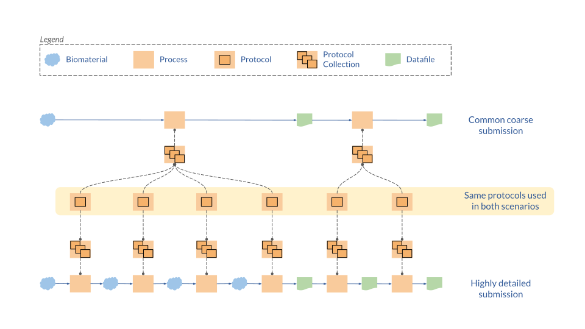

Examples of these two can be found in the [*Microarray*](#microarray) use-case section.

It is important to note that prov:hadMember expresses membership alone, not ordering. The main aim of the model is not to contain the full and detailed protocol information of each activity, but the information to enable discoverability of data. Therefore, protocol order was not deemed worth bringing into the mix. If this were to change, other models such as P-Plan[^184] could be considered.

On a different note, **processes** can be classified in **four categories** (see [Table 2](#table-2-classification-of-processes-based-on-input-output-combinations), [Figure 7](#figure-7-classification-of-processes-and-comparison-of-ega-v1-experimentsanalysis-and-ega-v2-processes)) depending on the input-output combinations. These categories are merely informative, and are foreseen to greatly help users discover relevant datasets in EGA.

###### ***Table 2**. Classification of processes based on input-output combinations.*

|  |  | Output |  |
| :---: | :---: | :---: | :---: |
|  |  | Biomaterial | Datafile |
| **Input** | Biomaterial | Sample preparation | Assay |
|  | Datafile | Synthetic biology | Analysis |

It is important to understand the differences and similarities between EGA v1 and v2 with respect to processes. What in EGA v1 is represented by experiments and analyses, in EGA v2 is represented by sequential processes of different types. In [Figure 7](#figure-7-classification-of-processes-and-comparison-of-ega-v1-experimentsanalysis-and-ega-v2-processes), these similarities are visualized by encompassing the processes of a mock example in what would be their corresponding representations in EGA v1 and v2 conceptual models. See further details at the [*CEGA use-case*](#worked-example) section.

##### ***Figure 7\.** Classification of processes and comparison of EGA v1 experiments/analysis and EGA v2 processes.*

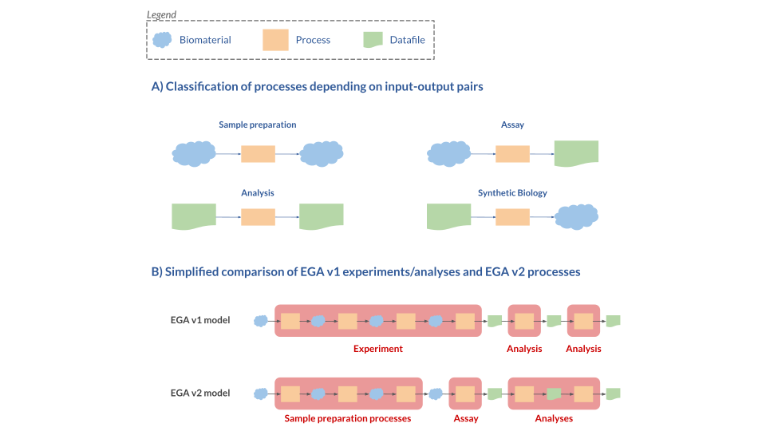

2. #### Datasets and Datafiles

In DCAT, datasets carry "dataset-level" descriptive metadata, while distributions carry "delivery/access" metadata (e.g., download URLs, media type, byte size). 

DCAT notes that distributions of one dataset "should broadly contain the same data". This view of datasets and distributions in DCAT **partly conflicts** with the canonical EGA v1 model definition, where datafiles are parts of a dataset, and not alternative ways to access the same data. Nevertheless, DCAT also states that the boundary between "same dataset, multiple distributions" versus "different datasets" is application-specific and up to community practice. There is no expectation that different downloadable distributions must contain exactly equivalent information. For example, different distributions **might include or exclude different subsets** of the entire dataset.

In order to avoid highly nested datasets (i.e., each Datafile being a Dataset) and overly complicated Datafile metadata, EGA v2 adopts in this model the **practical convention** that: (1) a **Dataset** corresponds to the **collection of datafiles** under the same Policy; while (2) **Datafiles** are the **file-level distributions** that make up a Dataset.

5. ## Use-cases

In this section, we review **metadata modelling use-cases that the FEGA community may face** and show how each one maps to the proposed EGA v2 metadata model, side-by-side with the current EGA v1 model when relevant. The goal is to reassure the community that their data is represented seamlessly through, and thus encourage the adoption of, the EGA v2 model.

Each of these use-cases has been worked through as a **community effort**, by setting up "*FEGA Use-case sessions*", open to everyone, where a volunteer presented an example dataset and the attendees, including experts in the field, modelled it in detail using the EGA v2 model entities.

These sessions were held in the order shown below. The large Excalidraw[^185] diagrams ([Annexes 1 to 4](#annexes)) are snapshots from those sessions: they capture the hands-on work and discussions, but may not reflect the final model in every detail. Treat them as historical evidence of the process, not as authoritative diagrams. The mermaid diagrams and written explanations in each use-case are up to date, and note any model changes that occurred after each session.

To date, the MWG has organised **four use-case sessions**: (1) CEGA; (2) Microarray; (3) Proteomics; and (4) Microbiome. Based on the discussion held during the ELIXIR Federated Human Data (FHD) Community Day[^186],[^187] 2025 in Lausanne, Switzerland, future use-case session candidates are: Cohorts/Biobanks, Imaging, Phenotypic/Clinical (e.g., longitudinal study), Single-cell Sequencing, and Exposome. We welcome any suggestions for other possible scenarios that should be tested with the model and are different to the existing ones.

1. ### CEGA use-case

Here we describe the session held by the MWG, use a submission example and summarise its outcomes, working out an updated representation of a CEGA submission (natively in EGA v1 model) using the EGA v2 model. For further details (slides, recording, diagrams, etc.), please refer to the session agenda**[^188]**.

In this use-case, we went through the most common CEGA submission type: **genomics**. Given that attendees brought their own datasets to model, the group split into:

* An **example synthetic dataset** (EGAD00001008392[^189]) submitted to CEGA. This was the example that attendees of groups A and B (see [Annex 1](#annexes)) took during the hands-on session.

* A **real-world submission in progress**, brought by Robin Liechti. This was the example that group C (see [Annex 1](#annexes)) took during the hands-on session.

  1. #### Key session outcomes

* The **EGA v2 model can adequately represent the most common CEGA submission** type (sequencing) without losing information.

* The **Protocol Collection** entity was added to the EGA v2 model.

  2. #### Worked example

Below, we model in detail the **synthetic dataset example** (EGAD00001008392). In doing so, we pinpoint the **similarities and overlapping semantic entities across models**, bridging both the EGA v1 and v2 metadata models.

For the sake of simplicity, we do **not** cover all entities in this dataset, given how verbose the output diagram would be. Nevertheless, we go over types that are different across models, with sufficient coverage for this exercise. For further details about the dataset itself, please request access[^190] to the dataset, which is managed by CEGA. Alternatively, you can see a summary of the dataset in the slides[^191] of the session.

To understand the transition from EGA v1 to EGA v2 models, we need to clarify one of the key differences: **modularity of processes**. As explained in the [*Model entities*](#model-entities) section, and depicted in [Figure 7](#figure-7-classification-of-processes-and-comparison-of-ega-v1-experimentsanalysis-and-ega-v2-processes) and [Figure 8](#figure-8-representation-of-the-same-sequencing-and-alignment-processes-in-both-the-ega-v1-and-v2-models), when we have a sample in the EGA v1 model, it can be linked to datafiles either through EXPERIMENTs and RUNs, or through ANALYSES. Meanwhile, the EGA v2 model simply represents them as different types of **procedural steps**, each with its specific protocol collection and process.

##### ***Figure 8\.** Representation of the same sequencing and alignment processes in both the EGA v1 and v2 models.*

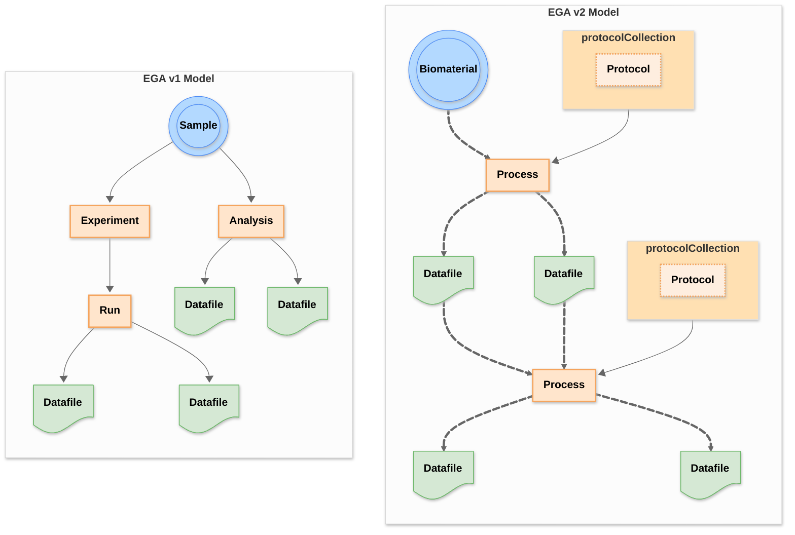
```mermaid
---
config:
  theme: neutral
  look: neo
  layout: dagre
---
flowchart TB
 subgraph PC1["<b>protocolCollection</b>"]
        n5@{ label: "<span style=\"--tw-scale-x:\"><b>Protocol</b></span>" }
  end
 subgraph PC2["<b>protocolCollection</b>"]
        n6@{ label: "<span style=\"--tw-scale-x:\"><b>Protocol</b></span>" }
  end
 subgraph subGraph1["<b>EGA v2 Model</b>"]
    direction TB
        BIOMATERIAL@{ label: "<span id=\"docs-internal-guid-84ef360c-7fff-ac07-a967-8e0e2d2cd0a6\"><p dir=\"ltr\" style=\"line-height:\"><b>Biomaterial</b></p></span>" }
        PC1
        SEQ_PROC["<b>Process</b>"]
        RAW1@{ label: "<span id=\"docs-internal-guid-0b3e6dab-7fff-d37f-2424-d6e086a28925\"><p dir=\"ltr\" style=\"line-height:\"><span style=\"--tw-scale-x:\"><b>Datafile</b></span></p></span>" }
        RAW2@{ label: "<span id=\"docs-internal-guid-7c3da251-7fff-4b43-c949-00faa3d41998\"><p dir=\"ltr\" style=\"line-height:\"><b>Datafile</b></p></span>" }
        PC2
        ALIGN_PROC["<b>Process</b>"]
        ALN1@{ label: "<span id=\"docs-internal-guid-2f637a91-7fff-13ce-bd05-29006547af08\"><p dir=\"ltr\" style=\"line-height:\"><span style=\"--tw-scale-x:\"><b>Datafile</b></span></p></span>" }
        ALN2@{ label: "<span id=\"docs-internal-guid-de137c36-7fff-d5b1-e230-7858938ba490\"><p dir=\"ltr\" style=\"line-height:\"><span style=\"--tw-scale-x:\"><b>Datafile</b></span></p></span>" }
  end
 subgraph subGraph0["<b>EGA v1 Model</b>"]
    direction TB
        SAMPLE((("<b>Sample</b>")))
        EXPERIMENT["<b>Experiment</b>"]
        RUN@{ label: "<span id=\"docs-internal-guid-ea14d459-7fff-9dcb-740a-884694fbca24\"><span style=\"font-size:\"><b>Run</b></span></span>" }
        ANALYSIS["<b>Analysis</b>"]
        n1@{ label: "<span id=\"docs-internal-guid-0b3e6dab-7fff-d37f-2424-d6e086a28925\"><p dir=\"ltr\" style=\"line-height:\"><span style=\"--tw-scale-x:\"><b>Datafile</b></span></p></span>" }
        n2@{ label: "<span id=\"docs-internal-guid-0b3e6dab-7fff-d37f-2424-d6e086a28925\"><p dir=\"ltr\" style=\"line-height:\"><span style=\"--tw-scale-x:\"><b>Datafile</b></span></p></span>" }
        n3@{ label: "<span id=\"docs-internal-guid-2f637a91-7fff-13ce-bd05-29006547af08\"><p dir=\"ltr\" style=\"line-height:\"><span style=\"--tw-scale-x:\"><b>Datafile</b></span></p></span>" }
        n4@{ label: "<span id=\"docs-internal-guid-de137c36-7fff-d5b1-e230-7858938ba490\"><p dir=\"ltr\" style=\"line-height:\"><span style=\"--tw-scale-x:\"><b>Datafile</b></span></p></span>" }
  end
    SAMPLE --> EXPERIMENT & ANALYSIS
    EXPERIMENT --> RUN
    RUN --> n1 & n2
    BIOMATERIAL BIO_PROC1@==> SEQ_PROC
    PC1 --> SEQ_PROC
    SEQ_PROC L_SEQ_PROC_RAW1_0@==> RAW1 & RAW2
    RAW1 L_RAW1_ALIGN_PROC_0@==> ALIGN_PROC
    RAW2 L_RAW2_ALIGN_PROC_0@==> ALIGN_PROC
    PC2 --> ALIGN_PROC
    ALIGN_PROC PROC_ALN1@==> ALN1 & ALN2
    ANALYSIS --> n3 & n4
    EXPERIMENT@{ shape: rect}
    RUN@{ shape: rect}
    ANALYSIS@{ shape: rect}
    n1@{ shape: doc}
    n2@{ shape: doc}
    n3@{ shape: doc}
    n4@{ shape: doc}
    n5@{ shape: rect}
    n6@{ shape: rect}
    BIOMATERIAL@{ shape: dbl-circ}
    RAW1@{ shape: doc}
    RAW2@{ shape: doc}
    ALN1@{ shape: doc}
    ALN2@{ shape: doc}
     SAMPLE:::biomaterial
     EXPERIMENT:::process
     RUN:::process
     ANALYSIS:::process
     n1:::datafile
     n2:::datafile
     n3:::datafile
     n4:::datafile
     n5:::protocol
     n6:::protocol
     BIOMATERIAL:::biomaterial
     SEQ_PROC:::process
     RAW1:::datafile
     RAW2:::datafile
     ALIGN_PROC:::process
     ALN1:::datafile
     ALN2:::datafile
    classDef biomaterial fill:#B3D9FF,stroke:#4C8BF5,stroke-width:1px
    classDef datafile   fill:#D5E8D4,stroke:#6FB96C,stroke-width:1px
    classDef process fill:#FFE5CC, stroke:#F5A45D, stroke-width:2px, stroke-dasharray: 0
    classDef protocol fill:#FFE5CC, stroke:#F5A45D, stroke-width:2px, fill:#feeedf, background-color:#feeedf, stroke-dasharray: 2
    style PC1 fill:#FFE0B2
    style PC2 fill:#FFE0B2
    BIO_PROC1@{ animation: slow } 
    L_SEQ_PROC_RAW1_0@{ animation: slow } 
    L_SEQ_PROC_RAW2_0@{ animation: slow } 
    L_RAW1_ALIGN_PROC_0@{ animation: slow } 
    L_RAW2_ALIGN_PROC_0@{ animation: slow } 
    PROC_ALN1@{ animation: slow } 
    L_ALIGN_PROC_ALN2_0@{ animation: slow }
```

Now let us replace the placeholder names (e.g., Datafile) with the **real identifiers and given names** from the example dataset, and explore the differences across models (see [Figure 9](#figure-9-representation-in-detail-with-real-accessions-of-the-same-sequencing-and-alignment-processes-in-both-the-ega-v1-and-v2-models)). In the synthetic dataset, sample EGAN00003364608 (named case2\_father), was used by a sequencing experiment (EGAX00002583878), associated with a run (EGAR00003021169) that contains two datafiles (two FASTQ files).

This can be represented in a simple way through the EGA v2 model: a **biomaterial** (case2\_father) was used as **input in a process** that followed two protocols (library preparation and sequencing) and produced as **output** two **FASTQ files**.

If we go one step further, we start to see the **utility of the EGA v2 model and its modularity**. The way the original dataset was modelled in the EGA v1 model, these two FASTQ files were used in an analysis (EGAZ00001743989) to create an alignment (BAM) file. At first glance, it looks apparent in the EGA v1 model that these two FASTQ files were the input for such an analysis, but this is an **implicit association** based on the filenames. In other words, **in the EGA v1 model there is no direct linkage between the FASTQ and BAM files**.

On the other hand, in the **EGA v2 model**, we **explicitly** indicate that the quality control and alignment process had these two FASTQ files as inputs, creating a **procedural sequence**: a material entity (the biomaterial sample) was sequenced, and its sequencing files were aligned to produce a BAM file.

##### ***Figure 9\.** Representation in detail (with real accessions) of the same sequencing and alignment processes in both the EGA v1 and v2 models.*

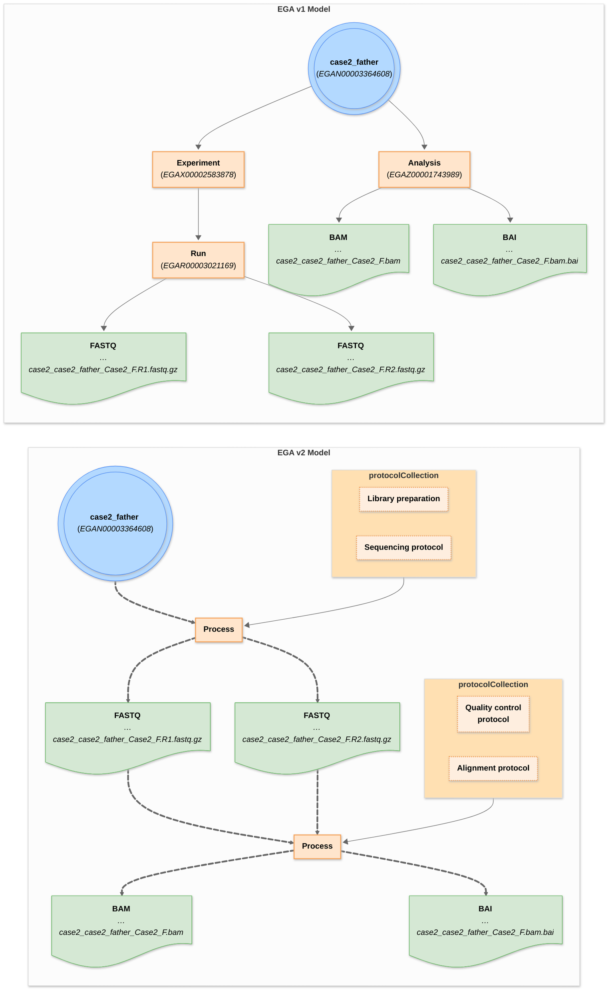
```mermaid
---
config:
  theme: neutral
  look: neo
  layout: dagre
---
flowchart LR
 subgraph PC1["<b>protocolCollection</b>"]
        SEQ_PROTOCOL["<b>Library preparation</b>"]
        n5@{ label: "<span style=\"--tw-scale-x:\"><b>Sequencing protocol</b></span>" }
  end
 subgraph PC2["<b>protocolCollection</b>"]
        ALIGN_PROTOCOL["<b>Quality control<br>protocol</b>"]
        n6["<b>Alignment protocol</b>"]
  end
 subgraph subGraph1["<b>EGA v2 Model</b>"]
    direction TB
        BIOMATERIAL@{ label: "<span id=\"docs-internal-guid-84ef360c-7fff-ac07-a967-8e0e2d2cd0a6\"><p dir=\"ltr\" style=\"line-height:\"><span style=\"font-size:\"><b>case2_father </b>(<i>EGAN00003364608</i>)</span></p></span>" }
        PC1
        SEQ_PROC["<b>Process</b>"]
        RAW1@{ label: "<span id=\"docs-internal-guid-0b3e6dab-7fff-d37f-2424-d6e086a28925\"><p dir=\"ltr\" style=\"line-height:\"><span style=\"font-size:\"><b>FASTQ</b></span><span style=\"font-size:\"><br></span><span style=\"font-size:\">…</span><span style=\"font-size:\"><i>case2_case2_father_Case2_F.R1.fastq.gz</i></span></p></span>" }
        RAW2@{ label: "<span id=\"docs-internal-guid-7c3da251-7fff-4b43-c949-00faa3d41998\"><p dir=\"ltr\" style=\"line-height:\"><span style=\"font-size:\"><b>FASTQ</b></span><span style=\"font-size:\"><br></span><i><span style=\"font-size:\">…</span><span style=\"font-size:\">case2_case2_father_Case2_F.R2.fastq.gz</span></i></p></span>" }
        PC2
        ALIGN_PROC["<b>Process</b>"]
        ALN1@{ label: "<span id=\"docs-internal-guid-2f637a91-7fff-13ce-bd05-29006547af08\"><p dir=\"ltr\" style=\"line-height:\"><span style=\"font-size:\"><b>BAM</b></span><span style=\"font-size:\"><br></span><i><span style=\"font-size:\">…</span><span style=\"font-size:\">case2_case2_father_Case2_F.bam</span></i></p></span>" }
        ALN2@{ label: "<span id=\"docs-internal-guid-de137c36-7fff-d5b1-e230-7858938ba490\"><p dir=\"ltr\" style=\"line-height:\"><span style=\"font-size:\"><b>BAI</b></span><span style=\"font-size:\"><br></span><i><span style=\"font-size:\">…</span><span style=\"font-size:\">case2_case2_father_Case2_F.bam.bai</span></i></p></span>" }
  end
   subgraph subGraph0["<b>EGA v1 Model</b>"]
    direction TB
        SAMPLE@{ label: "<span style=\"--tw-scale-x:\"><b>case2_father</b><br></span>(<i style=\"--tw-scale-x:\">EGAN00003364608</i>)" }
        EXPERIMENT@{ label: "<b>Experiment </b><br>(<span style=\"background-color:\"><i>EGAX00002583878</i></span>)" }
        RUN@{ label: "<span id=\"docs-internal-guid-ea14d459-7fff-9dcb-740a-884694fbca24\"><span style=\"font-size:\"><b>Run</b><br>(<i>EGAR00003021169</i>)</span></span>" }
        ANALYSIS@{ label: "<b>Analysis<br></b>(<span style=\"background-color:\"><i>EGAZ00001743989</i>)</span>" }
        n1@{ label: "<span id=\"docs-internal-guid-0b3e6dab-7fff-d37f-2424-d6e086a28925\"><p dir=\"ltr\" style=\"line-height:\"><span style=\"font-size:\"><b>FASTQ</b></span><span style=\"font-size:\"><br></span><span style=\"font-size:\">…</span><span style=\"font-size:\"><i>case2_case2_father_Case2_F.R1.fastq.gz</i></span></p></span>" }
        n2@{ label: "<span id=\"docs-internal-guid-0b3e6dab-7fff-d37f-2424-d6e086a28925\"><p dir=\"ltr\" style=\"line-height:\"><span style=\"font-size:\"><b>FASTQ</b></span><span style=\"font-size:\"><br></span><span style=\"font-size:\">…</span><span style=\"font-size:\"><i>case2_case2_father_Case2_F.R2.fastq.gz</i></span></p></span>" }
        n3@{ label: "<span id=\"docs-internal-guid-2f637a91-7fff-13ce-bd05-29006547af08\"><p dir=\"ltr\" style=\"line-height:\"><span style=\"font-size:\"><b>BAM</b></span><span style=\"font-size:\"><br></span><i><span style=\"font-size:\">…</span><span style=\"font-size:\">case2_case2_father_Case2_F.bam</span></i></p></span>" }
        n4@{ label: "<span id=\"docs-internal-guid-de137c36-7fff-d5b1-e230-7858938ba490\"><p dir=\"ltr\" style=\"line-height:\"><span style=\"font-size:\"><b>BAI</b></span><span style=\"font-size:\"><br></span><i><span style=\"font-size:\">…</span><span style=\"font-size:\">case2_case2_father_Case2_F.bam.bai</span></i></p></span>" }
  end
    SAMPLE --> EXPERIMENT & ANALYSIS
    EXPERIMENT --> RUN
    RUN --> n1 & n2
    BIOMATERIAL BIO_PROC1@==> SEQ_PROC
    PC1 --> SEQ_PROC
    SEQ_PROC L_SEQ_PROC_RAW1_0@==> RAW1 & RAW2
    RAW1 L_RAW1_ALIGN_PROC_0@==> ALIGN_PROC
    RAW2 L_RAW2_ALIGN_PROC_0@==> ALIGN_PROC
    PC2 --> ALIGN_PROC
    ALIGN_PROC PROC_ALN1@==> ALN1 & ALN2
    ANALYSIS --> n3 & n4
    SAMPLE@{ shape: doublecircle}
    EXPERIMENT@{ shape: rect}
    RUN@{ shape: rect}
    ANALYSIS@{ shape: rect}
    n1@{ shape: doc}
    n2@{ shape: doc}
    n3@{ shape: doc}
    n4@{ shape: doc}
    n5@{ shape: rect}
    n6@{ shape: rect}
    BIOMATERIAL@{ shape: dbl-circ}
    RAW1@{ shape: doc}
    RAW2@{ shape: doc}
    ALN1@{ shape: doc}
    ALN2@{ shape: doc}
     SAMPLE:::biomaterial
     EXPERIMENT:::process
     RUN:::process
     ANALYSIS:::process
     n1:::datafile
     n2:::datafile
     n3:::datafile
     n4:::datafile
     SEQ_PROTOCOL:::protocol
     n5:::protocol
     ALIGN_PROTOCOL:::protocol
     n6:::protocol
     BIOMATERIAL:::biomaterial
     SEQ_PROC:::process
     RAW1:::datafile
     RAW2:::datafile
     ALIGN_PROC:::process
     ALN1:::datafile
     ALN2:::datafile
    classDef biomaterial fill:#B3D9FF,stroke:#4C8BF5,stroke-width:1px
    classDef datafile   fill:#D5E8D4,stroke:#6FB96C,stroke-width:1px
    classDef process fill:#FFE5CC, stroke:#F5A45D, stroke-width:2px, stroke-dasharray: 0
    classDef protocol fill:#FFE5CC, stroke:#F5A45D, stroke-width:2px, fill:#feeedf, background-color:#feeedf, stroke-dasharray: 2
    style PC1 fill:#FFE0B2
    style PC2 fill:#FFE0B2
    BIO_PROC1@{ animation: slow } 
    L_SEQ_PROC_RAW1_0@{ animation: slow } 
    L_SEQ_PROC_RAW2_0@{ animation: slow } 
    L_RAW1_ALIGN_PROC_0@{ animation: slow } 
    L_RAW2_ALIGN_PROC_0@{ animation: slow } 
    PROC_ALN1@{ animation: slow } 
    L_ALIGN_PROC_ALN2_0@{ animation: slow }
```

Similarly, we could continue down this route where, in this same dataset, each sample has 24 VCF files derived from a variant calling process, using their respective BAM files as inputs. All these analyses sit as individual entities in the EGA v1 model, while they form a process tree in the future approach, enabling provenance tracking.

Regarding **administrative** (Study) and **data management entities** (Dataset, Policy and DAC), the representation would be extremely similar across models (see [Figure 10](#figure-10-representation-in-detail-with-real-accessions-of-the-whole-worked-cega-example-modelled-through-ega-v1-model) and [Figure 11](#figure-11-representation-in-detail-with-real-accessions-of-the-worked-cega-example-modelled-through-the-ega-v2-model)). The main differences are the cardinality between entities, rather than the entities themselves. For example, a dataset in the EGA v1 model is linked to analyses and runs, while in the EGA v2 model it is connected to datafiles.

##### ***Figure 10\.** Representation in detail (with real accessions) of the whole worked CEGA example modelled through EGA v1 model.*

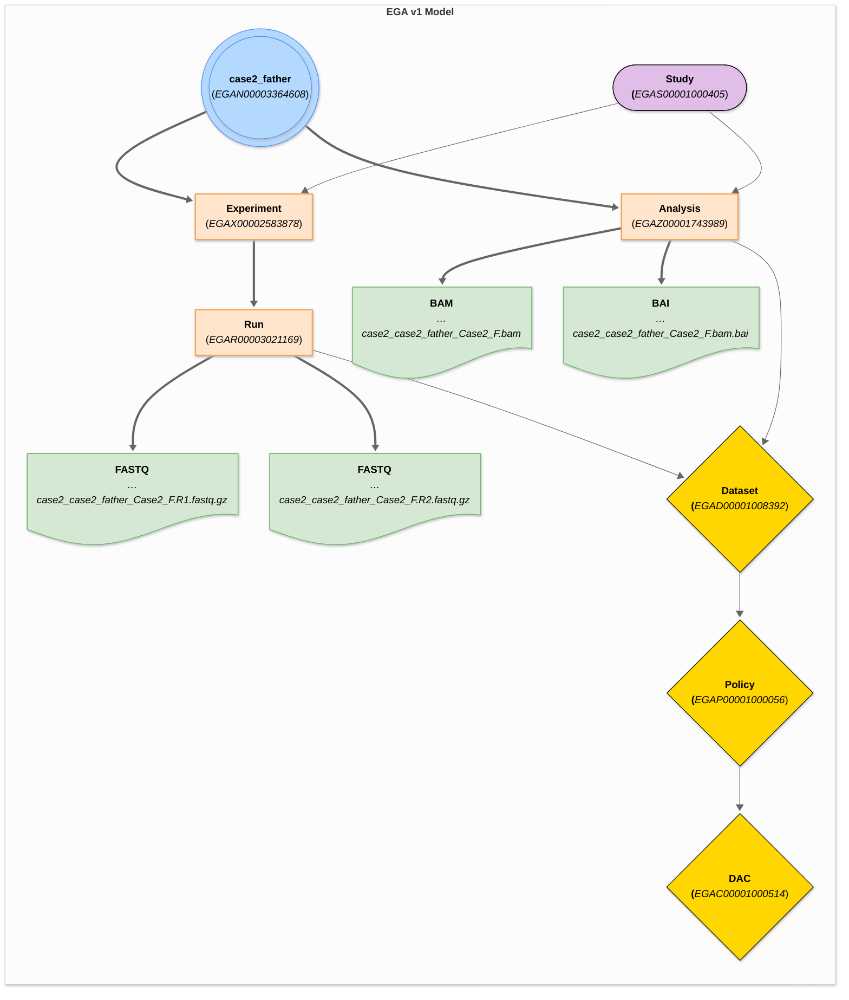
```mermaid
---
config:
  theme: neutral
  look: neo
  layout: dagre
---
flowchart LR
 subgraph subGraph0["<b>EGA v1 Model</b>"]
    direction TB
        SAMPLE@{ label: "<span style=\"--tw-scale-x:\"><b>case2_father</b><br></span>(<i style=\"--tw-scale-x:\">EGAN00003364608</i>)" }
        EXPERIMENT@{ label: "<b>Experiment </b><br>(<span style=\"background-color:\"><i>EGAX00002583878</i></span>)" }
        RUN@{ label: "<span id=\"docs-internal-guid-ea14d459-7fff-9dcb-740a-884694fbca24\"><span style=\"font-size:\"><b>Run</b><br>(<i>EGAR00003021169</i>)</span></span>" }
        ANALYSIS@{ label: "<b>Analysis<br></b>(<span style=\"background-color:\"><i>EGAZ00001743989</i>)</span>" }
        n1@{ label: "<span id=\"docs-internal-guid-0b3e6dab-7fff-d37f-2424-d6e086a28925\"><p dir=\"ltr\" style=\"line-height:\"><span style=\"font-size:\"><b>FASTQ</b></span><span style=\"font-size:\"><br></span><span style=\"font-size:\">…</span><span style=\"font-size:\"><i>case2_case2_father_Case2_F.R1.fastq.gz</i></span></p></span>" }
        n2@{ label: "<span id=\"docs-internal-guid-0b3e6dab-7fff-d37f-2424-d6e086a28925\"><p dir=\"ltr\" style=\"line-height:\"><span style=\"font-size:\"><b>FASTQ</b></span><span style=\"font-size:\"><br></span><span style=\"font-size:\">…</span><span style=\"font-size:\"><i>case2_case2_father_Case2_F.R2.fastq.gz</i></span></p></span>" }
        n3@{ label: "<span id=\"docs-internal-guid-2f637a91-7fff-13ce-bd05-29006547af08\"><p dir=\"ltr\" style=\"line-height:\"><span style=\"font-size:\"><b>BAM</b></span><span style=\"font-size:\"><br></span><i><span style=\"font-size:\">…</span><span style=\"font-size:\">case2_case2_father_Case2_F.bam</span></i></p></span>" }
        n4@{ label: "<span id=\"docs-internal-guid-de137c36-7fff-d5b1-e230-7858938ba490\"><p dir=\"ltr\" style=\"line-height:\"><span style=\"font-size:\"><b>BAI</b></span><span style=\"font-size:\"><br></span><i><span style=\"font-size:\">…</span><span style=\"font-size:\">case2_case2_father_Case2_F.bam.bai</span></i></p></span>" }
        n7@{ label: "<b style=\"color:\">Dataset <br>(</b><i>EGAD00001008392</i>)" }
        n8@{ label: "<b style=\"color:\">Policy<br>(</b><i>EGAP00001000056</i>)" }
        n9@{ label: "<b style=\"color:\">DAC<br>(</b><i>EGAC00001000514</i>)" }
        n13@{ label: "<b style=\"color:\">Study<br>(</b><i>EGAS00001000405</i>)" }
  end
    SAMPLE L_SAMPLE_EXPERIMENT_0@==> EXPERIMENT & ANALYSIS
    EXPERIMENT L_EXPERIMENT_RUN_0@==> RUN
    RUN L_RUN_n1_0@==> n1 & n2
    RUN --> n7
    ANALYSIS L_ANALYSIS_n3_0@==> n3 & n4
    ANALYSIS --> n7
    n7 --> n8
    n8 --> n9
    n13 --> ANALYSIS & EXPERIMENT
    SAMPLE@{ shape: doublecircle}
    EXPERIMENT@{ shape: rect}
    RUN@{ shape: rect}
    ANALYSIS@{ shape: rect}
    n1@{ shape: doc}
    n2@{ shape: doc}
    n3@{ shape: doc}
    n4@{ shape: doc}
    n7@{ shape: diam}
    n8@{ shape: diam}
    n9@{ shape: diam}
    n13@{ shape: stadium}
     SAMPLE:::biomaterial
     EXPERIMENT:::process
     RUN:::process
     ANALYSIS:::process
     n1:::datafile
     n2:::datafile
     n3:::datafile
     n4:::datafile
     n7:::dataManagement
     n8:::dataManagement
     n9:::dataManagement
     n13:::Administrative
    classDef biomaterial fill:#B3D9FF,stroke:#4C8BF5,stroke-width:1px
    classDef datafile   fill:#D5E8D4,stroke:#6FB96C,stroke-width:1px
    classDef process fill:#FFE5CC, stroke:#F5A45D, stroke-width:2px, stroke-dasharray: 0
    classDef protocol fill:#FFE5CC, stroke:#F5A45D, stroke-width:2px, fill:#feeedf, background-color:#feeedf, stroke-dasharray: 2
    classDef dataManagement fill:#FFD600, stroke:#000000, color:#000000
    classDef Administrative stroke:#000000, fill:#E1BEE7, color:#000000
```

##### ***Figure 11\.** Representation in detail (with real accessions) of the worked CEGA example, modelled through the EGA v2 model.*

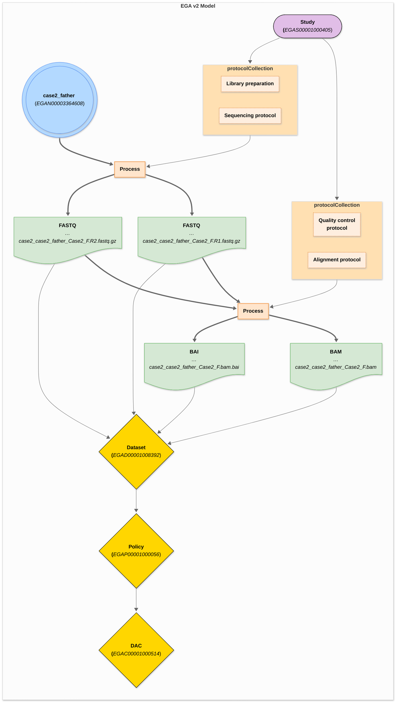
```mermaid
---
config:
  theme: neutral
  look: neo
  layout: dagre
---
flowchart LR
 subgraph PC1["<b>protocolCollection</b>"]
        SEQ_PROTOCOL["<b>Library preparation</b>"]
        n5@{ label: "<span style=\"--tw-scale-x:\"><b>Sequencing protocol</b></span>" }
  end
 subgraph PC2["<b>protocolCollection</b>"]
        ALIGN_PROTOCOL["<b>Quality control<br>protocol</b>"]
        n6["<b>Alignment protocol</b>"]
  end
 subgraph subGraph1["<b>EGA v2 Model</b>"]
    direction TB
        BIOMATERIAL@{ label: "<span id=\"docs-internal-guid-84ef360c-7fff-ac07-a967-8e0e2d2cd0a6\"><p dir=\"ltr\" style=\"line-height:\"><span style=\"font-size:\"><b>case2_father </b>(<i>EGAN00003364608</i>)</span></p></span>" }
        PC1
        SEQ_PROC["<b>Process</b>"]
        RAW1@{ label: "<span id=\"docs-internal-guid-0b3e6dab-7fff-d37f-2424-d6e086a28925\"><p dir=\"ltr\" style=\"line-height:\"><span style=\"font-size:\"><b>FASTQ</b></span><span style=\"font-size:\"><br></span><span style=\"font-size:\">…</span><span style=\"font-size:\"><i>case2_case2_father_Case2_F.R1.fastq.gz</i></span></p></span>" }
        RAW2@{ label: "<span id=\"docs-internal-guid-7c3da251-7fff-4b43-c949-00faa3d41998\"><p dir=\"ltr\" style=\"line-height:\"><span style=\"font-size:\"><b>FASTQ</b></span><span style=\"font-size:\"><br></span><i><span style=\"font-size:\">…</span><span style=\"font-size:\">case2_case2_father_Case2_F.R2.fastq.gz</span></i></p></span>" }
        PC2
        ALIGN_PROC["<b>Process</b>"]
        ALN1@{ label: "<span id=\"docs-internal-guid-2f637a91-7fff-13ce-bd05-29006547af08\"><p dir=\"ltr\" style=\"line-height:\"><span style=\"font-size:\"><b>BAM</b></span><span style=\"font-size:\"><br></span><i><span style=\"font-size:\">…</span><span style=\"font-size:\">case2_case2_father_Case2_F.bam</span></i></p></span>" }
        ALN2@{ label: "<span id=\"docs-internal-guid-de137c36-7fff-d5b1-e230-7858938ba490\"><p dir=\"ltr\" style=\"line-height:\"><span style=\"font-size:\"><b>BAI</b></span><span style=\"font-size:\"><br></span><i><span style=\"font-size:\">…</span><span style=\"font-size:\">case2_case2_father_Case2_F.bam.bai</span></i></p></span>" }
        n10@{ label: "<b style=\"color:\">Dataset <br>(</b><i>EGAD00001008392</i>)" }
        n11@{ label: "<b style=\"color:\">Policy<br>(</b><i>EGAP00001000056</i>)" }
        n12@{ label: "<b style=\"color:\">DAC<br>(</b><i>EGAC00001000514</i>)" }
        n14@{ label: "<b style=\"color:\">Study<br>(</b><i>EGAS00001000405</i>)" }
  end
    BIOMATERIAL BIO_PROC1@==> SEQ_PROC
    PC1 --> SEQ_PROC
    SEQ_PROC L_SEQ_PROC_RAW1_0@==> RAW1 & RAW2
    RAW1 L_RAW1_ALIGN_PROC_0@==> ALIGN_PROC
    RAW2 L_RAW2_ALIGN_PROC_0@==> ALIGN_PROC
    PC2 --> ALIGN_PROC
    ALIGN_PROC PROC_ALN1@==> ALN1 & ALN2
    n10 --> n11
    n11 --> n12
    n14 --> PC2 & PC1
    RAW2 --> n10
    RAW1 --> n10
    ALN1 --> n10
    ALN2 --> n10
    BIOMATERIAL@{ shape: dbl-circ}
    RAW1@{ shape: doc}
    RAW2@{ shape: doc}
    ALN1@{ shape: doc}
    ALN2@{ shape: doc}
    n10@{ shape: diam}
    n11@{ shape: diam}
    n12@{ shape: diam}
    n14@{ shape: stadium}
    n5@{ shape: rect}
    n6@{ shape: rect}
    SEQ_PROC@{ shape: rect}
    ALIGN_PROC@{ shape: rect}
     BIOMATERIAL:::biomaterial
     SEQ_PROC:::process
     RAW1:::datafile
     RAW2:::datafile
     ALIGN_PROC:::process
     ALN1:::datafile
     ALN2:::datafile
     n10:::dataManagement
     n11:::dataManagement
     n12:::dataManagement
     n14:::Administrative
     SEQ_PROTOCOL:::protocol
     n5:::protocol
     ALIGN_PROTOCOL:::protocol
     n6:::protocol
    classDef biomaterial fill:#B3D9FF,stroke:#4C8BF5,stroke-width:1px
    classDef datafile   fill:#D5E8D4,stroke:#6FB96C,stroke-width:1px
    classDef process fill:#FFE5CC, stroke:#F5A45D, stroke-width:2px, stroke-dasharray: 0
    classDef protocol fill:#FFE5CC, stroke:#F5A45D, stroke-width:2px, fill:#feeedf, background-color:#feeedf, stroke-dasharray: 2
    classDef dataManagement fill:#FFD600, stroke:#000000, color:#000000
    classDef Administrative stroke:#000000, fill:#E1BEE7, color:#000000
    style PC1 fill:#FFE0B2
    style PC2 fill:#FFE0B2
```

2. ### Microarray

During a dedicated "Microarray" session (see [Annex 2](#annexes)), the MWG went through a **simple two-colour experiment** in which two cancer patients (individual A and B) each provided a tumour and a matched normal tissue sample. RNA is isolated, reverse-transcribed, labelled with dyes and co-hybridised on the same microarray slide. TIFF images are generated by scanning the tissues, and downstream software generates intensity files (\*.idat) and an expression matrix. Phenotypic and disease metadata for each patient are captured using GA4GH Phenopackets. For further details (slides, recording, diagrams…), please refer to the session **agenda**[^192].

1. #### Key session outcomes

1. The **EGA v2 model can adequately represent microarray** experiments.

2. The amount of **intermediary entities** (biomaterials from individuals A and B in [Annex 2](#annexes)) depends on the granularity that the submitter can (or is willing to) provide.

3. "**Project**" entity was added to the EGA v2 model.

   2. #### Worked example

As introduced above, this use-case revolved around **two fictitious individuals: A and B**, who, in summary, had **clinical information**, **samples assayed, and analysis** performed on their data.

During the session, we made use of these two individuals to **represent the possible differences in granularity** across submissions. In this example, submission for individual B had more intermediary steps (e.g., mRNA and cDNA biomaterials) than the one for individual A.

The simplest scenario was represented through **individual A** (i.e., a biomaterial of type organism 'A'). In this case, following [Figure 12](#figure-12-representation-in-ega-v2-model-of-a-simplified-view-for-individual-a-except-for-clinical-information), through sample preparation, two tissue samples were obtained: control and case (tumour). These samples were then processed following an encompassing protocol collection, which included steps from RNA isolation to scanning. The output of this process was a set of files, including raw intensity files.

Finally, the intensity files, combined with other input files, were used following another analytical protocol collection and produced the differential expression matrices.

##### ***Figure 12\.** Representation (in EGA v2 model) of a simplified view for individual A, except for clinical information.*

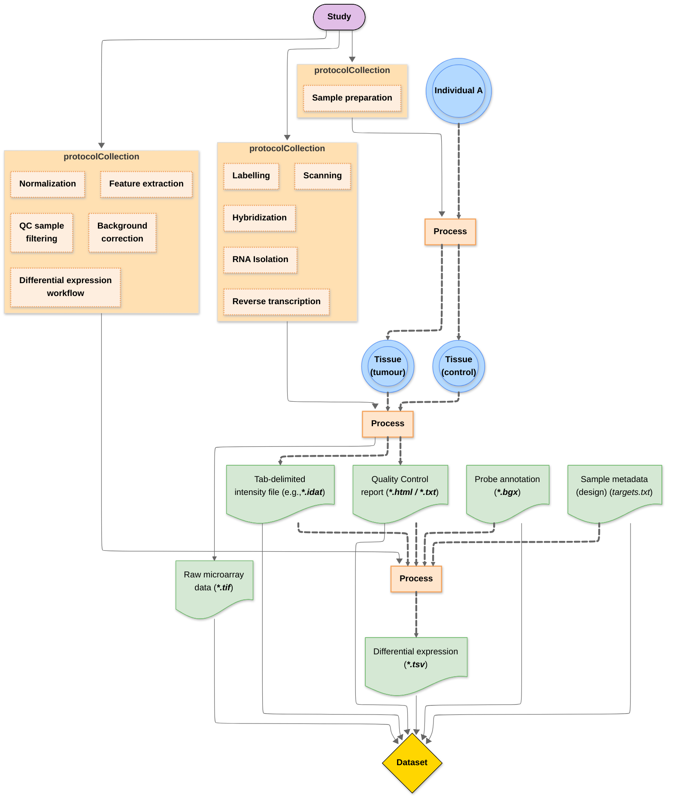
```mermaid
---
config:
  theme: neutral
  look: neo
  layout: dagre
  flowchart:
    defaultRenderer: elk
---
flowchart TB
 subgraph PC1["<b>protocolCollection</b>"]
        SEQ_PROTOCOL["<b>Sample preparation</b>"]
  end
 subgraph PC2["<b>protocolCollection</b>"]
    direction LR
        ALIGN_PROTOCOL["<b>RNA Isolation</b>"]
        n6["<b>Reverse transcription</b>"]
        n17["<b>Labelling</b>"]
        n18["<b>Hybridization</b>"]
        n19["<b>Scanning</b>"]
  end
 subgraph s1["<b>protocolCollection</b>"]
    direction LR
        n30["<b>Feature extraction</b>"]
        n31["<b>QC sample<br>filtering</b>"]
        n24["<b>Background<br>correction</b>"]
        n25["<b>Normalization</b>"]
        n26["<b>Differential expression<br>workflow</b>"]
  end
    BIOMATERIAL["<b>Individual A</b>"] BIO_PROC1@==> SEQ_PROC["<b>Process</b>"]
    PC1 --> SEQ_PROC
    PC2 --> ALIGN_PROC["<b>Process</b>"]
    ALIGN_PROC PROC_ALN1@==> ALN1["Tab-delimited <br>intensity file (e.g.,<i><b>*.idat</b></i>)"] & n20["Quality Control<br>report (<i><b>*.html / *.txt</b></i>)"]
    ALIGN_PROC L_ALIGN_PROC_ALN2_0@--> ALN2@{ label: "Raw microarray<br>data (<i style=\"--tw-scale-x:\"><span style=\"--tw-scale-x:\"><b>*.tif</b></span></i>)" }
    SEQ_PROC L_SEQ_PROC_n16_0@==> n16["<b>Tissue<br>(tumour)</b>"] & n15["<b>Tissue<br>(control)</b>"]
    n14@{ label: "<b style=\"color:\">Study<br></b>" } --> PC2 & PC1 & s1
    n15 L_n15_ALIGN_PROC_0@==> ALIGN_PROC
    n16 L_n16_ALIGN_PROC_0@==> ALIGN_PROC
    ALN1 L_ALN1_n21_0@==> n21["<b>Process</b>"]
    s1 --> n21
    n21 L_n21_n27_0@==> n27@{ label: "Differential expression<br>(<i style=\"--tw-scale-x:\"><span style=\"--tw-scale-x:\"><b>*.tsv</b></span></i>)" }
    n28["Probe annotation<br>(<i><b>*.bgx</b></i>)"] L_n28_n21_0@==> n21
    n29["Sample metadata <br>(design) (<i>targets.txt</i>)"] L_n29_n21_0@==> n21
    n20 L_n20_n21_0@==> n21
    n20 --> n10@{ label: "<b style=\"color:\">Dataset</b>" }
    ALN2 --> n10
    n29 --> n10
    n28 --> n10
    n27 --> n10
    ALN1 --> n10

    n6@{ shape: rect}
    n17@{ shape: rect}
    n18@{ shape: rect}
    n19@{ shape: rect}
    n30@{ shape: rect}
    n31@{ shape: rect}
    n24@{ shape: rect}
    n25@{ shape: rect}
    n26@{ shape: rect}
    BIOMATERIAL@{ shape: dbl-circ}
    ALN1@{ shape: doc}
    n20@{ shape: doc}
    ALN2@{ shape: doc}
    n10@{ shape: diam}
    n16@{ shape: dbl-circ}
    n15@{ shape: dbl-circ}
    n14@{ shape: stadium}
    n21@{ shape: rect}
    n27@{ shape: doc}
    n28@{ shape: doc}
    n29@{ shape: doc}
     SEQ_PROTOCOL:::protocol
     ALIGN_PROTOCOL:::protocol
     n6:::protocol
     n17:::protocol
     n18:::protocol
     n19:::protocol
     n30:::protocol
     n31:::protocol
     n24:::protocol
     n25:::protocol
     n26:::protocol
     BIOMATERIAL:::biomaterial
     SEQ_PROC:::process
     ALIGN_PROC:::process
     ALN1:::datafile
     n20:::datafile
     ALN2:::datafile
     n10:::dataManagement
     n16:::biomaterial
     n15:::biomaterial
     n14:::Administrative
     n21:::process
     n27:::datafile
     n28:::datafile
     n29:::datafile
    classDef biomaterial fill:#B3D9FF,stroke:#4C8BF5,stroke-width:1px
    classDef datafile   fill:#D5E8D4,stroke:#6FB96C,stroke-width:1px
    classDef process fill:#FFE5CC, stroke:#F5A45D, stroke-width:2px, stroke-dasharray: 0
    classDef protocol fill:#FFE5CC, stroke:#F5A45D, stroke-width:2px, fill:#feeedf, background-color:#feeedf, stroke-dasharray: 2
    classDef dataManagement fill:#FFD600, stroke:#000000, color:#000000
    classDef Administrative stroke:#000000, fill:#E1BEE7, color:#000000
    style PC1 fill:#FFE0B2
    style PC2 fill:#FFE0B2
    style s1 fill:#FFE0B2

    BIO_PROC1@{ animation: slow } 
    PROC_ALN1@{ animation: slow } 
    L_ALIGN_PROC_n20_0@{ animation: slow } 
    L_ALIGN_PROC_ALN2_0@{ animation: none } 
    L_SEQ_PROC_n16_0@{ animation: slow } 
    L_SEQ_PROC_n15_0@{ animation: slow } 
    L_n15_ALIGN_PROC_0@{ animation: slow } 
    L_n16_ALIGN_PROC_0@{ animation: slow } 
    L_ALN1_n21_0@{ animation: slow } 
    L_n21_n27_0@{ animation: slow } 
    L_n28_n21_0@{ animation: slow } 
    L_n29_n21_0@{ animation: slow } 
    L_n20_n21_0@{ animation: slow }
```

The metadata of the submission for **individual B** is very similar to the one above (see [Figure 13](#figure-13-comparison-of-differences-between-examples-for-individual-b-and-a-in-ega-v2-model)). The only difference is that we are creating an intermediary entity, a biomaterial of type cDNA, in between the tissue biomaterial and the datafiles. This would be the case if the submitter had information specifically about that new intermediary biomaterial that could be informative (e.g., when it was obtained, where, under which conditions…). These two correspond to the coarse and detailed submission types introduced in the [*Processes and Protocols*](#processes-and-protocols) section.

To account for this new granularity, the model simply splits the protocol collection that was encompassing all these steps into two different protocol collections:

1. **RNA isolation and reverse transcription**. The one that is followed to transform the tissue biomaterial into the cDNA biomaterial.

2. **Labelling, hybridisation and scanning**. The one that enables obtaining the datafiles from the cDNA biomaterial.

##### ***Figure 13\.** Comparison of differences between examples for individual B and A in EGA v2 model.*

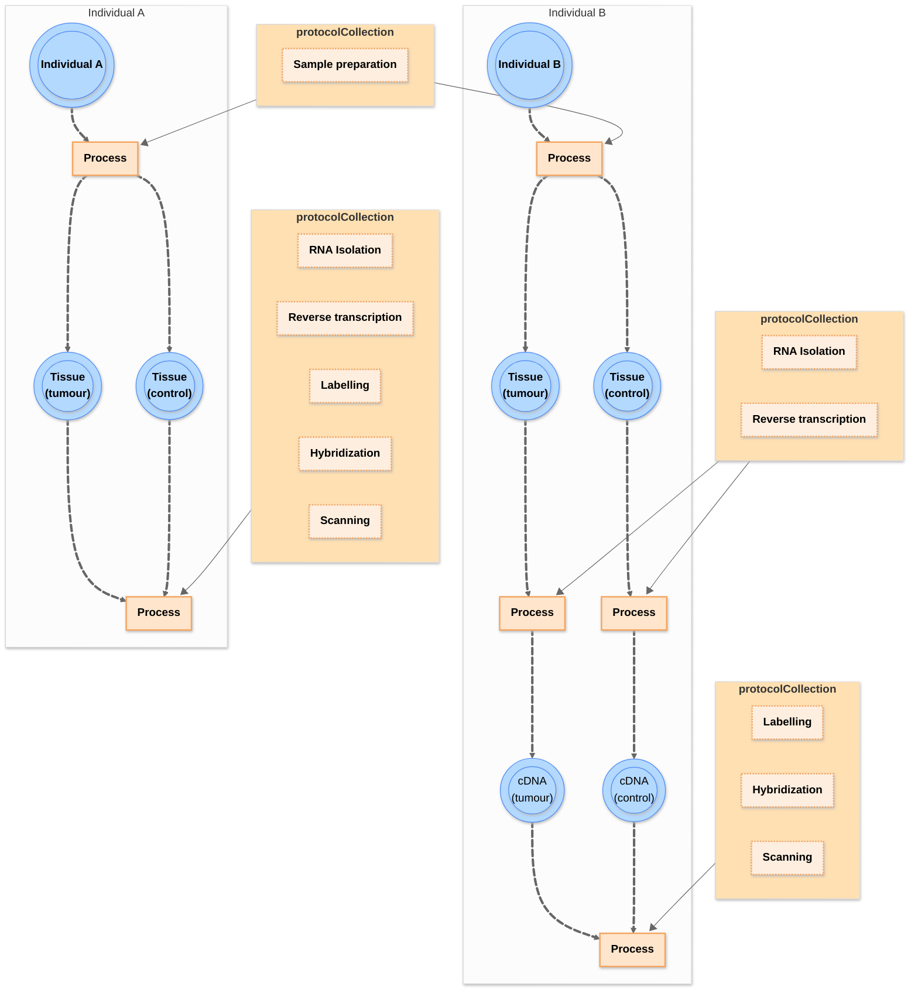
```mermaid
---
config:
  theme: neutral
  look: neo
  layout: dagre
---
flowchart TB
 subgraph s5["<b>protocolCollection</b>"]
        n43["<b>Sample preparation</b>"]
  end
 subgraph s6["Individual B"]
        n44["<b>Individual B</b>"]
        n45["<b>Process</b>"]
        n46["<b>Process</b>"]
        n47["cDNA<br>(control)"]
        n48["<b>Process</b>"]
        n49["cDNA<br>(tumour)"]
        n50["<b>Tissue<br>(tumour)</b>"]
        n51["<b>Tissue<br>(control)</b>"]
        n52["<b>Process</b>"]
  end
 subgraph s3["<b>protocolCollection</b>"]
        n38["<b>RNA Isolation</b>"]
        n39["<b>Reverse transcription</b>"]
  end
 subgraph s8["Individual A"]
        n53["<b>Individual A</b>"]
        n54["<b>Process</b>"]
        n57["<b>Process</b>"]
        n59["<b>Tissue<br>(tumour)</b>"]
        n60["<b>Tissue<br>(control)</b>"]
  end
 subgraph s4["<b>protocolCollection</b>"]
        n40["<b>Labelling</b>"]
        n41["<b>Hybridization</b>"]
        n42["<b>Scanning</b>"]
  end
 subgraph s9["<b>protocolCollection</b>"]
        n61["<b>RNA Isolation</b>"]
        n62["<b>Reverse transcription</b>"]
        n63["<b>Labelling</b>"]
        n64["<b>Hybridization</b>"]
        n65["<b>Scanning</b>"]
  end
    n44 L_n44_n45_0@==> n45
    n46 L_n46_n47_0@==> n47
    n48 L_n48_n49_0@==> n49
    n45 L_n45_n50_0@==> n50 & n51
    n50 L_n50_n48_0@==> n48
    n51 L_n51_n46_0@==> n46
    s4 --> n52
    s5 --> n45 & n54
    s3 --> n46 & n48
    n49 L_n49_n52_0@==> n52
    n47 L_n47_n52_0@==> n52
    n53 L_n53_n54_0@==> n54
    n54 L_n54_n59_0@==> n59 & n60
    n59 L_n59_n57_0@==> n57
    n60 L_n60_n57_0@==> n57
    s9 --> n57
    n43@{ shape: rect}
    n44@{ shape: dbl-circ}
    n45@{ shape: rect}
    n46@{ shape: rect}
    n47@{ shape: dbl-circ}
    n48@{ shape: rect}
    n49@{ shape: dbl-circ}
    n50@{ shape: dbl-circ}
    n51@{ shape: dbl-circ}
    n52@{ shape: rect}
    n38@{ shape: rect}
    n39@{ shape: rect}
    n53@{ shape: dbl-circ}
    n54@{ shape: rect}
    n57@{ shape: rect}
    n59@{ shape: dbl-circ}
    n60@{ shape: dbl-circ}
    n40@{ shape: rect}
    n41@{ shape: rect}
    n42@{ shape: rect}
    n61@{ shape: rect}
    n62@{ shape: rect}
    n63@{ shape: rect}
    n64@{ shape: rect}
    n65@{ shape: rect}
     n43:::protocol
     n44:::biomaterial
     n45:::process
     n46:::process
     n47:::biomaterial
     n48:::process
     n49:::biomaterial
     n50:::biomaterial
     n51:::biomaterial
     n52:::process
     n38:::protocol
     n39:::protocol
     n53:::biomaterial
     n54:::process
     n57:::process
     n59:::biomaterial
     n60:::biomaterial
     n40:::protocol
     n41:::protocol
     n42:::protocol
     n61:::protocol
     n62:::protocol
     n63:::protocol
     n64:::protocol
     n65:::protocol
    classDef biomaterial fill:#B3D9FF,stroke:#4C8BF5,stroke-width:1px
    classDef datafile   fill:#D5E8D4,stroke:#6FB96C,stroke-width:1px
    classDef process fill:#FFE5CC, stroke:#F5A45D, stroke-width:2px, stroke-dasharray: 0
    classDef protocol fill:#FFE5CC, stroke:#F5A45D, stroke-width:2px, fill:#feeedf, background-color:#feeedf, stroke-dasharray: 2
    classDef dataManagement fill:#FFD600, stroke:#000000, color:#000000
    classDef Administrative stroke:#000000, fill:#E1BEE7, color:#000000
    style s4 fill:#FFE0B2
    style s5 fill:#FFE0B2
    style s3 fill:#FFE0B2
    style s9 fill:#FFE0B2
    L_n44_n45_0@{ animation: slow } 
    L_n46_n47_0@{ animation: slow } 
    L_n48_n49_0@{ animation: slow } 
    L_n45_n50_0@{ animation: slow } 
    L_n45_n51_0@{ animation: slow } 
    L_n50_n48_0@{ animation: slow } 
    L_n51_n46_0@{ animation: slow } 
    L_n49_n52_0@{ animation: slow } 
    L_n47_n52_0@{ animation: slow } 
    L_n53_n54_0@{ animation: slow } 
    L_n54_n59_0@{ animation: slow } 
    L_n54_n60_0@{ animation: slow } 
    L_n59_n57_0@{ animation: slow } 
    L_n60_n57_0@{ animation: slow }
```

For the sake of simplicity in visualization, the **clinical information** was separated into a different diagram (see [Figure 14](#figure-14-representation-of-clinical-information-for-both-individuals-a-and-b-in-ega-v2-model)). As observed in the figure, the two individuals were the input of a clinical record extraction protocol, where the output is their combined phenoclinical information in the format of a phenopacket.

##### ***Figure 14\.** Representation of clinical information for both individuals A and B in EGA v2 model.*

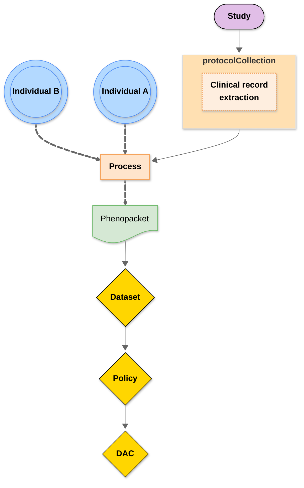
```mermaid
---
config:
  theme: neutral
  look: neo
  layout: dagre
---
flowchart TB
 subgraph s3["<b>protocolCollection</b>"]
        n39["<b>Clinical record<br>extraction</b>"]
  end
    n11@{ label: "<b style=\"color:\">Policy</b>" } --> n12@{ label: "<b style=\"color:\">DAC</b>" }
    n10@{ label: "<b style=\"color:\">Dataset</b>" } --> n11
    n40["<b>Individual B</b>"] L_n40_n41_0@==> n41["<b>Process</b>"]
    s3 --> n41
    n42@{ label: "<b style=\"color:\">Study<br></b>" } --> s3
    n41 L_n41_n43_0@==> n43["Phenopacket"]
    n44["<b>Individual A</b>"] L_n44_n41_0@==> n41
    n43 --> n10

    n39@{ shape: rect}
    n11@{ shape: diam}
    n12@{ shape: diam}
    n10@{ shape: diam}
    n40@{ shape: dbl-circ}
    n41@{ shape: rect}
    n42@{ shape: stadium}
    n43@{ shape: doc}
    n44@{ shape: dbl-circ}
     n39:::protocol
     n11:::dataManagement
     n12:::dataManagement
     n10:::dataManagement
     n40:::biomaterial
     n41:::process
     n42:::Administrative
     n43:::datafile
     n44:::biomaterial
    classDef biomaterial fill:#B3D9FF,stroke:#4C8BF5,stroke-width:1px
    classDef datafile   fill:#D5E8D4,stroke:#6FB96C,stroke-width:1px
    classDef process fill:#FFE5CC, stroke:#F5A45D, stroke-width:2px, stroke-dasharray: 0
    classDef protocol fill:#FFE5CC, stroke:#F5A45D, stroke-width:2px, fill:#feeedf, background-color:#feeedf, stroke-dasharray: 2
    classDef dataManagement fill:#FFD600, stroke:#000000, color:#000000
    classDef Administrative stroke:#000000, fill:#E1BEE7, color:#000000
    style s3 fill:#FFE0B2

    L_n40_n41_0@{ animation: slow } 
    L_n41_n43_0@{ animation: slow } 
    L_n44_n41_0@{ animation: slow }
```

3. ### Proteomics

The proteomics use case addresses important **metadata representation gaps** previously identified in the current EGA v1 model, which was primarily genomics-centric and lacked dedicated fields or concepts tailored for proteomics data submissions.

Proteomics datasets, often deposited in repositories such as the PRoteomics IDEntifications Database[^193],[^194] (PRIDE) under the ProteomeXchange consortium[^195],[^196], require capturing nuanced submission information, including experiment types and the specific file formats generated by mass spectrometry workflows. The FEGA MWG, through a thorough pre-workshop analysis and hands-on workshop session, has refined the metadata model to accommodate those needs effectively. The details can be found in the use-case agenda[^197].

#### Use-case workshop

In this section, we describe the Proteomics session ([Annex 3](#annexes)) held by the FEGA MWG and summarise its outcomes—specifically, how a **proteomics dataset containing human mass spectrometry data can be represented by the EGA v2 metadata model**. Mapping such a submission involves aligning core information (e.g., sample details, data acquisition methods) and file formats with FEGA requirements. 

PXD006482[^198] is the **original dataset submitted to the PRIDE** database. This dataset ("*Identification of Missing Proteins in the Phosphoproteome of Kidney Cancer*") is a phosphoproteomics study comparing kidney cancer tissue and adjacent healthy tissue, identifying 8,962 proteins (6,415 phosphoproteins) and 44,728 phosphosites (10,266 previously unreported), and verifying some "missing proteins" under the Chromosome-Centric Human Proteome Project[^199].

For the use-case session, we made use of the **dataset specification table**[^200]. This consists of the **sample metadata** submitted to the PRIDE database according to the Sample and Data Relationship Format for Proteomics[^201] (SDRF). **SDRF is part of the metadata standards** adopted by PRIDE / ProteomeXchange / Proteomics Standards Initiative[^202] (PSI), used to encode sample-level metadata (e.g. biological sample type, condition, replicate, tissue, disease), and to link each sample to its corresponding datafile(s).

In PRIDE's record for a given dataset (such as PXD006482), there is a metadata table titled "Experimental Design (Samples)"; what the user submits via SDRF becomes or fills this table in the PRIDE web interface. That is, this table in GitHub is what was submitted (or what could be submitted) to supply PRIDE with structured information for that Experimental Design table.

Using the example, the working group engaged in a discussion on how to model the dataset, which included:

* **RAW files**. Instrument-generated proprietary format files (e.g., Thermo RAW files).

* **SEARCH files**. Results from peptide identification software (e.g., Mascot[^203],[^204] .dat[^205]).

* **RESULT files**. Standard identification/quantification output in formats like mzIdentML[^206],[^207] and mzTab[^208],[^209] (required for complete submissions).

* **PEAK files**. Peak lists (e.g., Mascot .mgf).

* **FASTA files**. Protein sequence databases used during analysis (optional).

  1. #### Key session outcomes

The EGA v2 model was able to capture the detailed processes involved in capturing a Proteomics experiment.

* **"Submission Type" distinction.** The long-standing division between "complete" and "partial" proteomics submissions is outdated. Most submissions are currently "partial" but, in reality, they contain all relevant data — the current issue is only about file standardization. Consensus: treat all submissions equally as full submissions; both partial and complete submissions require raw (experiment) and analysis files.

* **Core file types clarified. Experiment files** \= raw data (from instruments); **Analysis files** \= both SEARCH (software output) and RESULT (standardized, if available). **Recommendation**: always require both SEARCH and RESULT when possible, but accept non-standard formats too. Extra files (FASTA, spectrum libraries, etc.) remain optional.

* **Standardization and conversion.** Archives (like PRIDE) do not perform conversions themselves. They accept original software outputs, but for complete submissions they require results in supported standard formats. For FEGA, a stricter approach is recommended: always require RESULT files to ensure usability and reproducibility.

* **Sample metadata as a requirement.** Strong recommendation that SDRF files (sample metadata spreadsheets) be made mandatory in FEGA submissions. This ensures clinical and experimental context (e.g., sample sex, condition) is always captured — a gap in many PRIDE submissions.

* **Affinity proteomics (Olink[^210]) emerges as a priority.** New technology (antibody-based, Next Generation Sequencing (NGS)-driven, high-throughput, cheap, plasma-based, clinically relevant). Olink data are usually released without raw NGS data (to avoid IP risks), only processed protein quantification \+ Quality Control (QC) metadata are released. Since FEGA deals with clinical/sensitive data, preparing for Olink submissions (including potential controlled-access) is essential.

* **Metadata modelling and provenance.** Importance of capturing clear relationships between samples, protocols, files, and outputs (including replicates, fractions, and processing steps). Flexibility is needed: not all users will provide detailed process chains, but the model should allow representation of complex workflows.

* **Ontology use and factor values.** Controlled vocabularies/ontologies (e.g., EFO, UBERON) are needed for consistency. The "factor value" concept (variables actually studied, e.g., tumour vs. normal) should be emphasised to help users and align with ISA/SDRF standards.

  2. #### Worked example

Below, we represent the **proteomics dataset PXD006482 using the EGA v2 model** (see [Figure 15](#figure-15-proteomics-use-case-representation-in-ega-v2-model)).

Given the inherent complexity and size (192 Samples) of this proteomics dataset, we have chosen to model only a subset of entities for this exercise, focusing primarily on those most relevant to illustrating the mapping process. As a result, not all entity types—particularly those related to administrative metadata (e.g., Studies)—are fully covered. 

During the workshop, we also showcased how the EGA v2 metadata model can be used to represent **intermediate analytical processes** that are not currently supported by the EGA v1 model. Specifically, we defined a structured collection of protocols covering key experimental stages such as **protein quantification** and **differential expression analysis**. These protocol entities can be associated with multiple samples and are capable of producing distinct outputs depending on the inputs, thereby supporting a more granular and reusable representation of the experimental workflow.

In [Figure 15](#figure-15-proteomics-use-case-representation-in-ega-v2-model), we demonstrate a submission of a proteomics dataset in the EGA v2 model. Note the explicit representation of proteomics submission types via different file categories (RAW, SEARCH, RESULT).

##### *Figure 15\. Proteomics use case representation in EGA v2 model.*

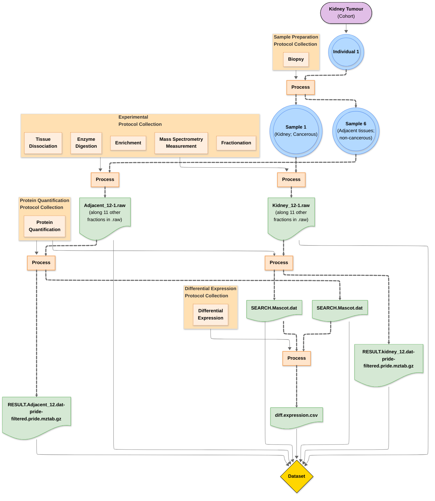
```mermaid
---
config:
  theme: neutral
  look: neo
  layout: dagre
  flowchart:
    defaultRenderer: elk
---
flowchart TB
 subgraph PC2["<b>Sample Preparation<br>Protocol Collection</b>"]
        n6["<b>Biopsy</b>"]
  end
 subgraph s1["<b>Experimental<br>Protocol Collection</b>"]
        n31@{ label: "<span style=\"--tw-scale-x:\"><b>Enzyme<br style=\"--tw-scale-x:\">Digestion</b></span>" }
        n34["<b>Enrichment</b>"]
        n32["<b>Tissue<br>Dissociation</b>"]
        nx["<b>Mass Spectrometry<br>Measurement</b>"]
        n49["<b>Fractionation</b>"]
  end
 subgraph s2["<b>Protein Quantification<br>Protocol Collection</b>"]
        n37["<b>Protein<br>Quantification</b>"]
  end
 subgraph s3["<b>Differential Expression<br>Protocol Collection</b>"]
        n42["<b>Differential<br>Expression</b>"]
  end
    PC2 --> ALIGN_PROC["<b>Process</b>"]
    n28["<b>Adjacent_12-1.raw<br></b>(along 11 other<br>fractions in .raw)"] --> n10@{ label: "<b style=\"color:\">Dataset</b>" }
    n28 L_n28_n41_0@==> n41["<b>Process</b>"]
    n14(["<b>Kidney Tumour<br></b>(Cohort)"]) --> BIOMATERIAL["<b>Individual 1</b><br>"]
    BIOMATERIAL L_BIOMATERIAL_ALIGN_PROC_0@==> ALIGN_PROC
    ALIGN_PROC L_ALIGN_PROC_n29_0@==> n29["<b>Sample 1<br></b>(Kidney; Cancerous)<br>"] & n30["<b>Sample 6<br></b>(Adjacent tissues;<br>non-cancerous)"]
    s1 --> n33["<b>Process</b>"] & n40["<b>Process</b>"]
    n30 L_n30_n33_0@==> n33
    s2 L_s2_n38_0@--> n38["<b>Process</b>"] & n41
    n33 L_n33_n28_0@==> n28
    n39@{ label: "<b>Kidney_12-1.raw</b><br>(along 11 other<br style=\"--tw-scale-x:\">fractions in .raw)" } ==> n38
    n40 L_n40_n39_0@==> n39
    n29 L_n29_n40_0@==> n40
    s3 --> n43["<b>Process</b>"]
    n38 L_n38_n44_0@==> n44@{ label: "<b>RESULT.kidney_12.dat-pride-<br style=\"--tw-scale-x:\"><span style=\"--tw-scale-x:\">filtered.pride.mztab.gz</span></b>" } & n47["<b>SEARCH.Mascot.dat</b>"]
    n41 L_n41_n45_0@==> n45@{ label: "<b>RESULT.Adjacent_12.dat-<br>pride-<span style=\"padding-left:\">filtered.pride.mztab.gz</span></b>" } & n46["<b>SEARCH.Mascot.dat</b>"]
    n46 L_n46_n43_0@==> n43
    n47 L_n47_n43_0@==> n43
    n39 --> n10
    n43 L_n43_n48_0@==> n48["<b>diff.expression.csv</b>"]
    n48 --> n10
    n45 --> n10
    n46 --> n10
    n44 --> n10
    n47 --> n10

    n6@{ shape: rect}
    n31@{ shape: rect}
    n34@{ shape: rect}
    n32@{ shape: rect}
    n49@{ shape: rect}
    n37@{ shape: rect}
    n42@{ shape: rect}
    n28@{ shape: doc}
    n10@{ shape: diam}
    n41@{ shape: rect}
    BIOMATERIAL@{ shape: dbl-circ}
    n29@{ shape: dbl-circ}
    n30@{ shape: dbl-circ}
    n33@{ shape: rect}
    n40@{ shape: rect}
    n38@{ shape: rect}
    n39@{ shape: doc}
    n43@{ shape: rect}
    n44@{ shape: doc}
    n47@{ shape: doc}
    n45@{ shape: doc}
    n46@{ shape: doc}
    n48@{ shape: doc}
     n6:::protocol
     n31:::protocol
     n34:::protocol
     n32:::protocol
     nx:::protocol
     n49:::protocol
     n37:::protocol
     n42:::protocol
     ALIGN_PROC:::process
     n28:::datafile
     n10:::dataManagement
     n41:::process
     n14:::Administrative
     BIOMATERIAL:::biomaterial
     n29:::biomaterial
     n30:::biomaterial
     n33:::process
     n40:::process
     n38:::process
     n39:::datafile
     n43:::process
     n44:::datafile
     n47:::datafile
     n45:::datafile
     n46:::datafile
     n48:::datafile
    classDef biomaterial fill:#B3D9FF,stroke:#4C8BF5,stroke-width:1px
    classDef datafile   fill:#D5E8D4,stroke:#6FB96C,stroke-width:1px
    classDef dataManagement fill:#FFD600, stroke:#000000, color:#000000
    classDef Administrative stroke:#000000, fill:#E1BEE7, color:#000000
    classDef process fill:#FFE5CC, stroke:#F5A45D, stroke-width:2px, stroke-dasharray:0
    classDef protocol fill:#feeedf, stroke:#F5A45D, stroke-width:2px, background-color:#feeedf, stroke-dasharray:2
    style PC2 fill:#FFE0B2
    style s1 fill:#FFE0B2
    style s2 fill:#FFE0B2
    style s3 fill:#FFE0B2

    L_n28_n41_0@{ animation: slow } 
    L_BIOMATERIAL_ALIGN_PROC_0@{ animation: slow } 
    L_ALIGN_PROC_n29_0@{ animation: slow } 
    L_ALIGN_PROC_n30_0@{ animation: slow } 
    L_n30_n33_0@{ animation: slow } 
    L_s2_n38_0@{ animation: none } 
    L_n33_n28_0@{ animation: slow } 
    L_n40_n39_0@{ animation: slow } 
    L_n29_n40_0@{ animation: slow } 
    L_n38_n44_0@{ animation: slow } 
    L_n38_n47_0@{ animation: slow } 
    L_n41_n45_0@{ animation: slow } 
    L_n41_n46_0@{ animation: slow } 
    L_n46_n43_0@{ animation: slow } 
    L_n47_n43_0@{ animation: slow }
    L_n39_n38_0@{ animation: slow }
    L_n43_n48_0@{ animation: slow }
```

4. ### Microbiome

For the microbiome use case ([Annex 4](#annexes)), we piloted FEGA pre-deposition and deposition workflows for microbiome studies (shotgun metagenomics, metatranscriptomics, metabolomics), discussed how **microbiome sample and study metadata** map into the EGA v2 metadata model, and refined it based on the FEGA Microbiome use-case session[^211] (2025-07-01), including decisions about public archive deposition, decontamination, and metadata mapping.

1. #### Key session outcomes

Challenges and considerations:

* **Privacy/sensitivity**: although most microbiome chunks are non-identifiable after decontamination, procedures developed for European contexts/conditions on microbiome sensitivity should be surveyed and followed[^212].

* **Standardisation**: ensure other metadata standards and the EGA v2 model fields overlap cleanly; session feedback and the worked example informed improvements to EGA v2 model compatibility. Examples of these standards are the Environment Ontology[^213],[^214] (ENVO), NCBI Taxonomy[^215], Minimum Information about any (x) Sequence[^216],[^217] (MIxS), Ontology for Biomedical Investigations[^218],[^219] (OBI).

* **Interoperability**: linkage patterns between public archives (e.g., ENA) and FEGA records must be explicit and machine-readable.

Conclusion and recommendations:

* **Default path**: decontaminate → deposit raw/processed sequences to ENA → submit metadata to FEGA following the EGA v2 model, ensuring linkage with ENA accessions.

* **Governance**: commission a short review to determine any Europe-level consensus/guidance on microbiome data sensitivity and consent languages.

  2. #### Worked example

Below is a short, focused representation of the **stool-microbiome pipeline** as shown in the diagram ([Figure 16](#figure-16-diagram-of-a-stool-microbiome-research-data-lifecycle-into-the-ega-v2-metadata-model-datasets-1--2-may-fit-best-in-public-archives-eg-ena-simplifying-the-example)), following the EGA v2 model. Because the diagram contains many elements, we model only the entities required to show the main provenance chain: how samples and protocols produce files and how those files assemble into three governed datasets. This multiple dataset governance, all under the same DAC, represents the scenario where a submission would not be distributed as a single unit, but follow different policies depending on the content of the linked data files. 

It is important to note that, in the **absence of the sensitivity review**, multiple entities modelled in [Figure 16](#figure-16-diagram-of-a-stool-microbiome-research-data-lifecycle-into-the-ega-v2-metadata-model-datasets-1--2-may-fit-best-in-public-archives-eg-ena-simplifying-the-example) could be removed from the FEGA submission. In other words, Datasets 1 and 2 of the figure may not contain sensitive data and, therefore, be suited for public archives such as the ENA. If that were the case, the FEGA submission would only encompass entities related to Dataset 3, which would certainly contain sensitive data. We included all datasets in the figure to satisfy the goal of this session: to assess whether the microbiome submission could be structured following the EGA v2 model. With this, we know that the most complex scenario (i.e., all datasets containing sensitive data) is covered and thus properly represented.

**Data Description**

* **Raw sequencing reads**: shotgun metagenomics FASTQ (after host-depletion where applicable).

* **Processed outputs**: CSV or TSV formats, taxonomic assignments, functional profiles, HMP Unified Metabolic Analysis Network[^220] (HUMAnN) outputs, pathway abundances.

* **Metadata**: Full MIxS-compatible sample metadata (sample type e.g., stool/biopsy, collection protocol, host phenotype, environmental parameters), plus study-level metadata per the EGA v2 model.

* **Storage/deposit recommendation**: Non-identifiable sequencing data should be deposited to public archives (e.g., ENA at EBI) and the FEGA submission should link to those accession(s). Human-sensitive or identifiable metadata should remain in FEGA access-controlled repositories.

**Minimal metadata checklist**

* **Project metadata**: title, description, submitter, keywords, publications.

* **Sample metadata**: sample name/ID, body site, collection method, host details (age, sex, health), environment.

* **Technical metadata**: sequencing platform, library prep, file names, run info.

* **Raw data**: FASTQ files (host-depleted where applicable).

* **Processed results**: taxonomic/functional profiles (.tsv/.csv).

* **Ethical compliance**: anonymisation, informed consent, ethics approval. 

**Processing / Methods**

1. **Sampling**: sample (e.g., stool) collection and preparation.

2. **Sequencing**: DNA extraction, library preparation and sequencing.

3. **Preprocessing & QC**: adapter trimming, quality filtering.

4. **Host decontamination**: strict removal of human reads using well-documented pipelines[^221],[^222]. Participants in the use-case session mentioned decontamination as standard practice; human-derived reads typically are removed before public deposition.

5. **Taxonomic and functional profiling**: bioBakery3[^223] tools such as MetaPhlAn[^224], HUMAnN for shotgun metagenomics.

6. **Metadata mapping**: map sample and study metadata into the EGA v2 model (use other metadata/ontologies to complement the model).

7. **Deposition and linking**: deposit non-sensitive sequence files to ENA (or equivalent public archive) and include those accessions in FEGA submission metadata; deposit processed tables and reproducible workflows into FEGA as appropriate.

##### ***Figure 16\.** Diagram of a stool-microbiome research data lifecycle into the EGA v2 Metadata Model. Datasets 1 & 2 may fit best in public archives (e.g., ENA), simplifying the example.*

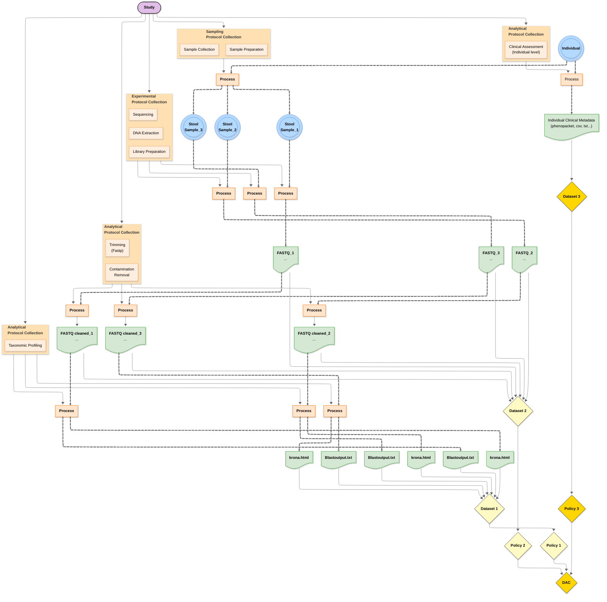
```mermaid
---
config:
  theme: neutral
  look: neo
  layout: dagre
  flowchart:
    defaultRenderer: elk
---
flowchart TB
 subgraph PC2["<b>Analytical<br>Protocol Collection</b>"]
        n6["Clinical Assessment<br>(Individual level)"]
  end
 subgraph s1["<b>Experimental<br>Protocol Collection</b>"]
    direction LR
        n31["Library Preparation"]
        n34["Sequencing"]
        n32["DNA Extraction"]
  end
 subgraph s2["<b>Analytical<br>Protocol Collection</b>"]
    direction LR
        n37["Trimming <br>(Fastp)"]
        n337["Contamination<br>Removal"]
  end
 subgraph s3["<b>Sampling<br>Protocol Collection</b>"]
        n42["Sample Collection"]
        xxx["Sample Preparation"]
  end
 subgraph s4["<b>Analytical<br>Protocol Collection</b>"]
        n4115["Taxonomic Profiling"]
  end
    s3 --> ALIGN_PROC["<b>Process</b>"]
    PC2 --> n43["Process"]
    BIOMATERIAL["<b>Individual</b><br>"] L_BIOMATERIAL_ALIGN_PROC_0@==> ALIGN_PROC & n43
    ALIGN_PROC L_ALIGN_PROC_n29_0@==> n29["<b>Stool <br>Sample_3</b>"] & n30["<b>Stool<br>Sample_2</b>"] & n50["<b>Stool<br>Sample_1</b>"]
    s1 --> n33["<b>Process</b>"] & n40["<b>Process</b>"] & n404["<b>Process</b>"]
    s4 --> nx33["<b>Process</b>"] & nx40["<b>Process</b>"] & nx404["<b>Process</b>"]
    n30 L_n30_n33_0@==> n33
    s2 --> n38["<b>Process</b>"] & n41["<b>Process</b>"] & n4111["<b>Process</b>"]
    n39["<b>FASTQ_1</b><br>..."] L_n39_n38_0@==> n38
    n14(["<b>Study</b>"]) --> s3 & PC2 & s1 & s2 & s4
    n43 L_n43_n46_0@==> n46["Individual Clinical Metadata<br>(phenopacket, csv, txt...)"]
    n29 L_n29_n40_0@==> n40
    n50 L_n50_n404_0@==> n404
    n40 L_n40_n406_0@==> n406["<b>FASTQ_3</b><br>..."]
    n404 L_n404_n39_0@==> n39
    n33 L_n33_n405_0@==> n405["<b>FASTQ_2</b><br>..."]
    n405 L_n405_n4111_0@==> n4111
    n406 L_n406_n41_0@==> n41
    n38 --> n4112["<b>FASTQ cleaned_1</b><br>..."]
    n41 --> n4114["<b>FASTQ cleaned_3</b><br>..."]
    n4111 --> n4113["<b>FASTQ cleaned_2</b><br>..."]
    n4112 L_n4112_nx33_0@==> nx33
    n4114 L_n4114_nx404_0@==> nx404
    n4113 L_n4113_nx40_0@==> nx40
    nx404 L_nx404_n4119_0@==> n4119["<b>krona.html</b>"] & n4121["<b>Blastoutput.txt</b>"]
    nx40 L_nx40_n4118_0@==> n4118["<b>Blastoutput.txt</b>"] & n4117["<b>krona.html</b>"]
    nx33 L_nx33_n4116_0@==> n4116["<b>Blastoutput.txt</b>"] & n4120["<b>krona.html</b>"]
    n46 --> n10@{ label: "<b style=\"color:\">Dataset 3</b>" }
    n39 --> n4122@{ label: "<b style=\"color:\">Dataset 2</b>" }
    n405 --> n4122
    n406 --> n4122
    n4113 --> n4122
    n4112 --> n4122
    n4114 --> n4122
    n4117 --> n4123@{ label: "<b style=\"color:\">Dataset 1</b>" }
    n4118 --> n4123
    n4120 --> n4123
    n4116 --> n4123
    n4119 --> n4123
    n4121 --> n4123
    n10 --> n4124@{ label: "<b style=\"color:\">Policy 3</b>" }
    n4122 --> n4125@{ label: "<b style=\"color:\">Policy 2</b>" }
    n4123 --> n4126@{ label: "<b style=\"color:\">Policy 1</b>" }
    n4124 --> n4127@{ label: "<b style=\"color:\">DAC</b>" }
    n4125 --> n4127
    n4126 --> n4127

    n6@{ shape: rect}
    n31@{ shape: rect}
    n34@{ shape: rect}
    n32@{ shape: rect}
    n37@{ shape: rect}
    n42@{ shape: rect}
    n4115@{ shape: rect}
    n43@{ shape: rect}
    BIOMATERIAL@{ shape: dbl-circ}
    n29@{ shape: dbl-circ}
    n30@{ shape: dbl-circ}
    n50@{ shape: dbl-circ}
    n33@{ shape: rect}
    n40@{ shape: rect}
    n38@{ shape: rect}
    n41@{ shape: rect}
    n39@{ shape: doc}
    n46@{ shape: doc}
    n406@{ shape: doc}
    n405@{ shape: doc}
    n4112@{ shape: doc}
    n4114@{ shape: doc}
    n4113@{ shape: doc}
    n4119@{ shape: doc}
    n4121@{ shape: doc}
    n4118@{ shape: doc}
    n4117@{ shape: doc}
    n4116@{ shape: doc}
    n4120@{ shape: doc}
    n10@{ shape: diam}
    n4122@{ shape: diam}
    n4123@{ shape: diam}
    n4124@{ shape: diam}
    n4125@{ shape: diam}
    n4126@{ shape: diam}
    n4127@{ shape: diam}
     n6:::protocol
     n31:::protocol
     n34:::protocol
     n32:::protocol
     n37:::protocol
     n337:::protocol
     n42:::protocol
     xxx:::protocol
     n4115:::protocol
     ALIGN_PROC:::process
     n43:::process
     BIOMATERIAL:::biomaterial
     n29:::biomaterial
     n30:::biomaterial
     n50:::biomaterial
     n33:::process
     n40:::process
     n404:::process
     nx33:::process
     nx40:::process
     nx404:::process
     n38:::process
     n41:::process
     n4111:::process
     n39:::datafile
     n14:::Administrative
     n46:::datafile
     n406:::datafile
     n405:::datafile
     n4112:::datafile
     n4114:::datafile
     n4113:::datafile
     n4119:::datafile
     n4121:::datafile
     n4118:::datafile
     n4117:::datafile
     n4116:::datafile
     n4120:::datafile
     n10:::dataManagement
     n4122:::dataManagement
     n4123:::dataManagement
     n4124:::dataManagement
     n4125:::dataManagement
     n4126:::dataManagement
     n4127:::dataManagement
    classDef biomaterial fill:#B3D9FF,stroke:#4C8BF5,stroke-width:1px
    classDef datafile   fill:#D5E8D4,stroke:#6FB96C,stroke-width:1px
    classDef dataManagement fill:#FFD600, stroke:#000000, color:#000000
    classDef Administrative stroke:#000000, fill:#E1BEE7, color:#000000
    classDef protocol fill:#feeedf, stroke:#F5A45D, stroke-width:2px, background-color:#feeedf, stroke-dasharray:2
    classDef process fill:#FFE5CC, stroke:#F5A45D, stroke-width:2px, stroke-dasharray:0
    style s3 fill:#FFE0B2
    style PC2 fill:#FFE0B2
    style s1 fill:#FFE0B2
    style s4 fill:#FFE0B2
    style s2 fill:#FFE0B2
    style n4122 fill:#FFF9C4
    style n4123 fill:#FFF9C4
    style n4125 fill:#FFF9C4
    style n4126 fill:#FFF9C4

    L_BIOMATERIAL_ALIGN_PROC_0@{ animation: slow } 
    L_BIOMATERIAL_n43_0@{ animation: slow } 
    L_ALIGN_PROC_n29_0@{ animation: slow } 
    L_ALIGN_PROC_n30_0@{ animation: slow } 
    L_ALIGN_PROC_n50_0@{ animation: slow } 
    L_n30_n33_0@{ animation: slow } 
    L_n39_n38_0@{ animation: slow } 
    L_n43_n46_0@{ animation: slow } 
    L_n29_n40_0@{ animation: slow } 
    L_n50_n404_0@{ animation: slow } 
    L_n40_n406_0@{ animation: slow } 
    L_n404_n39_0@{ animation: slow } 
    L_n33_n405_0@{ animation: slow } 
    L_n405_n4111_0@{ animation: slow } 
    L_n406_n41_0@{ animation: slow } 
    L_n4112_nx33_0@{ animation: slow } 
    L_n4114_nx404_0@{ animation: slow } 
    L_n4113_nx40_0@{ animation: slow } 
    L_nx404_n4119_0@{ animation: slow } 
    L_nx404_n4121_0@{ animation: slow } 
    L_nx40_n4118_0@{ animation: slow } 
    L_nx40_n4117_0@{ animation: slow } 
    L_nx33_n4116_0@{ animation: slow } 
    L_nx33_n4120_0@{ animation: slow }
```

6. ## Linked data

The introduction of **linked data principles** represents a significant step forward in the EGA v2 metadata model. It will be a valuable concept to accommodate, among others, multi-omics datasets. By **embedding contexts** (@context) in JSON Schemas, we ensure:

* Properties in schemas are resolvable to meaningful identifiers (e.g., https://schema.org/name for name).

* JSON documents referencing (in their @context) these schema files can be automatically expanded into RDF-compliant JSON-LD (see [Figure 17](#figure-17-diagram-depicting-the-expansion-of-a-json-document-into-json-ld-with-the-addition-of-context)) by inheriting the schemas' @context.

For instance, a cohort.json referencing FEGA.cohort.json through its URI[^225] will inherit the schema's context when expanded by a JSON-LD processor (see [Figure 17](#figure-17-diagram-depicting-the-expansion-of-a-json-document-into-json-ld-with-the-addition-of-context)). This enables terms used as keys (e.g., 'label') and CURIE values (e.g., 'ega:EGAD00000000001'), to be expanded, pointing to resolvable URIs (e.g., https://www.w3.org/2000/01/rdf-schema\#label and https://identifiers.org/ega:EGAD00000000001, respectively).

##### ***Figure 17\.** Diagram depicting the expansion of a JSON document into JSON-LD with the addition of @context.*

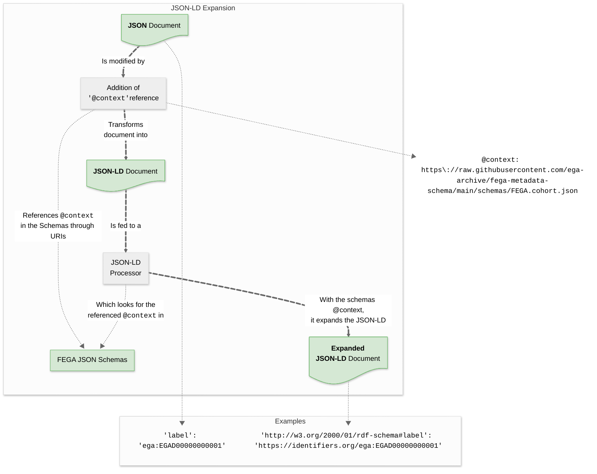
```mermaid
---
config:
  theme: neutral
  look: neo
  layout: dagre
---
flowchart TB
 subgraph s1["JSON-LD Expansion"]
    direction TB
        n1["<b>JSON </b>Document"]
        n4@{ label: "Addition of <br><code>'@context'</code>reference" }
        n5["<b>JSON-LD</b> Document"]
        n3["FEGA JSON Schemas"]
        n6["JSON-LD<br>Processor"]
        n7["<b>Expanded<br>JSON-LD</b> Document"]
  end
 subgraph s2["Examples"]
        n8@{ label: "<code>'label': 'ega:EGAD00000000001'</code>" }
        n10@{ label: "<code>'http\\://w3.org/2000/01/rdf-schema#label': 'https\\://identifiers.org/ega:EGAD00000000001'</code>" }
  end
    n1 L_n1_n4_0@== Is modified by ==> n4
    n4 L_n4_n5_0@== Transforms <br>document into ==> n5
    n4 -. References <code>@context</code><br>in the Schemas through URIs .-> n3
    n5 L_n5_n6_0@== Is fed to a ==> n6
    n6 -. Which looks for the<br>referenced <code>@context</code> in .-> n3
    n6 L_n6_n7_0@== "With the schemas @context,<br>it expands the JSON-LD" ==> n7
    n1 -.-> n8
    n4 -.-> n9["<code>@context: https\://raw.githubusercontent.com/ega-archive/fega-metadata-schema/main/schemas/FEGA.cohort.json</code>"]
    n7 -.-> n10
    n1@{ shape: doc}
    n4@{ shape: proc}
    n5@{ shape: doc}
    n6@{ shape: proc}
    n7@{ shape: doc}
    n8@{ shape: text}
    n10@{ shape: text}
    n9@{ shape: text}
     n1:::datafile
     n5:::datafile
     n3:::datafile
     n7:::datafile
    classDef biomaterial fill:#B3D9FF,stroke:#4C8BF5,stroke-width:1px
    classDef process    fill:#FFE5CC,stroke:#F5A45D,stroke-width:1px
    classDef protocol fill:#FFE5CC, stroke:#F5A45D, stroke-width:1px, fill:#feeedf, background-color:#feeedf, stroke-dasharray: 1
    classDef datafile fill:#D5E8D4, stroke:#6FB96C, stroke-width:1px
    L_n1_n4_0@{ animation: slow } 
    L_n4_n5_0@{ animation: slow } 
    L_n5_n6_0@{ animation: slow } 
    L_n6_n7_0@{ animation: slow }
```

1. ### Benefits of Linked data

With the expansion of plain strings into fully resolvable URIs:

* Identifiers in the metadata become dereferenceable on the Web, letting clients **follow links directly to the defining vocabulary term or record**. This removes ambiguity and supports automatic link-traversal between archives.

* Because JSON-LD expansion yields standard IRIs, the **same document can be ingested by any RDF toolchain or SPARQL federation** **layer** without extra mapping. Essentially, unlocking cross-format and potentially cross-dataset querying and reasoning out-of-the-box.

* **Persistent identifiers** are one of the **keys to the FAIR principles**. This expansion boosts Findability and Interoperability scores for every record.

* Search engines prioritise JSON-LD for structured data. This translates into an **improved indexing and surfacing of FEGA content in domain-specific portals** (e.g., Google Dataset Search[^226]) by embedding the expanded JSON-LD in each record. EGA already implements this context in a limited fashion for datasets alone (see [Figure 18](#figure-18-representation-of-existing-embedded-contexts-and-how-it-improves-the-findability-of-ega-records-on-the-web-1-record-of-a-dataset-in-the-ega-portal-2-applicationldjson-node-embedded-in-the-html-of-the-record-containing-context-and-metadata-in-json-ld-format-3-result-of-a-query-at-google-datasets-returning-the-ega-dataset-thanks-to-its-embedded-context)).

* Remote-context reuse means submitters need to **write less boilerplate to achieve a better semantic level** (i.e., lower verbosity with better semantic precision). This reduces maintenance overhead while following current best-practice guidance from W3C[^227]. 

* Resolvable URIs **let validation tools check not only syntax but also term existence** (e.g., "*does EGAD00000000001 exist or is it just a string?*") and **vocabulary consistency.**

* The same mechanism aligns seamlessly with **FAIR Data Point profiles** and **DCAT catalogues**, allowing each FEGA node to expose its holdings through standard discovery interfaces without duplicating information.

Formatting FEGA metadata in compliance with linked data also enables, with small tweaks to the FEGA websites, users to retrieve the metadata in different formats (e.g., JSON-LD, turtle, RDF…) directly from the portals.

These linked data capabilities have been tested for internal use-cases but are yet to be integrated with external archives (i.e., cross-archive semantic querying). This external capability may not be in scope for the EGA v2 model until the foundations are set.

##### ***Figure 18\.** Representation of existing embedded contexts and how it improves the findability of EGA records on the web. (1) Record of a dataset in the EGA portal; (2) application/ld+json node embedded in the HTML of the record, containing context and metadata in JSON-LD format; (3) result of a query at Google Datasets[^228], returning the EGA dataset thanks to its embedded context.*

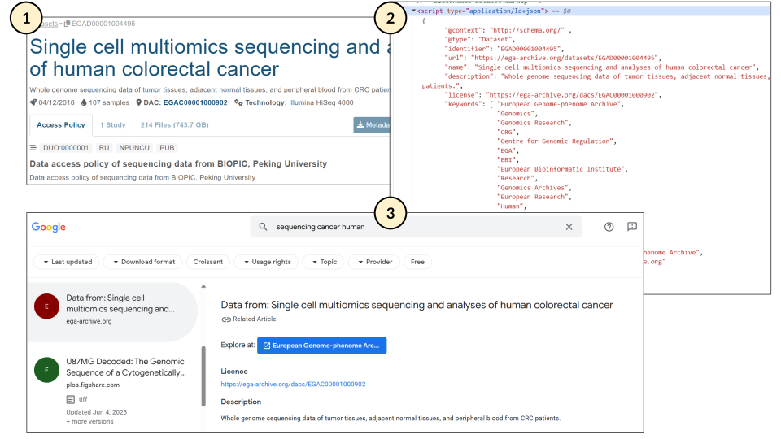

2. ### Drawbacks of Linked data

Although linked data is the clear trend for archives to expose and link records, we consider not only their advantages but also their possible drawbacks. 

It is worth noting that the use of linked data was designed to mainly add functionalities, but it introduces new dependencies and operational steps to maintain these features. Were linked data a failure in the FEGA metadata space, it would limit what the EGA v2 model could additionally do, but would not remove existing EGA v1 model features.

* Extra **processing steps** (e.g., expansion, flattening, framing) are needed to keep JSON Schema validation strict while allowing RDF-style flexibility. This would increase the difficulty in debugging and maintenance. Find more details in the [*Framing*](#framing) section.

* Greater reliance on networked resolution services:

  * Remote @context **dependencies can break JSON-LD expansion/framing** if the context URL is unavailable, rate-limited, or changes unexpectedly. This imposes a major dependency on GitHub to keep these contexts available; similar to the dependency of JSON Schemas being referenced and fetched from the same repository.

  * Resolver downtime or slowness can directly break or hamper identifier validation and linked-data dereferencing.

* Increased governance burden: **stable namespaces** (e.g., fega namespace in identifiers.org) must be created and maintained long-term, to avoid semantic drift.

* Higher operational complexity for nodes: to be robust against external outages, nodes may need **local copies of contexts/schemas**.

* Skills and tooling overhead: supporting **RDF-native use** (e.g., SPARQL toolchains) can require specialist expertise.

* **Portal/API work increases**: serving multiple serialisations typically requires changes in FEGA portals (e.g., format negotiation).

* **Privacy/inference risk can increase**: linked, traversable metadata makes it easier to combine public crumbs with external sources, so the public/private split and controlled-access enforcement must be clear and carefully audited.

* **Strategic lock-in**: once downstream consumers rely on FEGA contexts, CURIE patterns, and dereferenceable identifiers, reverting to a "no-linked-data" posture becomes disruptive. In essence, offering new features to take them back later on may undermine reputation and trust in EGA.

  7. ## Sensitive metadata

The EGA presents unique challenges as it is specifically tailored for human-derived data. Human omics data demands **meticulous handling to ensure compliance with national and international regulations**, **safeguarding data protection and privacy**. The following classification can be defined for this purpose:

* Risk is reduced by **publishing pseudonymised open-access metadata** (e.g., biologicalSex has value 'male'), linked to controlled-access records (e.g., encrypted .json phenopackets file) through EGA identifiers (e.g., EGAN00000000001).

* Directly **identifying metadata** (e.g., subject's names or addresses) must never be submitted as open-access metadata.

* Potentially **sensitive metadata** (e.g., subject's disease history) should be **open-access only where the submitter explicitly submits it as such**. Note that, if not as open-access, the submitter also has the option to submit metadata as controlled-access, encrypted, datafiles.

In essence, the access method proposal is to:

* Publicly disclose the **non-identifying submission metadata** required for findability and reuse (e.g., biological sex), as **pseudonymised metadata** compliant with the EGA v2 model. These are the metadata that the submitter explicitly provides as open-access.

* Enforce **controlled-access on submitted files**. These files are the (meta)data that the submitter explicitly provides as controlled-access. It is expected to include:

  * All information that the submitter deems **sensitive and identifiable personal data**. For example, a detailed phenopackets or electronic health record.

  * Any **other data** that the submitter wants to make accessible only through controlled authorisation. For example, non-identifiable personal data (e.g., subject's age) that could be aggregated with other publicly available datasets (e.g., lab results available at other archives) and become identifiable.

This submission routing (see [Figure 19](#figure-19-summary-diagram-representing-the-submission-proposal-with-regards-to-open-and-controlled-access-metadata)) **enables submitters** to propose[^229] **what metadata can be disclosed** (provided as open-access metadata) beyond the minimum EGA requirements **and what needs to be behind controlled-access** (provided as encrypted datafiles).

##### ***Figure 19\.** Summary diagram representing the submission proposal with regards to open and controlled access metadata.*

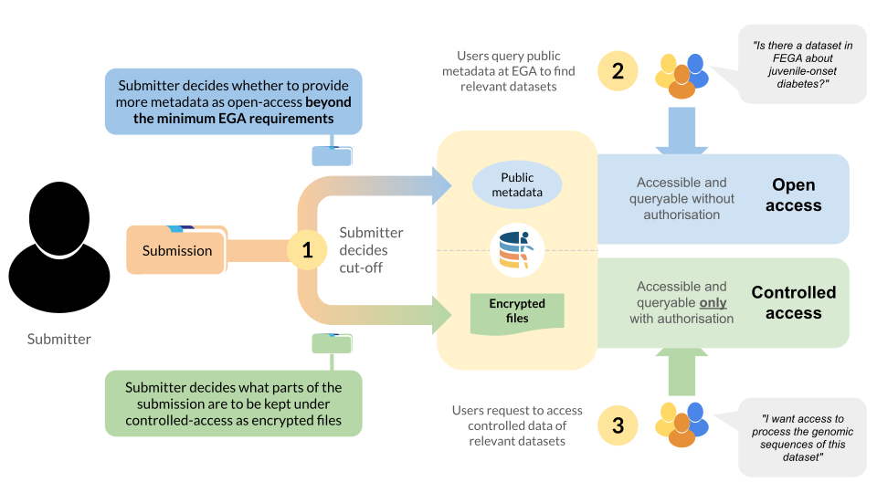

An important distinction is that **controlled-access/open-access metadata do not always overlap with sensitive/non-sensitive**. The definition of special category (i.e., sensitive) personal data as per the General Data Protection Regulation[^230] (GDPR) does not impose *open-access* (i.e., publicly displayed) or *controlled-access* constraints. Instead, it simply requires a special level of protection for this type of personal data. Depending on the idiosyncrasies of each submission (e.g., other linked submissions, public records, journal articles), the **threshold for what level of exposure of open-access metadata may lead to re-identification of subjects varies**. With this approach, we give submitters the freedom to set this boundary themselves, to enable FAIR, yet privacy-preserving, submissions to FEGA.

Here, we propose a FEGA-wide policy on how to handle open- and controlled-access submission metadata, promoting the responsible use of human-derived data by providing a **clear separation** between controlled-access and open-access submission metadata. 

Furthermore, the EGA v2 model improves the **linkage between phenoclinical data and individuals**. With the current EGA v1 model, clinical metadata were poorly represented as generic *phenotype* analyses. In contrast, the EGA v2 model provides a better representation, enabling clinical data (e.g., phenopacket files, spreadsheets, CSV files) to be distributed easily through a diverse variety of processes, but always properly linked to the source individual.

Nevertheless, this approach comes with its challenges and future refinements, such as:

* Defining the **minimum requirements** for public metadata, to enable discoverability of relevant datasets without constraining the freedom of data submitters to set the access boundary of their submissions.

* Harmonising more than seventeen years of EGA submissions, where policy regarding open- and controlled-access may have been absent or vary.

* Introducing methods as opt-in options to enable **discoverability through controlled-access** data. For example, querying genomic variants through Beacon-v2, or displaying privacy-preserving ranges (e.g., age groups).

  8. ## Improvements

As introduced in the [*EGA v2 metadata model*](#ega-v2-metadata-model), the EGA v2 entails both conceptual and technology stack changes. In this section, we briefly go through the main improvements of both. The EGA v2 model shifts from a flat, submission-centric XML mindset to a graph-ready, JSON-LD framework that is resolvable on the Web, easily validated through open-source tools and flexible enough to represent future complex submissions.

1. ### Linked-data foundation

Through this model, FEGA can serialise every record as JSON-LD, **allowing machines to traverse the metadata** as linked data across domains. Linked data practices directly support the **FAIR goals of findability and interoperability** that FEGA advocates for.

In comparison, the EGA v1 model has poor linkage with external resources, as it lacks linked data approaches. Despite the fact that there are some properties whose purpose is to link records to a limited set of external resources (e.g., XREF\_LINK), these are underutilised and most of the time missing in both programmatic and manual submissions. Efforts, such as comprehensive training materials, will be undertaken along EGA v2 model development to help submitters provide higher quality metadata and avoid underusing its features.

See further details in the [*Linked Data*](#linked-data) section.

2. ### Resolvable identifiers and external vocabularies

The schema requires CURIEs or HTTP URIs that resolve through identifiers.org or equivalent services, turning previously free-text fields into links that machines can dereference. For example, "biosample:SAMEA2397676" is resolved to "[https://www.ebi.ac.uk/biosamples/samples/SAMEA2397676](https://www.ebi.ac.uk/biosamples/samples/SAMEA2397676)" in an automatic way.

Furthermore, we make use of **Biovalidator's custom keywords** that enable the JSON schema to connect to third party services (e.g., OLS, ENA, identifiers.org) during validation. For example, isValidIdentifier[^231] checks links across resources, catching typos before ingestion. Following the same example as above, if a user provided an ID "biosample:SA**R**EA2397676" (notice the typo, *R* instead of *M*), this error would be picked at validation and corrected by the submitter.

Likewise, ontology terms are validated with the OLS through Biovalidator's custom keyword graphRestriction[^232], ensuring semantic consistency. For example, we can automatically check if "operon identification design" (EFO:0001785[^233]) is a valid "study design" (EFO:0001426[^234]) by relying on the JSON Schemas and Biovalidator to make the term comparison (i.e. *'is EFO:0001785 a child term of EFO:0001426?'*) through the OLS API.

In the current EGA v1 model, these constraints are non-existent, or depend on extensive Controlled Vocabularies (CV) that have to be individually maintained by the EGA. In contrast, relying on external resources simplifies the work of maintainers and keeps incoming submissions aligned with the latest field standards.

3. ### Wider scientific scope

New entity sets and controlled-vocabulary hooks let FEGA properly represent **use-cases** that were previously overlooked. For example, proteomics, microbiome, or array formats.

Furthermore, the **process-based approach** of the EGA v2 model enables a future-proof representation of incoming new use-cases without major schema rewrites.

4. ### Explicit, directional relationships

In the EGA v2 model, entities connect through typed edges, like prov:wasDerivedFrom or schema:sameAs. These **RDF relationships** are composed of three elements in sequence: subject-predicate-target. For example, we can encode that a biomaterial in FEGA (subject) is the same as (predicate) a sample in dbGap (target).

Each edge records its **direction**, mirroring graph-database conventions and avoiding ambiguous cross-references. This enables the exploration of semantic relationships in submissions, properly representing both simple and complex scenarios in a machine-readable way.

5. ### Robust validation pipeline

A single CLI or REST call to Biovalidator **validates structure and semantics** (e.g., ontology terms) against the **same versioned JSON Schemas** wherever it runs, giving **reproducible results** in CI and production.

Biovalidator has been tested locally[^235] and through a public API endpoint[^236], obtaining stable results in terms of scalability and validation times. Furthermore, parallelization of validation requests can easily be configured by deploying multiple servers of Biovalidator.

6. ### Anticipated FAIR gains with the EGA v2 model

Adopting the FEGA JSON-LD-enabled schema is expected to measurably raise FAIR scores across all four principle groups (see [Table 3](#table-3-anticipated-fair-gains-of-the-ega-v2-model-over-the-ega-v1-model)).

###### ***Table 3**. Anticipated FAIR gains of the EGA v2 model over the EGA v1 model.*

| FAIR aspect | Where we improve | Expected impact |
| :---- | :---- | :---- |
| **Findable** | Global, version-stable **$id IRIs** and **context-rich JSON-LD** embedded in landing pages. | Search engines and tools such as FAIR-Checker[^237] can resolve and index records automatically. |
| **Accessible** | HTTPS-resolvable **identifiers** and **content-negotiation**[^238] for JSON-LD/RDF, not just for datasets. | Machines retrieve the same metadata humans see, improving automation. |
| **Interoperable** | Ontology-backed **value sets** and **cross-entity links** expressed as IRIs. | Schemas expand cleanly to RDF, enabling semantic queries (e.g., SPARQL) and automated cross-repository alignments |
| **Reusable** | Rich **provenance** (PROV-O), explicit **licences** and versioned **release** manifest. | Easier interpretation of the provenance of model entities and, therefore, of (meta)data. |

7. ### Support input files

Procedural steps commonly require **datafiles as inputs**. For example, the Array Design Format (ADF) or the probe design of a microarray experiment, or the parameters file of a computational analysis.

As of now, this dependency in the EGA v1 model cannot be represented, since EGA has uniquely stored the result files of an experiment or analysis. This leads to data requestors not being able to fully scrutinize and reproduce some of these processes.

In contrast, the **EGA v2 model enables representing these dependencies between processes and their inputs** beyond a biomaterial level, adequately representing datafile dependencies for each process (see examples in [Figure 12](#figure-12-representation-in-ega-v2-model-of-a-simplified-view-for-individual-a-except-for-clinical-information)).

9. ## Model versioning

As introduced in the [*Metadata model naming conventions*](#metadata-model-naming-conventions) section, there are two elements that need to be clearly understood: the core model and its extensions. These are versioned separately, maintaining, nonetheless, a hierarchy of the former over the latter.

For example, in [Figure 20](#figure-20-made-up-example-of-the-core-ega-v2-model-and-a-fega-norway-extension-evolving-over-time) we see a made-up scenario, where FEGA Norway started their model extension (e.g., forking the fega-metadata-schema repository) using EGA v2.1.0. This extension had some changes added, to cater for the node's needs (e.g., new property for a model entity), creating their extension v1.0.0. The core EGA model evolved independently at fega-metadata-schema, reaching a new version 2.1.1. At one point, FEGA Norway decided their extension (v1.0.0) could be merged with the source one, creating EGA v2.2.0. This is, nonetheless, a frictionless and oversimplified example. In reality, this process may take long periods of time, and efforts in resolving conflicts between the two parallel versions, depending on the diligence of their maintainers.

##### ***Figure 20\.** Made-up example of the core EGA v2 model and a FEGA Norway extension evolving over time.*

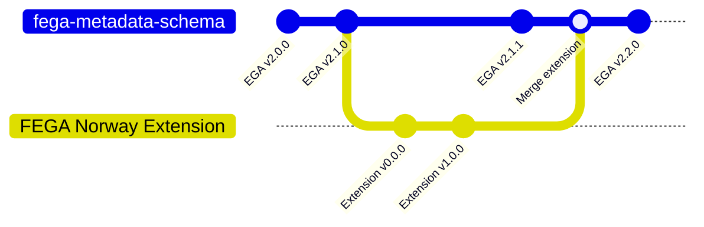
```mermaid
---
config:
  gitGraph:
    mainBranchName: 'fega-metadata-schema'
---

gitGraph
    commit id: "EGA v2.0.0"
    commit id: "EGA v2.1.0"
    branch "FEGA Norway Extension"
    checkout "FEGA Norway Extension"
    commit id: "Extension v0.0.0"
    commit id: "Extension v1.0.0"
    checkout "fega-metadata-schema"
    commit id: "EGA v2.1.1"
    checkout fega-metadata-schema
    merge "FEGA Norway Extension" id: "Merge extension"
    commit id: "EGA v2.2.0"
```

1. ### EGA v2 model schemas

The EGA v2 model schemas follow a **branch → release-branch → tag** workflow:

* Day-to-day work lives on dev.

* The latest stable snapshot is main.

* Each published version first gets a branch following semantic version[^239] (vX.Y.Z), and later an immutable tag with the same name (vX.Y.Z). Validators and applications can fetch these static releases from GitHub through their version names.

Full details of the release process can be found at the releases/README.md[^240]. The workflow includes **manual and automated steps**, where artifacts (e.g., release\_manifest.json) are created, and semantic versions are checked, as well as the URIs used to identify each schema and its versions.

The release\_manifest.json[^241] is a machine-readable summary of the schema version in each release. This document gets automatically generated prior to each release.

2. ### Model extensions

Extensions are copies of the main EGA v2 model schemas that are versioned independently yet maintain a hierarchical dependency with the original model. For example, in [Figure 20](#figure-20-made-up-example-of-the-core-ega-v2-model-and-a-fega-norway-extension-evolving-over-time), FEGA Norway extension v1.0.0 is expected to be compatible with EGA v2.1.0.

These extensions have a different governance model (i.e., different ownership), and can be created by any institution or individual, as the project is open-source. They can also be merged with the core model at fega-metadata-schema following the contributing documentation[^242].

10. ## Mapping archived data to the proposed model

    1. ### Starting point

The **EGA has been live for more than 17 years**. We have archived more than **12,000 datasets**, and **millions of entities like Samples and Runs**[^243]. These were submitted following the EGA v1 model, which was based on ENA's object types and identifiers.

On top of these submissions following the EGA v1 model, another \~**1,700 Array-based format (AF) datasets** have been archived. AF datasets use a bespoke method of submission as of now, in the absence of the EGA v2 metadata model.

2. ### Mapping strategy

In order to **bridge the gap** between models and to aid with the implementation of the EGA v2 model, we propose the creation of a **mapper library** (see [Table 4](#table-4-ega-v1-v2-models-mapping-strategy-overview)). It is important to note that:

* Although **full automation** is the ultimate goal, the process may require human intervention to fully map some datasets. A classical example of this would be the Array Format (AF) metadata, which is processed in a different way to the rest of EGA-archived metadata.

* There will be **gaps when transforming metadata** from one to another. That is unavoidable, by definition, when a more detailed model is to be adopted.   
  This will require lowering standards during the conversion, or enhancing existing data by making assumptions. For example:

  * If a user provided 'M' as the value for sex in their EGA v1 model submission, we would assume that it's referring to 'male' in the sex attribute of the EGA v2 model.

  * If an analysis in the EGA v1 model has multiple sample references, and multiple output files, the sample-file cardinality is not explicit. This changes in the EGA v2 model, and would require a fine-tuned process, for example matching sample identification (i.e. aliases or subject\_id) with filenames.

For further details about the comparison between these two models, refer to the [*CEGA use-case*](#worked-example) section.

Clues for the semantic equivalence (e.g., a sample in EGA v1 model is equivalent to a biomaterial in the v2 one) can be found within the EGA v2 model JSON Schemas following the Simple Standard for Sharing Ontological Mappings[^244] (SSSOM) specification. This would be of great help to the automatic conversion across models, by semantically bridging entities on both ends of the transformation.

###### ***Table 4**. EGA v1-v2 models mapping strategy overview.*

| Task | Mechanism | Notes |
| ----- | ----- | ----- |
| Schema-to-schema links | Each FEGA JSON Schema property embeds, where applicable, a meta:sssomMappings that points to the semantic equivalent in the EGA v1 model (among others). | Machine-readable, versioned with the codebase. |
| Entity transformation | An "EGA v1-v2" mapper library would aid with the automatic conversion between EGA v1 and v2 models. | Handles 1-to-many splits (e.g., EGA v1 Experiment becomes protocolCollection \+ Process). |
| Semantic enrichment | When the source (following the EGA v1 model) contains fields with known identifiers as free-text, the mapper library would expand them as CURIEs; ontological gaps are flagged for manual review. | Ensures every core node has a dereferenceable id. |

11. ## Implementation plan

The **implementation** of the EGA v2 model involves a key step in archiving by CEGA and any FEGA node: **validation against the EGA v2 model JSON Schemas**. Regardless of the method of submission (e.g., GUI, APIs) and storage (e.g., Postgres, MongoDB), as long as the metadata submitted are validated against the EGA v2 model and communicated across nodes in a compatible format, implementation is considered to be achieved.

1. **Phase 0**. Preparation.  
   1. Publish **EGA v2 JSON Schemas**, creating the first stable release of the model.

   2. Develop the **EGA v1-v2 mapper** and start testing model transformations.

2. **Phase 1**. CEGA pilot.  
   1. **Dual ingestion**: new submissions at EBI flow through both validators: EGA v1 model at CEGA/FEGA (for *status quo*) and EGA v2 model (for early adopters).

   2. **Back-fill**: progressively convert historical records.

   3. **API shim**: deploy the mapper as a lightweight REST service that translates EGA v1-v2 payloads back-to-back so external services that still rely on EGA v1 can continue unmodified.

3. **Phase 2**. Federation preview.  
   1. **Engage FEGA nodes** with the improvements of the EGA v2 model.

      1. Create and provide **training** to early adopter nodes, external services and end-users that would like to adopt the EGA v2 model.

      2. Run **cross-node FAIR dashboards** to demonstrate the quality gains of adopting the model (see [*Model Improvements*](#improvements) section).

4. **Phase 3**. Progressive adoption.  
   1. **Opt-in migration**: nodes progressively include a metadata validation step against the EGA v2 model in their primary submission methods.

   2. **Deprecation notice**. After the majority of the FEGA nodes migrate, EGA v1 model schema updates become security-only, and a deprecation plan is put in place.

5. **Phase 4**. Consolidation.  
   1. EGA v1 model is **frozen**, while the mapper is retained as a long-term support utility. All new submissions to FEGA are validated against the EGA v2 model.

8. # Governance

All schemas, examples and tests live in the **public fega-metadata-schema repository** under the MIT licence[^245], and every pull request triggers the same validation matrix the archive runs in production.

Releases will be **documented** in GitHub and Zenodo, enabling history tracking of the model evolution at any time. 

The FEGA network will manage the EGA v2 metadata model through a three-tier structure that mirrors the wider FEGA organisational layout[^246] (see [Table 5](#table-5-fega-governing-groups-over-the-ega-v2-model)).

###### ***Table 5**. FEGA governing groups over the EGA v2 model.*

| Name | Role for the model | Composition |
| ----- | ----- | ----- |
| **Strategic Committee** | **Endorses** every ***major*** model release (v2.0.0, v3.0.0, etc.) or can exercise a 30-day veto if concerns arise | Senior FEGA representatives from all operational nodes |
| **Operations Committee** | **Reviews** implementation impact, schedules deployment windows, and triggers the veto timer once a release candidate is tabled | Technical leads and product owners from operational nodes |
| **Metadata Working Group (MWG)** | **Drafts** changes, triages change requests, resolves issues, and reviews pull requests | Volunteer modellers from the majority of FEGA nodes (both onboarding and operational). Potentially invited experts. |

1. ### Change release flow

**Continuous development** is the norm for the FEGA metadata schemas: routine improvements move through the repository like any other open-source project. When an urgent fix or a formally versioned release is required, the steps in [Table 6](#table-6-change-release-flow-step-by-step), and the minimum notice they impose, ensure every node can react in time and the governance bodies can intervene if necessary. 

This change release flow, like most of the work in this report, is but a **proposal**, still to be validated by all participating drivers (FEGA nodes, CEGA, and respective committees). Once the EGA v2 model is released and this approach is tested, it will be updated accordingly.

###### ***Table 6**. Change release flow step-by-step.*

| Phase | Drivers | Minimum notice / deadline\* |
| ----- | ----- | ----- |
| **1 Change request logged** (issue / PR) | Any node / stakeholder | None |
| **2 Triage and label** (patch / minor / major / emergency) | Metadata Working Group (MWG) | ≤ 1 week |
| **3 Escalation to Operations Committee** (in case of emergency / major) | Metadata Working Group (MWG) | ≤ 2 days |
| **4 Operations Committee review** (impact on node software and workflows) | Operations Committee | 15 days (Emergency) / 30 days (Major) |
| **5 Strategic Committee veto window** (for major) | Strategic reps | \+ 15 days |
| **6 PR with changes and human check** | Metadata Working Group (MWG) | ≤ 1 week after veto period, depending on severity |
| **7 Trigger release** vX.Y.Z | Metadata Working Group (MWG) | Immediately after changes are reviewed |
| **8 Create tag** vX.Y.Z **\+ GitHub Release** | Metadata Working Group (MWG) | As needed following the release process. |

*\*Longer consultation is welcome when time allows. These figures are the minimum periods to be enforced when a fix is blocking validation or roll-out.*

2. ### Accountability and transparency

* **Authorship**: A markdown file AUTHORS.md[^247] at the root of fega-metadata-schema lists, for each contributor, their basic details and contributions. Furthermore, a CODEOWNERS[^248] file helps trace relevant people whose reviews gatekeep specific changes to the repository.

* **Contacts**: each operational node designates at least one MWG contact. MWG members are listed along with their roles and contact details in the AUTHORS.md file.

* **Public log:** the CHANGELOG and release\_manifest.json for every tag lets anyone trace exactly which schema changed in which release. This fulfils FAIR provenance recommendations.

  3. ### Alignment with the FEGA change-management plan

The plan's **Emergency / Major / Minor / Patch** categories map directly onto the semantic versioning bump and review windows above:

* Minor and Patch changes remain within MWG autonomy.

* Major changes invoke the committee veto cycle.

* Emergency patches (e.g. security, legal compliance) bypass the timer but must be back-ported to main and dev within 48 hours, with a retrospective review by the Strategic and Operations committees, as per the FEGA change-management policy (v1.0, 03-10-2024)[^249].

Further operational details (diagrams, CI scripts, release checklists…) live in the releases/README.md of the schema repository and are kept up to date by the MWG team.

9. # Dependencies

Here we list **external dependencies** of the EGA v2 model, which both enhance and constrain the technical approach. They let us reuse community infrastructure for identifiers, ontologies, and standards, while keeping the FEGA schemas lightweight and interoperable.

For what mitigation measures are in place for each dependency, refer to the [*Risks and mitigation*](#risks-and-mitigation) section.

1. ## Validation services

* **ELIXIR Biovalidator**[^250]. Core JSON Schema validator with ontology and taxonomy checks; runs as CLI or server. Our schemas and CI depend on it.

* **Ontology Lookup Service (OLS4) API**[^251]. Used by Biovalidator's custom keywords such as graphRestriction, isValidTerm, and isChildTermOf. If unavailable, semantic checks in validation cannot run.

* **Identifiers.org**[^252] **registry and resolver**. Backing isValidIdentifier and CURIE/IRI resolution.

* **ENA Taxonomy services**[^253]. Potential use for isValidTaxonomy checks supported by Biovalidator.

  2. ## Upstream schemas and profiles

* **GA4GH Beacon v2**[^254]. Selected JSON Schemas (e.g., Cohort's defaultSchema.json[^255]) are reused to stay aligned with Beacon models and formats.

* **BioSchemas**[^256]. Profiles and generated JSON Schema/JSON-LD assets inform parts of our model (e.g., ComputationalWorkflow profile[^257]).

* **ISA-JSON**[^258]. ISA model schemas and specs (e.g., process\_parameter\_value\_schema.json[^259]) are a reference for possible reuse of concepts and fields.

* **DCAT**[^260]. Schemas and specs are a reference for possible reuse of concepts and fields.

* **DCAT-AP**[^261]. DCAT application profile for data portals in Europe, describing catalogues, datasets and data services.

* **HealthDCAT-AP**[^262]. HealthDCAT Application Profile is a domain-specific (health data) metadata model designed to support the implementation of the secondary use framework under the European Health Data Space (EHDS).

* **JSON-LD**[^263]. Base JSON-LD structure schema (jsonld-schema.json[^264]) taken and referenced in the FEGA schemas.

Some of these are added to the FEGA repository as static files, while others are forked and referenced. See [*Risks and Mitigation*](#risks-and-mitigation) for further details.

3. ## Hosting and resolution

* **GitHub**[^265]. Schemas are distributed via repository URLs and fetched in validation through raw.githubusercontent.com; outages or rate limits can affect remote resolution.

  4. ## Linked data processing

* **JSON-LD processors**. When remote contexts are used, processors retrieve them per the JSON-LD 1.1 API, so availability of those context URLs matters.

10. # Risks and mitigation

###### ***Table 7**. Risks and mitigations overview.*

| Dependency | Service | Risk | Mitigation |
| ----- | ----- | ----- | ----- |
| [Validation services](#validation-services) | **ELIXIR Biovalidator** | Bug or breaking change blocks validation pipeline. | Pin versions in CI, keep a vetted fork, add regression tests, and contribute fixes upstream. |
|  |  | Upstream custom keywords change behaviour (e.g., graphRestriction). |  |
|  |  | Speed of validation becoming a bottleneck. | Base speed tested in validation benchmarks[^266] (2023); run yearly benchmarks to assess performance with more intensive tests. |
|  |  | Reliance on internet connection for integrated API checks (e.g., OLS, identifiers.org). | For ontology checks (e.g., graphRestriction), use local static OWL files representing ontologies, which can then be connected to Biovalidator (as a local OLS API) with a slight technical overhead. |
|  | **OLS4 API** | API outage or latency prevents ontology checks. | Stop validation service to prevent misvalidated submissions; if OLS4 is slow to come back online, consider a local OLS deployment backed by OWL files. |
|  |  | Backwards-incompatible API: impossibility of validating terms in older ontology versions. For example, if a term X was valid for ontology Y v1, but changed in v2, OLS4 API will not enable us to check years later if X was valid with Y v1. | Always validate against the latest version of ontologies. When metadata are validated and ingested by a FEGA node, it's assumed they were valid against the latest version at the time.For backwards-compatible validation (i.e., older versions), we may: Validate against local OWL API with versions. Release ontology-free schemas for older versions, enabling validation of syntax but not semantics. |
|  | **Identifiers.org** | Registry updates change prefix targets (e.g., biosample:... → biosample**s**:...). | Identifiers.org handles *deactivated* entries, and redirects properly to the new active ones. |
|  |  | Resolver downtime breaks CURIE/IRI validation and redirects. | Stop validation service to prevent misvalidated submissions.Alternatively, remove isValidIdentifier and isValidTaxonomy from the schemas. |
|  | **ENA Taxonomy** | API unavailable hampers isValidTaxonomy checks. |  |
| [Upstream schemas and profiles](#upstream-schemas-and-profiles) | **GA4GH Beacon v2** | Upstream schema changes or repo restructure break our references. | Beacon v2 references are not directly to the root Beacon v2 repository, but to a fork of it instead (for now at M-casado[^267]). Therefore, control over new changes is in FEGA's hands. |
|  |  |  | If references are swapped to the root beacon v2 repo, and this risk triggers, fallback is to have references to versioned Beacon v2 releases (e.g., v2.2.0[^268]). |
|  | **BioSchemas** | Spec evolution diverges from our reuse. | Adapt FEGA repo's local copy of spec (i.e., schemas) to new standards, and only release new changes when stable for FEGA. |
|  | **DCAT** |  |  |
|  | **DCAT-AP** |  |  |
|  | **HealthDCAT-AP** |  |  |
|  | **ISA-JSON** |  |  |
|  | **JSON-LD** |  |  |
|  |  | Remote context URLs unavailable during expansion or framing. | Bundle local copies of contexts, prefer content-negotiated URLs we control (i.e., the ones in the FEGA repo). |
| [Hosting and resolution](#hosting-and-resolution) | **GitHub** | GitHub outage or raw resolution rate limits block $id/$ref fetches. | Use cached schemas in existing Biovalidator instances; deploy validator instances with *local* schemas instead of letting it fetch them when referenced. |
|  | **FEGA nodes** | FEGA nodes have specific needs for validation. | FEGA nodes can deploy multiple local instances of the validator; and can fork the FEGA schema repo and alter it as needed. Responsibility for compliance would lie with the node maintainer. |

11. # Results

The FEGA MWG has successfully developed an **abstract metadata model for the FEGA** network, along with its **proposed technical stack**, that significantly advances FAIR principles and enables linked data interoperability. The following summarises key advancements and collaborative outcomes:

* **First abstract metadata model version drafted:** a process-oriented and ontology-aligned metadata model was drafted, shifting from traditional biology-centric schemata to a flexible, procedural framework suitable for diverse life science domains.

* **Ongoing model coverage:** the model consists of entities and their attributes. These are being standardised using JSON Schemas with JSON-LD contexts in the group's GitHub repository[^269].

* **Ontology and linked data integration:** the model incorporates widely adopted ontologies and vocabularies (e.g., EFO, DCAT), ensuring interoperability through linked data standards.

* **Community-driven use-case validation**: usage scenarios across genomics, proteomics, microarrays, and microbiomes have been modeled in dedicated FEGA use-case sessions. These sessions have demonstrated that the new model accommodates a variety of submission types and experimental designs. See further details in the [*Use-cases*](#use-cases) section.

* **Governance and versioning:** transparent governance and an open development process determine the model's continuous evolution. Robust versioning practices and collaborative mechanisms ensure traceability and reproducibility.

* **Community engagement**: a diverse group of stakeholders was consulted and involved in the design, development and testing of each component, from the abstract model to the JSON Schemas.

12. # Discussion

    1. ## FEGA operational structure

FEGA faces a complex data landscape with different regulatory, technical, and scientific requirements. This report documents monthly cross-node meetings and international workshops that focused on identifying the pain points with the EGA v1 model. Mainly, the (i) inability to model non-genomics data, (ii) limited ability to represent common procedural steps and (iii) reliance on controlled vocabularies and free-text fields.

The FEGA MWG responded by shifting the core modelling focus from the prevailing experiment/analysis paradigm to a **process-oriented**, **modular framework**. This decision—rooted in the lessons of the Human Cell Atlas and SEEK models—was not driven by abstraction, but by the practical need to represent workflows from genomics and beyond, such as imaging, microarray, microbiome, and proteomics.

2. ## Community-rooted model design and use-case validation

A defining characteristic of the process was deliberate, open engagement with FEGA nodes and external partners from the very beginning (see [*Group Formation*](#group-formation-and-work-summary) section).

Furthermore, the FEGA use-case sessions were not isolated workshops, but recurring, hands-on collaborations. Each session dissected real or synthetic datasets, actively shaping the entity structure and model granularity. The flexibility with which the model accommodated diverse use-cases—illustrated with side-by-side diagrams and worked mappings—proved instrumental in building confidence and fostering consensus, especially for data types (e.g., proteomics) that were not previously well-supported. 

3. ## Ontology integration and linked-data adoption

Instead of relying on static, locally maintained controlled vocabularies, the model uses standardized ontologies through CURIEs and URIs, ensuring (1) alignment with field standards, and (2) syntactic validation plus selected semantic checks (e.g., ontology term validation). Linked data principles are embedded by default, making the EGA v2 metadata model suitable for federated search and semantic querying in the future. 

Nevertheless, the use of external ontologies comes with its own challenges, such as dependency on ontology updates, and the risk of "ontology drift". The MWG will address these challenges through automated tooling and continuous monitoring. This makes the model not only machine-readable and interoperable, but also prepared for future expansion within biomedical data ecosystems.

4. ## Evaluation and impact

As of now, national FEGA nodes struggle to balance between remaining consistent with the EGA v1 model and creating their own metadata models or bespoke solutions that cater to their needs. This commonly results in duplicated effort or loss of metadata fidelity across nodes.

The EGA v2 model aims to overcome that challenge by becoming the common FEGA standard for metadata validation. This is supported through **open-source software and tooling,** which will aid cross-node communication and reduce both ambiguity and manual curation overhead.

Trust from the scientific community is backed by transparency in governance (e.g., clear release/versioning pathways, public logs) and direct representation of participant feedback in schema evolution.

5. ## Challenges

* **Ontology change management:** dependency on external vocabularies mandates further automation and community alerting as terms evolve.

* **Granularity negotiation:** user story analysis exposed the problem between minimal submitter burden and the need for detailed provenance. In other words, how much information and flexibility is *enough* for a data requester without overwhelming the submitter.

* **ELSI differences across nodes:** different countries have different rules for consent and data sharing. This caused some friction during federation. A future solution involves adding **machine-readable consent codes** to ensure that automated systems respect legal boundaries.

See specific challenges in the [*Open questions*](#open-questions) section.

13. # Next steps

* Finalising JSON Schemas, including **ontology mappings** and **validation constraints**.

* **Continuous development** in the GH repository. Including JSON Schemas, housekeeping scripts, GH actions and overall documentation.

* **Community engagement** through (1) further use-case sessions (e.g., Biobanks, Imaging, Cohorts) and (2) **external stakeholder feedback** (e.g., GDI, ELIXIR, GA4GH).

* **Widening adoption and interoperability** by developing semi-automated mapper libraries (e.g., EGA v1-v2 models) to assist smooth migration of legacy records and implementation of the EGA v2 model.

* **Expanding linked data capabilities** to enable semantic queries and interoperability testing. For example, adding comprehensive @context to every schema and, potentially, adding RDF dumps and a public SPARQL endpoint.

* Designing and creating the fega **namespace in identifiers.org** and ensuring its resolvability. Further FEGA-wide discussions on the matter of PIDs are required.

* **Dissemination** of the work done by the MWG, including adding remarks in public aggregators of documentation like RDMkit, FAIRsharing, etc.

* Further overlap with the **HealthDCAT-AP** standard. This would include not only mapping entities from both models, but directly reusing/adapting existing validation constraints for HealthDCAT-AP:

  * Validation through SHACL shapes for DCAT-overlapping entities (e.g., Dataset). 

  * Support for CEGA/FEGA metadata to be harvested by portals like data.europa.eu[^270].

* Testing and adopting a **Metadata Quality** **Assessment (MQA)** system for submissions, similar to: (1) data.europa.eu's MQA[^271], or (2) Quantum[^272] (HealthData@EU data quality label project).

* Collaborate with the **ELIXIR FHDPortal**[^273] on how to reconcile the portal's drafted JSON Schemas[^274] and the future EGA v2 model JSON Schemas.

* Collaborate with the **German Human Genome-Phenome Archive**[^275] (GHGA), Germany's FEGA node, to reconcile its JSON Schemas[^276] with the future EGA v2 model JSON Schemas.

* Define a **FEGA-wide default policy for open- vs controlled-access metadata** exposure (minimum public metadata, review responsibilities, and enforcement).

14. # Open questions

###### ***Table 8**. Open questions of the Technical Report.*

| Question | Comment |
| ----- | ----- |
| *Should we use SHACL shapes instead of JSON Schemas for semantic validation, like other profiles (e.g., DCAT-US 3\.0[^277])?* | Given that (1) Biovalidator accepts JSON Schema as input and (2) JSON-LD is an RDF-friendly format for semantic data, we advocate for keeping JSON Schema as the current validation constraint language. In the long-term, FEGA may release additional SHACL shapes for graph-level validation, or shift to SHACL validation altogether. Thanks to JSON-LD being an RDF format with @context, the transition, if it were to occur, to SHACL would be relatively straightforward. |
| *Should we promote Beacon-v2 to create its own @context?* | As of now, their JSON Schemas lack @context, and instead we are the ones adding it in our entities that use Beacon-v2 schemas. |
| *Should we add more entities (e.g., Genomic Variations) from other standards and models? Are they needed by FEGA?* | There is a sweet spot between trying to model *everything* in life, and modelling not enough. The usefulness towards the goals of the model (findability, analysis, reproducibility…) would be considered. |
| *How should we handle dependencies on other standards?* | As of now, we are directly referencing, for example, Beacon-v2 JSON Schemas in their repositories (M-casado's fork[^278] for compatibility). This opens the possibility of changes done in other repositories affecting integrity within the FEGA schemas. An alternative is to store these references as static files within the repo prior to each release. |
| *How should we handle dependencies on ontologies?* | Controlled vocabulary terms within ontologies, like EFO, HPO or Mondo, are embedded in the JSON Schemas. This facilitates validation, but obfuscates traceability of validation when ontologies evolve over time. This could be alleviated, a priori, by freezing external resources and releasing them along the JSON Schemas. |
| *What other standards should we reuse directly?* | This involves standards that are not simply taken for inspiration (e.g., DCAT-AP), but instead are directly embedded in the EGA v2 model (e.g., Beacon-v2). Possibilities include Beacon-v2, JSON-LD, BioSchemas, ISA-JSON, DCAT, and GDI HDM. |
| *How to reconcile a FEGA node's relational storage database with a graph-based procedural model?* | Although the EGA v2 model is not tied to the possible implementations of it by the nodes, it would be naive to disjoin both. Thus, some trade-offs are already agreed within the model to limit the number of combinations and possible complexity of process trees that could be represented by it. For example, by using the *Protocol Collection* entity, or by creating additional "checklists" (e.g., 'if your protocol is X, I'm expecting Y and Z as an input') to impose limitations for submitters. |
| *Should Datafiles be a dcat:Dataset instead of a dcat:Distribution?* | Following a strict DCAT definition, multiple dcat:Distribution of a dataset are intended to be used as different methods to access the same information. Albeit explained in the [*Dataset and Datafiles*](#datasets-and-datafiles) section, our definition of Datafiles would fall better under a dcat:Dataset of one single file, which would be a "part" of a bigger dcat:Dataset that corresponds to the common (F)EGA Dataset. The former, with one single file, would then have multiple possible dcat:Distribution(s) itself. These additional steps may overcomplicate the model, though, but would be more conformant with the DCAT specification. |
| *Should we add prov:Association linking the prov:Activity and the prov:Plan?* | In the PROV-O specification, a prov:hadPlan is not intended to be used directly on a prov:Activity. Instead, its domain is prov:Association. In the EGA v2 model, we are skipping this middle step, linking prov:Activity and prov:Plan directly through a prov:hadPlan, when the most strict linkage would be: prov:Activity –prov:qualifiedAssociation→ prov:Association –prov:hadPlan→ prov:Plan. Similar to other open questions, we consider these trade-offs of the models in order to simplify the model and reduce the query joins and steps to retrieve metadata. |
| *Is protocol ordering relevant for FEGA submissions?* | The relationship prov:hadMember expresses membership alone, not ordering. Since the main aim of the model is not to contain the full and detailed protocol information of each activity, but the information to enable discoverability of data, protocol order was not deemed worth bringing into the mix. If a more detailed view of the protocols used for each activity is needed, other models such as P-Plan could be considered. |
| *Should the linkage between Protocol and Process be exclusively through a Protocol Collection?* | If we are strict with the representation aspect, having both Process–ProtocolCollection and Process–Protocol make sense. Nevertheless, we need a balance between (1) being semantically sound, (2) having extra steps in between (i.e., the Protocol Collection) that would hinder queries to retrieve data, and (3) the complexity for submitters/users to understand that a Process may be linked to a Protocol in two different ways. For that reason, we assume the default linkage would be through Protocol Collections, but a direct, inferred, relationship between Process and Protocol could be made at the implementation level (see [Figure 5](https://docs.google.com/document/d/1EsKKScuQ3K6fYW1TNemGflH401qyYOIwrkhSF0E4K2Q/edit?userstoinvite=ychenggsc@gmail.com&sharingaction=manageaccess&role=writer&tab=t.0#heading=h.n2cu17fj2ql4)). |

15. # Annexes

| Number | Name |
| :---- | :---- |
| 1 | [CEGA Use-case - post-session modelling results](images/FEGA_technical_report-annex_1-CEGA_use_case.svg)[^279] |
| 2 | [Microarray Use-case - post-session modelling results](images/FEGA_technical_report-annex_2-microarray_use_case.svg)[^280] |
| 3 | [Proteomics Use-case - post-session modelling results](images/FEGA_technical_report-annex_3-proteomics_use_case.svg)[^281] |
| 4 | [Microbiome Use-case - post-session modelling results](images/FEGA_technical_report-annex_4-microbiome_use_case.svg)[^282] |

[^1]:  [https://orcid.org/0000-0002-7747-6256](https://orcid.org/0000-0002-7747-6256) 

[^2]:  [https://ror.org/02catss52](https://ror.org/02catss52) 

[^3]:  [https://orcid.org/0000-0002-5571-4962](https://orcid.org/0000-0002-5571-4962) 

[^4]:  [https://ror.org/01zjc6908](https://ror.org/01zjc6908) 

[^5]:  [https://orcid.org/0000-0002-2734-0449](https://orcid.org/0000-0002-2734-0449) 

[^6]:  [https://orcid.org/0000-0003-1086-2483](https://orcid.org/0000-0003-1086-2483) 

[^7]:  [https://ror.org/03wyzt892](https://ror.org/03wyzt892) 

[^8]:  [https://orcid.org/0000-0001-6425-2176](https://orcid.org/0000-0001-6425-2176) 

[^9]:  [https://ror.org/02q7abn51](https://ror.org/02q7abn51) 

[^10]:  [https://orcid.org/0000-0002-6681-8564](https://orcid.org/0000-0002-6681-8564) 

[^11]:  [https://orcid.org/0000-0003-2253-1171](https://orcid.org/0000-0003-2253-1171) 

[^12]:  [https://orcid.org/0000-0002-9016-4820](https://orcid.org/0000-0002-9016-4820) 

[^13]:  [https://ror.org/01xtthb56](https://ror.org/01xtthb56) 

[^14]:  [https://orcid.org/0000-0002-3890-6620](https://orcid.org/0000-0002-3890-6620) 

[^15]:  [https://ror.org/048a87296](https://ror.org/048a87296) 

[^16]:  [https://orcid.org/0000-0003-1688-7112](https://orcid.org/0000-0003-1688-7112) 

[^17]:  [https://orcid.org/0009-0002-7343-1779](https://orcid.org/0009-0002-7343-1779) 

[^18]:  [https://orcid.org/0000-0001-6428-3431](https://orcid.org/0000-0001-6428-3431) 

[^19]:  [https://orcid.org/0000-0001-6579-6941](https://orcid.org/0000-0001-6579-6941) 

[^20]:  [https://orcid.org/0000-0003-2989-5971](https://orcid.org/0000-0003-2989-5971) 

[^21]:  [https://orcid.org/0009-0006-1362-0681](https://orcid.org/0009-0006-1362-0681) 

[^22]:  [https://ror.org/0333j0897](https://ror.org/0333j0897) 

[^23]:  [https://orcid.org/0000-0001-8351-4776](https://orcid.org/0000-0001-8351-4776) 

[^24]:  [https://ror.org/019whta54](https://ror.org/019whta54) 

[^25]:  [https://orcid.org/0000-0002-2571-6860](https://orcid.org/0000-0002-2571-6860) 

[^26]:  [https://ror.org/002n09z45](https://ror.org/002n09z45) 

[^27]:  [https://orcid.org/0009-0008-4457-2947](https://orcid.org/0009-0008-4457-2947) 

[^28]:  [https://orcid.org/0000-0003-1571-1473](https://orcid.org/0000-0003-1571-1473) 

[^29]:  [https://ror.org/05cq64r17](https://ror.org/05cq64r17) 

[^30]:  [https://orcid.org/0000-0002-3597-8557](https://orcid.org/0000-0002-3597-8557) 

[^31]:  [https://ror.org/03gnr7b55](https://ror.org/03gnr7b55) 

[^32]:  [https://orcid.org/0000-0002-3484-4493](https://orcid.org/0000-0002-3484-4493) 

[^33]:  [https://orcid.org/0000-0002-4602-2040](https://orcid.org/0000-0002-4602-2040) 

[^34]:  [https://ror.org/013x0ky90](https://ror.org/013x0ky90) 

[^35]:  [https://orcid.org/0000-0002-5905-3591](https://orcid.org/0000-0002-5905-3591) 

[^36]:  [https://ror.org/02vjkv261](https://ror.org/02vjkv261) 

[^37]:  [https://orcid.org/0000-0003-0485-089X](https://orcid.org/0000-0003-0485-089X) 

[^38]:  [https://ror.org/03z77qz90](https://ror.org/03z77qz90) 

[^39]:  [https://orcid.org/0000-0002-7040-8322](https://orcid.org/0000-0002-7040-8322) 

[^40]:  [https://orcid.org/0009-0004-3243-0045](https://orcid.org/0009-0004-3243-0045) 

[^41]:  [https://orcid.org/0000-0002-5129-2248](https://orcid.org/0000-0002-5129-2248) 

[^42]:  [https://orcid.org/0000-0001-9091-257X](https://orcid.org/0000-0001-9091-257X) 

[^43]:  [https://doi.org/10.5281/zenodo.19388370](https://doi.org/10.5281/zenodo.19388370) 

[^44]:  [https://doi.org/10.5281/zenodo.18802072](https://doi.org/10.5281/zenodo.18802072)

[^45]:  [https://www.w3.org/TR/2010/NOTE-curie-20101216/](https://www.w3.org/TR/2010/NOTE-curie-20101216/) 

[^46]:  [https://github.com/EGA-archive/LocalEGA](https://github.com/EGA-archive/LocalEGA) 

[^47]:  [https://www.rfc-editor.org/rfc/rfc3987](https://www.rfc-editor.org/rfc/rfc3987) 

[^48]:  [https://ega-archive.org/submission/metadata/ega-schema](https://ega-archive.org/submission/metadata/ega-schema) 

[^49]:  [https://github.com/EGA-archive/LocalEGA](https://github.com/EGA-archive/LocalEGA) 

[^50]:  [https://doi.org/10.5281/zenodo.18802072](https://doi.org/10.5281/zenodo.18802072) 

[^51]:  [https://github.com/M-casado/fega-metadata-schema/tree/main/schemas](https://github.com/M-casado/fega-metadata-schema/tree/main/schemas) 

[^52]:  [https://github.com/elixir-europe/biovalidator](https://github.com/elixir-europe/biovalidator) 

[^53]:  [https://github.com/EGA-archive/fega-metadata-schema](https://github.com/EGA-archive/fega-metadata-schema) 

[^54]:  [https://github.com/EGA-archive/fega-metadata-schema/blob/main/docs/technical-report.md](https://github.com/EGA-archive/fega-metadata-schema/blob/main/docs/technical-report.md) 

[^55]:  [https://digital-strategy.ec.europa.eu/en/policies/1-million-genomes](https://digital-strategy.ec.europa.eu/en/policies/1-million-genomes) 

[^56]:  D’Altri, T., Freeberg, M. A., Curwin, A. J., Alonso, A., Freitas, A. T., Capella-Gutierrez, S., ... & Keane, T. M. (2025). The Federated European Genome–Phenome Archive as a global network for sharing human genomics data. *Nature Genetics*, 1-5.

[^57]:  [https://ega-archive.org/about/projects-and-funders/federated-ega](https://ega-archive.org/about/projects-and-funders/federated-ega) 

[^58]:  [https://ega-archive.org/about/projects-and-funders/federated-ega](https://ega-archive.org/about/projects-and-funders/federated-ega) 

[^59]:  [https://ega-archive.org/search/federated\_ega:\*?type=dataset](https://ega-archive.org/search/federated_ega:*?type=dataset) 

[^60]:  [https://doi.org/10.1038/s41588-025-02101-9](https://doi.org/10.1038/s41588-025-02101-9) 

[^61]:  [https://digital-strategy.ec.europa.eu/en/policies/1-million-genomes](https://digital-strategy.ec.europa.eu/en/policies/1-million-genomes) 

[^62]:  [https://gdi.onemilliongenomes.eu/about/](https://gdi.onemilliongenomes.eu/about/) 

[^63]:  [https://www.ga4gh.org/about-us/](https://www.ga4gh.org/about-us/) 

[^64]:  [https://ega-archive.org/submission/metadata/ega-schema](https://ega-archive.org/submission/metadata/ega-schema) 

[^65]:  [https://semver.org/\#semantic-versioning-200](https://semver.org/#semantic-versioning-200) 

[^66]:  [https://elixir-europe.slack.com/archives/C05UHABF0CT](https://elixir-europe.slack.com/archives/C05UHABF0CT) 

[^67]:  [https://github.com/EGA-archive/fega-metadata-schema](https://github.com/EGA-archive/fega-metadata-schema) 

[^68]:  [https://github.com/EGA-archive/fega-metadata-schema/forks](https://github.com/EGA-archive/fega-metadata-schema/forks) 

[^69]:  [schema.org](http://schema.org) 

[^70]:  [https://doi.org/10.25504/FAIRsharing.hzdzq8](https://doi.org/10.25504/FAIRsharing.hzdzq8) 

[^71]:  [https://schema.org/description](https://schema.org/description) 

[^72]:  [https://www.w3.org/TR/skos-reference](https://www.w3.org/TR/skos-reference) 

[^73]:  [https://doi.org/10.25504/FAIRsharing.48e326](https://doi.org/10.25504/FAIRsharing.48e326) 

[^74]:  [https://www.w3.org/TR/skos-reference/\#exactMatch](https://www.w3.org/TR/skos-reference/#exactMatch) 

[^75]:  [http://w3id.org/semapv/vocab/semapv.owl](http://w3id.org/semapv/vocab/semapv.owl) 

[^76]:  [https://w3id.org/semapv/vocab/LexicalMatching](https://w3id.org/semapv/vocab/LexicalMatching) 

[^77]:  [https://www.w3.org/TR/rdf-schema](https://www.w3.org/TR/rdf-schema) 

[^78]:  [https://doi.org/10.25504/FAIRsharing.v9n3gk](https://doi.org/10.25504/FAIRsharing.v9n3gk) 

[^79]:  [https://www.w3.org/TR/rdf-schema/\#ch\_label](https://www.w3.org/TR/rdf-schema/#ch_label) 

[^80]:  [https://www.w3.org/TR/prov-o/](https://www.w3.org/TR/prov-o/) 

[^81]:  [https://doi.org/10.25504/FAIRsharing.2rm2b3](https://doi.org/10.25504/FAIRsharing.2rm2b3) 

[^82]:  [https://www.w3.org/TR/prov-o/\#used](https://www.w3.org/TR/prov-o/#used) 

[^83]:  [https://doi.org/10.25504/FAIRsharing.OrNi1L](https://doi.org/10.25504/FAIRsharing.OrNi1L) 

[^84]:  [https://orcid.org/0000-0002-7747-6256](https://orcid.org/0000-0002-7747-6256) 

[^85]:  [https://www.ebi.ac.uk/efo/](https://www.ebi.ac.uk/efo/) 

[^86]:  [https://doi.org/10.25504/FAIRsharing.1gr4tz](https://doi.org/10.25504/FAIRsharing.1gr4tz) 

[^87]:  [http://www.ebi.ac.uk/efo/EFO\_0002699](http://www.ebi.ac.uk/efo/EFO_0002699) 

[^88]:  [http://purl.obolibrary.org/obo/UBERON\_0000992](http://purl.obolibrary.org/obo/UBERON_0000992) 

[^89]:  [https://doi.org/10.25504/FAIRsharing.8f3fdc](https://doi.org/10.25504/FAIRsharing.8f3fdc) 

[^90]:  [https://phenopacket-schema.readthedocs.io/en/latest/disease.html\#disease](https://phenopacket-schema.readthedocs.io/en/latest/disease.html#disease) 

[^91]:  [https://doi.org/10.25504/FAIRsharing.6fba91](https://doi.org/10.25504/FAIRsharing.6fba91) 

[^92]:  [https://doi.org/10.25504/FAIRsharing.c3eae6](https://doi.org/10.25504/FAIRsharing.c3eae6) 

[^93]:  [https://discovery.biothings.io/api/schema/bioschemasdrafts:ComputationalWorkflow/validation](https://discovery.biothings.io/api/schema/bioschemasdrafts:ComputationalWorkflow/validation) 

[^94]:  [https://doi.org/10.25504/FAIRsharing.yhLgTV](https://doi.org/10.25504/FAIRsharing.yhLgTV) 

[^95]:  [https://isa-specs.readthedocs.io/en/latest/isajson.html\#process-parameter-value-schema-json](https://isa-specs.readthedocs.io/en/latest/isajson.html#process-parameter-value-schema-json) 

[^96]:  [https://doi.org/10.25504/FAIRsharing.h4j3qm](https://doi.org/10.25504/FAIRsharing.h4j3qm) 

[^97]:  [https://www.w3.org/TR/vocab-dcat-3/\#Class:Catalog](https://www.w3.org/TR/vocab-dcat-3/#Class:Catalog) 

[^98]:  [https://doi.org/10.25504/FAIRsharing.07f04a](https://doi.org/10.25504/FAIRsharing.07f04a) 

[^99]:  [https://healthdataeu.pages.code.europa.eu/healthdcat-ap/releases/release-5/](https://healthdataeu.pages.code.europa.eu/healthdcat-ap/releases/release-5/) 

[^100]:  [https://github.com/elixir-europe/biovalidator](https://github.com/elixir-europe/biovalidator) 

[^101]:  [https://doi.org/10.25504/FAIRsharing.Mkl9RR](https://doi.org/10.25504/FAIRsharing.Mkl9RR) 

[^102]:  [https://json-ld.org/playground/](https://json-ld.org/playground/) 

[^103]:  [https://www.jsonschemavalidator.net/](https://www.jsonschemavalidator.net/) 

[^104]:  [https://github.com/M-casado/fega-metadata-schema/blob/main/schemas/FEGA.biomaterial.json](https://github.com/M-casado/fega-metadata-schema/blob/main/schemas/FEGA.biomaterial.json) 

[^105]:  [https://json-schema.org/specification](https://json-schema.org/specification) 

[^106]:  [https://github.com/M-casado/fega-metadata-schema/tree/main/scripts/py](https://github.com/M-casado/fega-metadata-schema/tree/main/scripts/py) 

[^107]:  [https://github.com/M-casado/fega-metadata-schema/tree/main/src/fega\_tools](https://github.com/M-casado/fega-metadata-schema/tree/main/src/fega_tools) 

[^108]:  [https://github.com/M-casado/fega-metadata-schema/tree/main/.github/workflows](https://github.com/M-casado/fega-metadata-schema/tree/main/.github/workflows) 

[^109]:  [https://registry.identifiers.org/registry/ega](https://registry.identifiers.org/registry/ega) 

[^110]:  [https://doi.org/10.25504/FAIRsharing.n14rc8](https://doi.org/10.25504/FAIRsharing.n14rc8) 

[^111]:  [https://identifiers.org/ega:EGAD00001008392](https://identifiers.org/ega:EGAD00001008392) 

[^112]:  [https://github.com/M-casado/fega-metadata-schema/blob/774392bbb4ad446f7d39226a6ce17111ac258557/data/jsonld/biomaterial-valid\_1.json\#L5-L66](https://github.com/M-casado/fega-metadata-schema/blob/774392bbb4ad446f7d39226a6ce17111ac258557/data/jsonld/biomaterial-valid_1.json#L5-L66) 

[^113]:  [https://github.com/M-casado/fega-metadata-schema/blob/774392bbb4ad446f7d39226a6ce17111ac258557/data/jsonld/biomaterial-valid\_1.json\#L2-L4](https://github.com/M-casado/fega-metadata-schema/blob/774392bbb4ad446f7d39226a6ce17111ac258557/data/jsonld/biomaterial-valid_1.json#L2-L4) 

[^114]:  [https://json-schema.org/draft/2020-12/schema](https://json-schema.org/draft/2020-12/schema) 

[^115]:  [https://github.com/elixir-europe/biovalidator?tab=readme-ov-file\#extended-keywords-for-ontology-and-taxonomy-validation](https://github.com/elixir-europe/biovalidator?tab=readme-ov-file#extended-keywords-for-ontology-and-taxonomy-validation) 

[^116]:  [https://github.com/M-casado/fega-metadata-schema/tree/main/schemas\#overview](https://github.com/M-casado/fega-metadata-schema/tree/main/schemas#overview) 

[^117]:  [http://biovalidator.ega.ebi.ac.uk/validate](http://biovalidator.ega.ebi.ac.uk/validate) \- Note that this endpoint is not actively maintained.

[^118]:  [https://github.com/elixir-europe/biovalidator](https://github.com/elixir-europe/biovalidator) 

[^119]:  [https://doi.org/10.5281/zenodo.14968151](https://doi.org/10.5281/zenodo.14968151) 

[^120]:  [https://doi.org/10.7490/f1000research.1120212.1](https://doi.org/10.7490/f1000research.1120212.1) 

[^121]:  [https://doi.org/10.7490/f1000research.1119732.1](https://doi.org/10.7490/f1000research.1119732.1) 

[^122]:  [https://doi.org/10.7490/f1000research.1119417.1](https://doi.org/10.7490/f1000research.1119417.1) 

[^123]:  [https://github.com/M-casado/fega-metadata-schema/blob/main/.github/workflows/json\_validation\_deploying\_biovalidator.yml](https://github.com/M-casado/fega-metadata-schema/blob/main/.github/workflows/json_validation_deploying_biovalidator.yml) 

[^124]:  [https://json-ld.org/playground/](https://json-ld.org/playground/) 

[^125]:  Sporny, M., Kellogg, G., Lanthaler, M., & Lindström, N. (2020, July 16). *JSON-LD 1.1: A JSON-based Serialization for Linked Data*. W3C Recommendation. Retrieved from [https://www.w3.org/TR/json-ld11/](https://www.w3.org/TR/json-ld11/)

[^126]:  [https://w3c.github.io/json-ld-syntax/\#framed-document-form](https://w3c.github.io/json-ld-syntax/#framed-document-form) 

[^127]:  [https://github.com/M-casado/fega-metadata-schema/tree/main/frames](https://github.com/M-casado/fega-metadata-schema/tree/main/frames) 

[^128]:  [https://github.com/M-casado/fega-metadata-schema](https://github.com/M-casado/fega-metadata-schema) 

[^129]:  [https://gdi-elixir.slack.com/archives/C07D6GFJ3LH](https://gdi-elixir.slack.com/archives/C07D6GFJ3LH) 

[^130]:  [https://docs.google.com/document/d/18ZPfdwucj8eaiUDbnyS5F9DaUzR1BGvhTf42H\_maZKw](https://docs.google.com/document/d/18ZPfdwucj8eaiUDbnyS5F9DaUzR1BGvhTf42H_maZKw) 

[^131]:  [http://www.ebi.ac.uk/ena](http://www.ebi.ac.uk/ena) 

[^132]:  [https://doi.org/10.25504/FAIRsharing.dj8nt8](https://doi.org/10.25504/FAIRsharing.dj8nt8) 

[^133]:  [https://nbis.se/](https://nbis.se/) 

[^134]:  [https://www.ddbj.nig.ac.jp/jga](https://www.ddbj.nig.ac.jp/jga) 

[^135]:  [https://doi.org/10.25504/FAIRsharing.pwgf4p](https://doi.org/10.25504/FAIRsharing.pwgf4p) 

[^136]:  [https://forms.gle/bDacFij9Mz7xWUhA9](https://forms.gle/bDacFij9Mz7xWUhA9) 

[^137]:  [https://forms.gle/Sw1k7SRiEG8YUpoL7](https://forms.gle/Sw1k7SRiEG8YUpoL7) 

[^138]:  [https://forms.gle/h5ZWsvL73djqaduw6](https://forms.gle/h5ZWsvL73djqaduw6) 

[^139]:  [https://elixir-events.eventscase.com/EN/ahm2024](https://elixir-events.eventscase.com/EN/ahm2024) 

[^140]:  [https://forms.gle/8JN4bGJrY5EfmY15A](https://forms.gle/8JN4bGJrY5EfmY15A) 

[^141]:  [https://elixir-europe.org/communities/human-data](https://elixir-europe.org/communities/human-data) 

[^142]:  [https://elixir-europe.org/events/elixir-federated-human-data-community-day-0](https://elixir-europe.org/events/elixir-federated-human-data-community-day-0) 

[^143]:  [https://forms.gle/iT1revnW5foeDREy8](https://forms.gle/iT1revnW5foeDREy8) 

[^144]:  [https://docs.google.com/presentation/d/1Vue9BFoURdBg8ZWta20r4kx17YunAH4ny8j7gGWOoNw](https://docs.google.com/presentation/d/1Vue9BFoURdBg8ZWta20r4kx17YunAH4ny8j7gGWOoNw) 

[^145]:  [https://docs.google.com/presentation/d/16M7c1-p1NxjraQQWNa\_Tgg4ya-g4qNOkUu3sMsJmeuA](https://docs.google.com/presentation/d/16M7c1-p1NxjraQQWNa_Tgg4ya-g4qNOkUu3sMsJmeuA) 

[^146]:  [https://docs.google.com/presentation/d/1IwPS2OBcoJJuaPnz0OlC7JoT4sMcOyXS](https://docs.google.com/presentation/d/1IwPS2OBcoJJuaPnz0OlC7JoT4sMcOyXS/edit#slide=id.g310a143e130_0_22)

[^147]:  [https://doi.org/10.5281/zenodo.14726856](https://doi.org/10.5281/zenodo.14726856) 

[^148]:  [https://doi.org/10.5281/zenodo.14968151](https://doi.org/10.5281/zenodo.14968151) 

[^149]:  [https://docs.google.com/document/d/1LHvH2nMs0MMjEYdlEtzCAUB442D\_83SZ](https://docs.google.com/document/d/1LHvH2nMs0MMjEYdlEtzCAUB442D_83SZ) 

[^150]:  [https://doi.org/10.5281/zenodo.16087281](https://doi.org/10.5281/zenodo.16087281) 

[^151]:  [https://docs.google.com/presentation/d/1piiixarPwVnYqGes-RZbL9xocwb1\_g8pggdrzoP3-3E](https://docs.google.com/presentation/d/1piiixarPwVnYqGes-RZbL9xocwb1_g8pggdrzoP3-3E/edit?usp=sharing)

[^152]:  [https://docs.google.com/presentation/d/1EtoLU\_08XaH8NOTm9\_lTTZkwfMwPhPQXjk1jGxEiivA](https://docs.google.com/presentation/d/1EtoLU_08XaH8NOTm9_lTTZkwfMwPhPQXjk1jGxEiivA/edit#slide=id.g2eb20668969_0_0)

[^153]:  [https://nako.de/en/study](https://nako.de/en/study) 

[^154]:  [https://doi.org/10.7490/f1000research.1119417.1](https://doi.org/10.7490/f1000research.1119417.1) 

[^155]:  [https://elixir-europe.org/events/elixir-all-hands-2023](https://elixir-europe.org/events/elixir-all-hands-2023) 

[^156]:  [https://doi.org/10.7490/f1000research.1119732.1](https://doi.org/10.7490/f1000research.1119732.1) 

[^157]:  [https://doi.org/10.7490/f1000research.1120212.1](https://doi.org/10.7490/f1000research.1120212.1) 

[^158]:  [https://elixir-events.eventscase.com/EN/ahm2025](https://elixir-events.eventscase.com/EN/ahm2025) 

[^159]:  [https://doi.org/10.25504/FAIRsharing.4Vs9VM](https://doi.org/10.25504/FAIRsharing.4Vs9VM) 

[^160]:  [https://data.humancellatlas.org/metadata](https://data.humancellatlas.org/metadata) 

[^161]:  Regev, A., Teichmann, S. A., Lander, E. S., Amit, I., Benoist, C., Birney, E., ... & Human Cell Atlas Meeting Participants. (2017). The human cell atlas. elife, 6, e27041.

[^162]:  [https://doi.org/10.1016/B978-0-12-385118-5.00029-3](https://doi.org/10.1016/B978-0-12-385118-5.00029-3) 

[^163]:  Wolstencroft, K., Owen, S., Du Preez, F., Krebs, O., Mueller, W., Goble, C., & Snoep, J. L. (2011). The SEEK: a platform for sharing data and models in systems biology. In Methods in enzymology (Vol. 500, pp. 629-655). Academic Press.

[^164]:  [http://purl.obolibrary.org/obo/OBI\_0100051](http://purl.obolibrary.org/obo/OBI_0100051) 

[^165]:  [https://www.w3.org/TR/prov-o/\#Plan](https://www.w3.org/TR/prov-o/#Plan) 

[^166]:  [https://www.w3.org/TR/prov-o/\#Activity](https://www.w3.org/TR/prov-o/#Activity) 

[^167]:  [https://www.w3.org/TR/vocab-dcat-3/\#Class:Distribution](https://www.w3.org/TR/vocab-dcat-3/#Class:Distribution) 

[^168]:  [https://www.w3.org/TR/vocab-dcat-3/\#Class:Dataset](https://www.w3.org/TR/vocab-dcat-3/#Class:Dataset) 

[^169]:  At first, the group defined the Dataset as a compilation of processes, instead of Datafiles. Therefore, there may be discrepancies notable in the graphs created during the initial use-case sessions.

[^170]:  [http://purl.org/dc/terms/RightsStatement](http://purl.org/dc/terms/RightsStatement) 

[^171]:  [https://www.w3.org/TR/prov-o/\#Agent](https://www.w3.org/TR/prov-o/#Agent) 

[^172]:  [https://schema.org/ResearchProject](https://schema.org/ResearchProject) 

[^173]:  [https://www.w3.org/TR/prov-o/\#Collection](https://www.w3.org/TR/prov-o/#Collection) 

[^174]:  [https://schema.org/Project](https://schema.org/Project) 

[^175]:  [https://www.w3.org/TR/vocab-dcat-3/\#Class:Catalog](https://www.w3.org/TR/vocab-dcat-3/#Class:Catalog) 

[^176]:  [https://www.w3.org/TR/vocab-dcat-3/\#Class:Catalog\_Record](https://www.w3.org/TR/vocab-dcat-3/#Class:Catalog_Record) 

[^177]:  [https://www.w3.org/ns/prov](https://www.w3.org/ns/prov#) 

[^178]:  [http://www.w3.org/ns/dcat](http://www.w3.org/ns/dcat#)

[^179]:  [http://purl.org/dc/terms](http://purl.org/dc/terms) 

[^180]:  [http://schema.org](http://schema.org) 

[^181]:  [http://xmlns.com/foaf/0.1](http://xmlns.com/foaf/0.1) 

[^182]:  [https://www.w3.org/TR/prov-o/\#hadPlan](https://www.w3.org/TR/prov-o/#hadPlan) 

[^183]:  [https://www.w3.org/TR/prov-o/\#hadMember](https://www.w3.org/TR/prov-o/#hadMember) 

[^184]:  [https://www.opmw.org/model/p-plan/\#figure\_mapping\_example](https://www.opmw.org/model/p-plan/#figure_mapping_example) 

[^185]:  [https://plus.excalidraw.com/](https://plus.excalidraw.com/) 

[^186]:  [https://elixir-europe.org/events/fhd-hdtr-day](https://elixir-europe.org/events/fhd-hdtr-day) 

[^187]:  [https://docs.google.com/document/d/1TSROVqmBXC1ZOzpy\_3Zqpu60GHuFrDObyCap83YjtW4](https://docs.google.com/document/d/1TSROVqmBXC1ZOzpy_3Zqpu60GHuFrDObyCap83YjtW4) 

[^188]:  [https://docs.google.com/document/d/178nspgIt\_N4F52lVZpaNCnbXDSjnCFiGMpsSMO7ricc](https://docs.google.com/document/d/178nspgIt_N4F52lVZpaNCnbXDSjnCFiGMpsSMO7ricc) 

[^189]:  [https://ega-archive.org/datasets/EGAD00001008392](https://ega-archive.org/datasets/EGAD00001008392) 

[^190]:  [https://ega-archive.org/datasets/EGAD00001008392/request](https://ega-archive.org/datasets/EGAD00001008392/request) 

[^191]:  [https://docs.google.com/presentation/d/1maxcv1IupnJtkMbw2l7h82CJQOFfqk\_Lx-HkvF1fadQ](https://docs.google.com/presentation/d/1maxcv1IupnJtkMbw2l7h82CJQOFfqk_Lx-HkvF1fadQ) 

[^192]:  [https://docs.google.com/document/d/1VCJ3qF4ShggiNrnLxtLFIH\_h8J5-J2aeiUKt37aUMd8](https://docs.google.com/document/d/1VCJ3qF4ShggiNrnLxtLFIH_h8J5-J2aeiUKt37aUMd8) 

[^193]:  [https://doi.org/10.25504/FAIRsharing.e1byny](https://doi.org/10.25504/FAIRsharing.e1byny) 

[^194]:  [https://www.ebi.ac.uk/pride/markdownpage/citationpage](https://www.ebi.ac.uk/pride/markdownpage/citationpage) 

[^195]:  [https://doi.org/10.25504/FAIRsharing.92dt9d](https://doi.org/10.25504/FAIRsharing.92dt9d) 

[^196]:  [https://www.proteomexchange.org/](https://www.proteomexchange.org/) 

[^197]:  [https://docs.google.com/document/d/1i7AUR2qL5PrgbSy0yndClSbYJT-XyfWi-XJmQJ0AEik](https://docs.google.com/document/d/1i7AUR2qL5PrgbSy0yndClSbYJT-XyfWi-XJmQJ0AEik) 

[^198]:  [https://www.ebi.ac.uk/pride/archive/projects/PXD006482](https://www.ebi.ac.uk/pride/archive/projects/PXD006482) 

[^199]:  [https://hupo.org/c-hpp](https://hupo.org/c-hpp) 

[^200]:  [https://github.com/bigbio/proteomics-sample-metadata/blob/master/sdrf-specification-examples/PXD006482/PXD006482.sdrf.tsv\#L13](https://github.com/bigbio/proteomics-sample-metadata/blob/master/sdrf-specification-examples/PXD006482/PXD006482.sdrf.tsv#L13) 

[^201]:  [https://doi.org/10.25504/FAIRsharing.4a8cd2](https://doi.org/10.25504/FAIRsharing.4a8cd2) 

[^202]:  [https://doi.org/10.25504/FAIRsharing.9f60e7](https://doi.org/10.25504/FAIRsharing.9f60e7) 

[^203]:  [https://doi.org/10.25504/FAIRsharing.8e1ce0](https://doi.org/10.25504/FAIRsharing.8e1ce0) 

[^204]:  [https://www.matrixscience.com](https://www.matrixscience.com) 

[^205]:  [https://pnnl-comp-mass-spec.github.io/Uniprot-DAT-File-Parser/](https://pnnl-comp-mass-spec.github.io/Uniprot-DAT-File-Parser/) 

[^206]:  [https://www.psidev.info/mzidentml](https://www.psidev.info/mzidentml) 

[^207]:  [https://doi.org/10.25504/FAIRsharing.11889](https://doi.org/10.25504/FAIRsharing.11889) 

[^208]:  [https://doi.org/10.25504/FAIRsharing.c12tyk](https://doi.org/10.25504/FAIRsharing.c12tyk) 

[^209]:  [https://hupo-psi.github.io/mzTab/](https://hupo-psi.github.io/mzTab/) 

[^210]:  [https://olink.com/](https://olink.com/) 

[^211]:  [https://docs.google.com/document/u/0/d/1uJdtTvDo3j8IuaMKSdqX1GY7hhrj21J-4h2Qy6U9g1w](https://docs.google.com/document/u/0/d/1uJdtTvDo3j8IuaMKSdqX1GY7hhrj21J-4h2Qy6U9g1w) 

[^212]:  Rodriguez, J., Cordaillat-Simmons, M., Badalato, N., Berger, B., Breton, H., de Lahondès, R., ... & Druart, C. (2024). Microbiome testing in Europe: navigating analytical, ethical and regulatory challenges. Microbiome, 12(1), 258\.

[^213]:  [https://doi.org/10.25504/FAIRsharing.azqskx](https://doi.org/10.25504/FAIRsharing.azqskx) 

[^214]:  [https://jbiomedsem.biomedcentral.com/articles/10.1186/2041-1480-4-43](https://jbiomedsem.biomedcentral.com/articles/10.1186/2041-1480-4-43) 

[^215]:  [https://www.ncbi.nlm.nih.gov/taxonomy](https://www.ncbi.nlm.nih.gov/taxonomy) 

[^216]:  [https://doi.org/10.25504/FAIRsharing.9aa0zp](https://doi.org/10.25504/FAIRsharing.9aa0zp) 

[^217]:  [https://w3id.org/mixs](https://w3id.org/mixs) 

[^218]:  [https://doi.org/10.25504/FAIRsharing.284e1z](https://doi.org/10.25504/FAIRsharing.284e1z) 

[^219]:  [https://github.com/obi-ontology/obi](https://github.com/obi-ontology/obi) 

[^220]:  [https://doi.org/10.7554/eLife.65088](https://doi.org/10.7554/eLife.65088) 

[^221]:  [https://pmc.ncbi.nlm.nih.gov/articles/PMC12018304/\#TB1](https://pmc.ncbi.nlm.nih.gov/articles/PMC12018304/#TB1) 

[^222]:  Sirasani, J. P., Gardner, C., Jung, G., Lee, H., & Ahn, T. H. (2025). Bioinformatic approaches to blood and tissue microbiome analyses: challenges and perspectives. Briefings in Bioinformatics, 26(2), bbaf176.

[^223]:  Beghini, F., McIver, L. J., Blanco-Míguez, A., Dubois, L., Asnicar, F., Maharjan, S., ... & Segata, N. (2021). Integrating taxonomic, functional, and strain-level profiling of diverse microbial communities with bioBakery 3\. elife, 10, e65088.

[^224]:  [https://huttenhower.sph.harvard.edu/metaphlan/](https://huttenhower.sph.harvard.edu/metaphlan/) 

[^225]:  [https://raw.githubusercontent.com/M-casado/fega-metadata-schema/main/schemas/FEGA.cohort.json](https://raw.githubusercontent.com/M-casado/fega-metadata-schema/main/schemas/FEGA.cohort.json)

[^226]:  [https://datasetsearch.research.google.com/](https://datasetsearch.research.google.com/) 

[^227]:  [https://w3c.github.io/json-ld-bp/](https://w3c.github.io/json-ld-bp/) 

[^228]:  [https://datasetsearch.research.google.com/search?src=0\&query=sequencing%20cancer%20human\&docid=L2cvMTFqY2p2X3Mzdw%3D%3D](https://datasetsearch.research.google.com/search?src=0&query=sequencing%20cancer%20human&docid=L2cvMTFqY2p2X3Mzdw%3D%3D) 

[^229]:  In case that the data controller and submitter roles are not taken by the same legal entity: under GDPR the data controller remains responsible and makes the ultimate decision.

[^230]:  [https://gdpr-info.eu/issues/personal-data/](https://gdpr-info.eu/issues/personal-data/) 

[^231]:  [https://github.com/elixir-europe/biovalidator?tab=readme-ov-file\#isvalididentifier](https://github.com/elixir-europe/biovalidator?tab=readme-ov-file#isvalididentifier) 

[^232]:  [https://github.com/elixir-europe/biovalidator?tab=readme-ov-file\#graphrestriction](https://github.com/elixir-europe/biovalidator?tab=readme-ov-file#graphrestriction) 

[^233]:  [http://www.ebi.ac.uk/efo/EFO\_0001785](http://www.ebi.ac.uk/efo/EFO_0001785) 

[^234]:  [http://www.ebi.ac.uk/efo/EFO\_0001426](http://www.ebi.ac.uk/efo/EFO_0001426) 

[^235]:  [https://github.com/EbiEga/ega-metadata-schema/tree/main/docs/biovalidator\_benchmarks/2023.01.26\_benchmarks/local\_endpoint](https://github.com/EbiEga/ega-metadata-schema/tree/main/docs/biovalidator_benchmarks/2023.01.26_benchmarks/local_endpoint)

[^236]:  [https://github.com/EbiEga/ega-metadata-schema/tree/main/docs/biovalidator\_benchmarks/2023.01.26\_benchmarks/EGAs\_endpoint](https://github.com/EbiEga/ega-metadata-schema/tree/main/docs/biovalidator_benchmarks/2023.01.26_benchmarks/EGAs_endpoint) 

[^237]:  Gaignard, A., Rosnet, T., De Lamotte, F., Lefort, V., & Devignes, M. D. (2023). FAIR-Checker: supporting digital resource findability and reuse with Knowledge Graphs and Semantic Web standards. *Journal of Biomedical Semantics*, *14*(1), 7\.

[^238]:  Content-negotiation in RDF is an HTTP mechanism that serves different serialized formats (e.g., Turtle, JSON-LD, RDF/XML) of the same semantic resource from a single URL.

[^239]:  [https://semver.org](https://semver.org) 

[^240]:  [https://github.com/M-casado/fega-metadata-schema/blob/main/docs/releases/README.md](https://github.com/M-casado/fega-metadata-schema/blob/main/docs/releases/README.md) 

[^241]:  [https://github.com/M-casado/fega-metadata-schema/blob/main/docs/releases/release\_manifest.json](https://github.com/M-casado/fega-metadata-schema/blob/main/docs/releases/release_manifest.json) 

[^242]:  [https://github.com/M-casado/fega-metadata-schema/blob/main/CONTRIBUTING.md](https://github.com/M-casado/fega-metadata-schema/blob/main/CONTRIBUTING.md) 

[^243]:  [https://ega-archive.org/about/statistics/growth/](https://ega-archive.org/about/statistics/growth/) 

[^244]:  [https://mapping-commons.github.io/sssom](https://mapping-commons.github.io/sssom) 

[^245]:  [https://github.com/EGA-archive/fega-metadata-schema/blob/main/LICENSE](https://github.com/EGA-archive/fega-metadata-schema/blob/main/LICENSE) 

[^246]:  [https://docs.google.com/document/d/1jHyj85iOr7gl75VmHX3DjVl4E-USWSD8d9HG1Z-f4SM](https://docs.google.com/document/d/1jHyj85iOr7gl75VmHX3DjVl4E-USWSD8d9HG1Z-f4SM) 

[^247]:  [https://github.com/M-casado/fega-metadata-schema/blob/main/AUTHORS.md](https://github.com/M-casado/fega-metadata-schema/blob/main/AUTHORS.md) 

[^248]:  [https://github.com/M-casado/fega-metadata-schema/blob/main/.github/CODEOWNERS](https://github.com/M-casado/fega-metadata-schema/blob/main/.github/CODEOWNERS) 

[^249]:  [https://docs.google.com/document/d/1xSzh38zMxINBIN9aHQ6\_Z5sacE1clmRBtkbSi5x\_qZ4/edit?tab=t.0\#heading=h.bly7duplfw9t](https://docs.google.com/document/d/1xSzh38zMxINBIN9aHQ6_Z5sacE1clmRBtkbSi5x_qZ4/edit?tab=t.0#heading=h.bly7duplfw9t) 

[^250]:  [https://github.com/elixir-europe/biovalidator](https://github.com/elixir-europe/biovalidator) 

[^251]:  [https://www.ebi.ac.uk/ols4/help](https://www.ebi.ac.uk/ols4/help) 

[^252]:  [identifiers.org](http://Identifiers.org)  

[^253]:  [https://ena-docs.readthedocs.io/en/latest/retrieval/programmatic-access/taxon-api.html](https://ena-docs.readthedocs.io/en/latest/retrieval/programmatic-access/taxon-api.html)? 

[^254]:  [https://github.com/ga4gh-beacon/beacon-v2](https://github.com/ga4gh-beacon/beacon-v2) 

[^255]:  [https://github.com/ga4gh-beacon/beacon-v2/blob/main/models/json/beacon-v2-default-model/cohorts/defaultSchema.json](https://github.com/ga4gh-beacon/beacon-v2/blob/main/models/json/beacon-v2-default-model/cohorts/defaultSchema.json) 

[^256]:  [https://bioschemas.org/](https://bioschemas.org/) 

[^257]:  [https://bioschemas.org/profiles/ComputationalWorkflow/1.0-RELEASE](https://bioschemas.org/profiles/ComputationalWorkflow/1.0-RELEASE) 

[^258]:  [https://isa-specs.readthedocs.io/en/latest/isajson.html](https://isa-specs.readthedocs.io/en/latest/isajson.html)? 

[^259]:  [https://isa-specs.readthedocs.io/en/latest/isajson.html\#process-parameter-value-schema-json](https://isa-specs.readthedocs.io/en/latest/isajson.html#process-parameter-value-schema-json) 

[^260]:  [https://www.w3.org/TR/vocab-dcat/](https://www.w3.org/TR/vocab-dcat/) 

[^261]:  [https://semiceu.github.io/DCAT-AP/releases/3.0.1/](https://semiceu.github.io/DCAT-AP/releases/3.0.1/) 

[^262]:  [https://healthdataeu.pages.code.europa.eu/healthdcat-ap/releases/release-6](https://healthdataeu.pages.code.europa.eu/healthdcat-ap/releases/release-6) 

[^263]:  [https://github.com/json-ld/json-ld.org](https://github.com/json-ld/json-ld.org) 

[^264]:  [https://github.com/json-ld/json-ld.org/blob/main/schemas/jsonld-schema.json](https://github.com/json-ld/json-ld.org/blob/main/schemas/jsonld-schema.json) 

[^265]:  [https://github.com/](https://github.com/) 

[^266]:  [https://github.com/EbiEga/ega-metadata-schema/tree/main/docs/biovalidator\_benchmarks/2023.01.26\_benchmarks/local\_endpoint\#json-validation-summary](https://github.com/EbiEga/ega-metadata-schema/tree/main/docs/biovalidator_benchmarks/2023.01.26_benchmarks/local_endpoint#json-validation-summary) 

[^267]:  [https://github.com/M-casado/beacon-v2](https://github.com/M-casado/beacon-v2) 

[^268]:  [https://github.com/ga4gh-beacon/beacon-v2/tree/v2.2.0](https://github.com/ga4gh-beacon/beacon-v2/tree/v2.2.0) 

[^269]:  [https://github.com/M-casado/fega-metadata-schema/tree/main/schemas](https://github.com/M-casado/fega-metadata-schema/tree/main/schemas) 

[^270]:  [https://data.europa.eu](https://data.europa.eu) 

[^271]:  [https://data.europa.eu/mqa/methodology](https://data.europa.eu/mqa/methodology) 

[^272]:  [https://www.healthinformationportal.eu/services/data-quality](https://www.healthinformationportal.eu/services/data-quality) 

[^273]:  [https://elixir-europe.org/how-we-work/scientific-programme/commissioned-services/science/hdtr/fhd](https://elixir-europe.org/how-we-work/scientific-programme/commissioned-services/science/hdtr/fhd) 

[^274]:  [https://github.com/sib-swiss/fhdportal-cli/tree/main/config/schemas](https://github.com/sib-swiss/fhdportal-cli/tree/main/config/schemas) 

[^275]:  [https://www.ghga.de/](https://www.ghga.de/) 

[^276]:  [https://github.com/ghga-de/ghga-metadata-schema](https://github.com/ghga-de/ghga-metadata-schema) 

[^277]:  [https://doi-do.github.io/dcat-us/\#profile-validation](https://doi-do.github.io/dcat-us/#profile-validation) 

[^278]:  [https://github.com/M-casado/beacon-v2/tree/biovalidator-test](https://github.com/M-casado/beacon-v2/tree/biovalidator-test) 

[^279]:  [https://drive.google.com/file/d/1vR7dJGQuyaV1rf1XbSfdyRRKJbQCYzJy](https://drive.google.com/file/d/1vR7dJGQuyaV1rf1XbSfdyRRKJbQCYzJy/view?usp=drive_link)

[^280]:  [https://drive.google.com/file/d/1RnMw7R4eDRuo4mXnoFShCcIf\_WIJ0m81](https://drive.google.com/file/d/1RnMw7R4eDRuo4mXnoFShCcIf_WIJ0m81/view?usp=drive_link)

[^281]:  [https://drive.google.com/file/d/1gUrfKkzegLciolPSHuYyAarrWqpNs3QV](https://drive.google.com/file/d/1gUrfKkzegLciolPSHuYyAarrWqpNs3QV/view?usp=drive_link)

[^282]:  [https://drive.google.com/file/d/1oNkau8mvMILOf0Kus4pNt1AnsvlEbHue](https://drive.google.com/file/d/1oNkau8mvMILOf0Kus4pNt1AnsvlEbHue/view?usp=drive_link)
